# Data processing

### ver 4.1 Last modified: 2024/1/23 minor revision (corrected ZooplaCr scaling)

### ver 4. modified: 2023/8/24 major revision (tentative)

## Load packages

``` r
sessionInfo() #save session information (R version 3.6.3 (2020))
```

    ## R version 3.6.3 (2020-02-29)
    ## Platform: x86_64-w64-mingw32/x64 (64-bit)
    ## Running under: Windows 10 x64 (build 19045)
    ## 
    ## Matrix products: default
    ## 
    ## locale:
    ## [1] LC_COLLATE=Japanese_Japan.932  LC_CTYPE=Japanese_Japan.932   
    ## [3] LC_MONETARY=Japanese_Japan.932 LC_NUMERIC=C                  
    ## [5] LC_TIME=Japanese_Japan.932    
    ## 
    ## attached base packages:
    ## [1] stats     graphics  grDevices utils     datasets  methods   base     
    ## 
    ## other attached packages:
    ## [1] rmarkdown_2.5      patchwork_1.1.1    ggsci_2.9          ggplot2_3.3.2     
    ## [5] RColorBrewer_1.1-2 tidyr_1.1.2        dplyr_1.0.2       
    ## 
    ## loaded via a namespace (and not attached):
    ##  [1] pillar_1.4.6     compiler_3.6.3   tools_3.6.3      digest_0.6.27    evaluate_0.14   
    ##  [6] lifecycle_1.0.3  tibble_3.0.4     gtable_0.3.0     pkgconfig_2.0.3  rlang_1.1.0     
    ## [11] cli_3.4.1        rstudioapi_0.11  yaml_2.2.1       xfun_0.19        fastmap_1.1.0   
    ## [16] stringr_1.4.0    withr_2.5.0      knitr_1.30       generics_0.1.0   vctrs_0.6.1     
    ## [21] grid_3.6.3       tidyselect_1.1.0 glue_1.4.2       R6_2.5.0         fansi_1.0.3     
    ## [26] purrr_0.3.4      farver_2.0.3     magrittr_2.0.3   scales_1.1.1     ellipsis_0.3.2  
    ## [31] htmltools_0.5.2  colorspace_2.0-3 labeling_0.4.2   utf8_1.1.4       stringi_1.4.6   
    ## [36] munsell_0.5.0    crayon_1.3.4

``` r
library(dplyr); packageVersion("dplyr") #v.1.0.2
```

    ## [1] '1.0.2'

``` r
library(tidyr); packageVersion("tidyr") #v.1.1.2
```

    ## [1] '1.1.2'

``` r
library(RColorBrewer); packageVersion("RcolorBrewer") #v.1.1.2
```

    ## [1] '1.1.2'

``` r
library(ggplot2); packageVersion("ggplot2") #v.3.3.2
```

    ## [1] '3.3.2'

``` r
library(ggsci); packageVersion("ggsci") #v.2.9
```

    ## [1] '2.9'

``` r
library(patchwork); packageVersion("patchwork") #v.1.1.1
```

    ## [1] '1.1.1'

## Data compile

-   Cont: Control
-   Fipro: Fipronil (insecticide) only
-   Pent: Pentoxazone (herbicide) only
-   Joint: Fipronil+Pentoxazone
-   Exclude -1 and 1 weeks

``` r
PlanktonData <- read.csv("./raw_data/PlaData171819_corrected.csv", header=TRUE)
MacrophyteData <- read.csv("./raw_data/MacrophyteData171819.csv", header=TRUE)
AnimalData <- read.csv("./raw_data/animaldata171819.completegathered.fixed.csv", header=TRUE)

# Data compilation

data_definefctr <- function(data) {
  data$Insecticide <- as.factor(data$Insecticide)
  data$Herbicide <- as.factor(data$Herbicide)
  data$Treatment <- factor(data$Treatment, levels=c("Cont", "Fipro", "Pent", "Joint")) #Define category order
  data$Tank <- factor(data$Tank, levels=c("Cont1", "Cont2", "Fipro1", "Fipro2", "Pent1", "Pent2", "Joint1", "Joint2"))
  data$Year_Tank <- with(data, paste(Year, Tank, sep="_")) #Define unit of analyses
  data$Year_Tank <- 
    factor(data$Year_Tank, 
           levels=c("2017_Cont1", "2017_Cont2", "2017_Fipro1", "2017_Fipro2", 
                    "2017_Pent1", "2017_Pent2", "2017_Joint1", "2017_Joint2", 
                    "2018_Cont1", "2018_Cont2", "2018_Fipro1", "2018_Fipro2", 
                    "2018_Pent1", "2018_Pent2", "2018_Joint1", "2018_Joint2", 
                    "2019_Cont1", "2019_Cont2", "2019_Fipro1", "2019_Fipro2", 
                    "2019_Pent1", "2019_Pent2", "2019_Joint1", "2019_Joint2")) #Define category order
  return(data)
}

PlanktonData <- data_definefctr(PlanktonData)
MacrophyteData <- data_definefctr(MacrophyteData)
MacrophyteData$SubPlot <- as.factor(MacrophyteData$SubPlot)
AnimalData <- data_definefctr(AnimalData)

# Split by functional groups

Phytopla <- 
  PlanktonData %>%
  filter(Group=="Diatom" | Group=="Flagellate" | Group=="GreenAlgae") %>% # Omit unnecessary taxa
  group_by(Year, Tank, Week, Year_Tank) %>%
  summarise(Abundance=sum(Abundance)) %>%
  ungroup(.) %>% filter(Week>1)
```

    ## `summarise()` regrouping output by 'Year', 'Tank', 'Week' (override with `.groups`
    ## argument)

``` r
Roti <- 
  PlanktonData %>%
  filter((Group=="Rotifer") & Species_each_file!="Nauplius_(E._japonicus)") %>%  #omit a different sampling protocol
  group_by(Year, Tank, Week, Year_Tank) %>%
  summarise(Abundance=sum(Abundance)) %>%
  ungroup(.) %>% filter(Week>1)
```

    ## `summarise()` regrouping output by 'Year', 'Tank', 'Week' (override with `.groups`
    ## argument)

``` r
#Miki Hirao counted all individuals in 1L sample, whereas Ji Cai took 1/10 subsample from 500mL sample and counted individuals in the 1/10 subsample
ZooplaCr <- 
  PlanktonData %>%
  filter((Group=="Cladocera" | Group=="Copepoda" | Group=="Ostracoda") & Species_each_file!="Nauplius_(E._japonicus)") %>%  #omit a different sampling protocol
  group_by(Year, Tank, Week, Year_Tank) %>%
  summarise(Abundance=sum(Abundance)) %>%
  ungroup(.) %>% filter(Week>1)
```

    ## `summarise()` regrouping output by 'Year', 'Tank', 'Week' (override with `.groups`
    ## argument)

``` r
Mp <- 
  MacrophyteData %>%
  group_by(Year, Tank, Week, SubPlot, Year_Tank) %>%
  summarise(Cover=sum(Cover)) %>%
  group_by(Year, Tank, Week, Year_Tank) %>%
  summarise(Abundance=mean(Cover)) %>%
  ungroup(.) %>% filter(Week>1)
```

    ## `summarise()` regrouping output by 'Year', 'Tank', 'Week', 'SubPlot' (override with
    ## `.groups` argument)`summarise()` regrouping output by 'Year', 'Tank', 'Week' (override
    ## with `.groups` argument)

``` r
Det <- 
  AnimalData %>%
  filter(Function=="Detritivore") %>%
  group_by(Year, Tank, Week, Year_Tank) %>%
  summarise(Abundance=sum(Abundance)) %>%
  ungroup(.) %>% filter(Week>1)
```

    ## `summarise()` regrouping output by 'Year', 'Tank', 'Week' (override with `.groups`
    ## argument)

``` r
Herb <- 
  AnimalData %>%
  filter(Function=="Herbivore") %>%
  group_by(Year, Tank, Week, Year_Tank) %>%
  summarise(Abundance=sum(Abundance)) %>%
  ungroup(.) %>% filter(Week>1)
```

    ## `summarise()` regrouping output by 'Year', 'Tank', 'Week' (override with `.groups`
    ## argument)

``` r
Pred <- 
  AnimalData %>%
  filter(Function=="Predator") %>%
  group_by(Year, Tank, Week, Year_Tank) %>%
  summarise(Abundance=sum(Abundance)) %>%
  ungroup(.) %>% filter(Week>1)
```

    ## `summarise()` regrouping output by 'Year', 'Tank', 'Week' (override with `.groups`
    ## argument)

``` r
Pred.P <- 
  AnimalData %>%
  filter(Function=="Predator" & Habitat=="Phytophilous") %>%
  group_by(Year, Tank, Week, Year_Tank) %>%
  summarise(Abundance=sum(Abundance)) %>%
  ungroup(.) %>% filter(Week>1)
```

    ## `summarise()` regrouping output by 'Year', 'Tank', 'Week' (override with `.groups`
    ## argument)

``` r
Pred.B <-   AnimalData %>%
  filter(Function=="Predator" & Habitat=="Benthic") %>%
  group_by(Year, Tank, Week, Year_Tank) %>%
  summarise(Abundance=sum(Abundance)) %>%
  ungroup(.) %>% filter(Week>1)
```

    ## `summarise()` regrouping output by 'Year', 'Tank', 'Week' (override with `.groups`
    ## argument)

``` r
Pred.S <-   AnimalData %>%
  filter(Function=="Predator" & Habitat=="Neustonic") %>%
  group_by(Year, Tank, Week, Year_Tank) %>%
  summarise(Abundance=sum(Abundance)) %>%
  ungroup(.) %>% filter(Week>1)
```

    ## `summarise()` regrouping output by 'Year', 'Tank', 'Week' (override with `.groups`
    ## argument)

``` r
Pred.C <-   AnimalData %>%
  filter(Function=="Predator" & Habitat=="Nektonic") %>%
  group_by(Year, Tank, Week, Year_Tank) %>%
  summarise(Abundance=sum(Abundance)) %>%
  ungroup(.) %>% filter(Week>1)
```

    ## `summarise()` regrouping output by 'Year', 'Tank', 'Week' (override with `.groups`
    ## argument)

``` r
Mollusca <- 
  AnimalData %>%
  filter(Species=="Bivalvia_sp" | Species=="Physa_acuta") %>%
  group_by(Year, Tank, Week, Year_Tank) %>%
  summarise(Abundance=sum(Abundance)) %>%
  ungroup(.) %>% filter(Week>1)
```

    ## `summarise()` regrouping output by 'Year', 'Tank', 'Week' (override with `.groups`
    ## argument)

``` r
Commulist <- list(Phytopla, Roti, ZooplaCr, Mp, Det, Herb, Pred.P, Pred.B, Pred.S, Pred.C, Mollusca)
names(Commulist) <- c("Phytopla", "Roti", "ZooplaCr", "Mp", "Det", "Herb", "Pred.P", "Pred.B", "Pred.S", "Pred.C", "Mollusca")

# Display raw time series

theme_set(theme_bw())
lapply(1:3, function(i) {
  Commulist[[i]] %>%
    separate(Tank, into=c("Treatment", "Num"), sep=-1) %>% 
    mutate(Treatment=factor(Treatment, levels=c("Cont", "Fipro", "Pent", "Joint"))) %>%
    ggplot(aes(x=Week, y=log10(Abundance+1), color=Treatment, linetype=Num)) + geom_line(size=1) + facet_wrap(~Year) + ggtitle(names(Commulist)[i])
}
)
```

    ## [[1]]

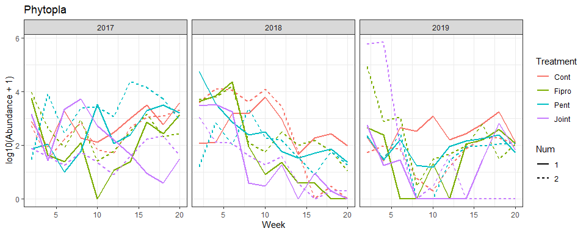

    ## 
    ## [[2]]

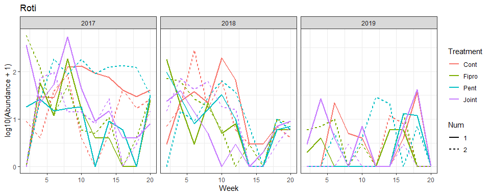

    ## 
    ## [[3]]

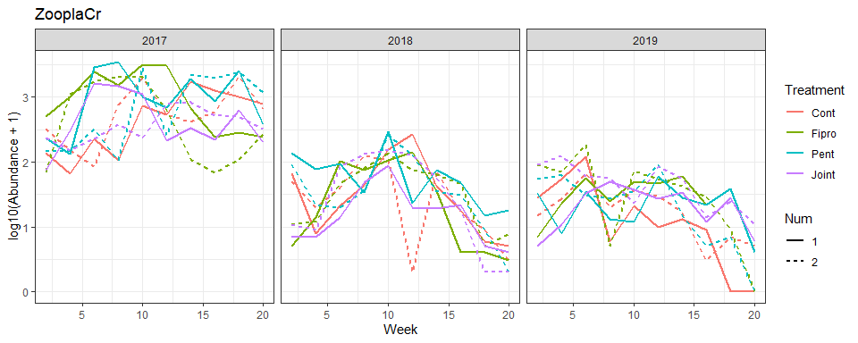

``` r
lapply(4:11, function(i) {
  Commulist[[i]] %>%
    separate(Tank, into=c("Treatment", "Num"), sep=-1) %>% 
    mutate(Treatment=factor(Treatment, levels=c("Cont", "Fipro", "Pent", "Joint"))) %>%
    ggplot(aes(x=Week, y=Abundance, color=Treatment, linetype=Num)) + geom_line(size=1) + facet_wrap(~Year) + ggtitle(names(Commulist)[i])
}
)
```

    ## [[1]]

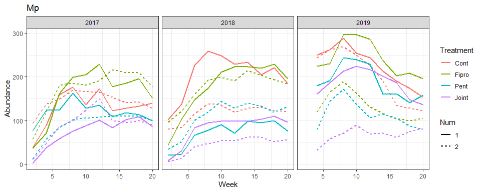

    ## 
    ## [[2]]

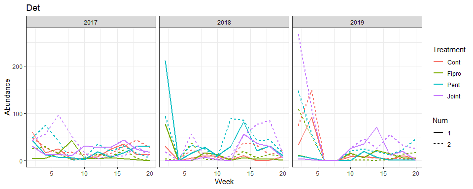

    ## 
    ## [[3]]

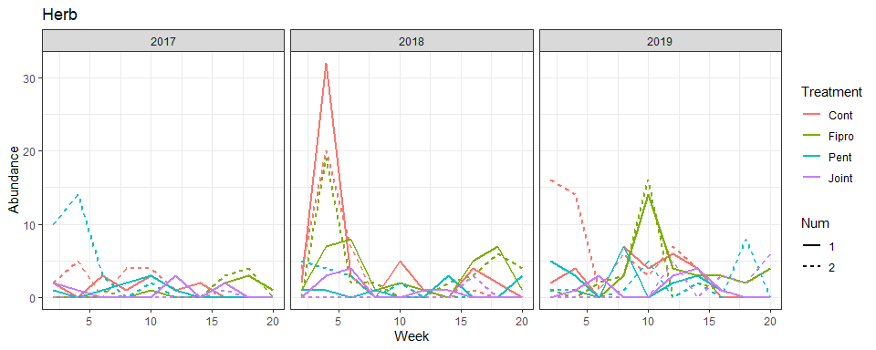

    ## 
    ## [[4]]

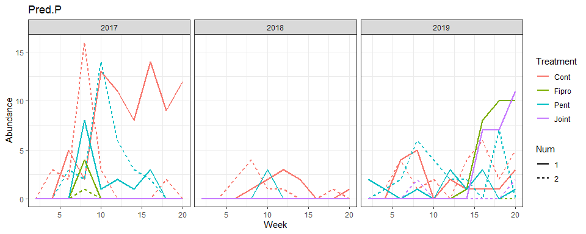

    ## 
    ## [[5]]

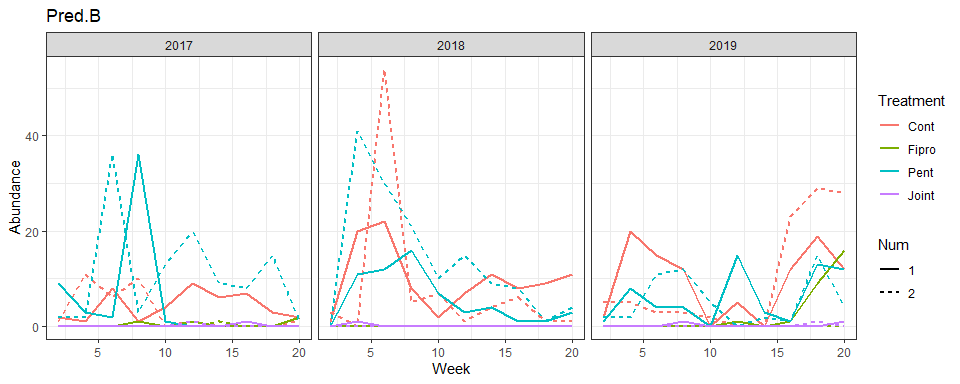

    ## 
    ## [[6]]

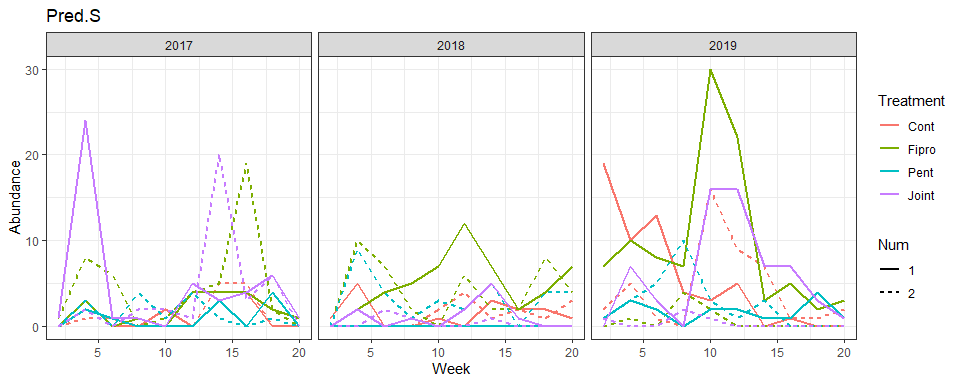

    ## 
    ## [[7]]

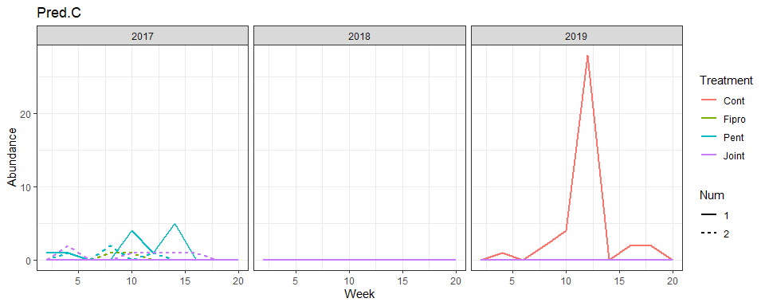

    ## 
    ## [[8]]

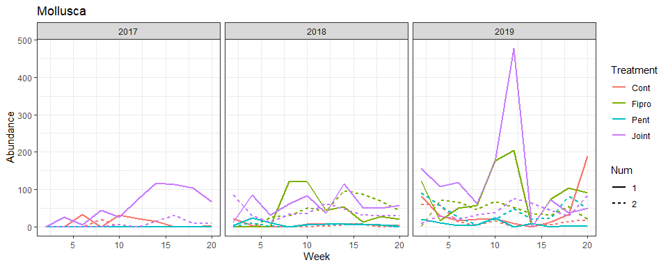

``` r
# Log-transformation and standardization

Tslist <- lapply(1:11, function(i) {
  Commulist[[i]] %>%
    select(Week, Year_Tank, Abundance) %>%
    spread(key=Year_Tank, value=Abundance) %>% # Remove unnecessary columns
    rbind(., rep(NaN, ncol(.))) %>% # Add NaN to separate different tanks, but not necessary if you correctly specify lib parameters
    gather(Year_Tank, Abundance, -Week) %>% # Gather data for EDM
    mutate(Year_Tank=factor(Year_Tank, levels=c("2017_Cont1", "2017_Cont2", "2017_Fipro1", "2017_Fipro2", 
                                                "2017_Pent1", "2017_Pent2", "2017_Joint1", "2017_Joint2", 
                                                "2018_Cont1", "2018_Cont2", "2018_Fipro1", "2018_Fipro2", 
                                                "2018_Pent1", "2018_Pent2", "2018_Joint1", "2018_Joint2", 
                                                "2019_Cont1", "2019_Cont2", "2019_Fipro1", "2019_Fipro2", 
                                                "2019_Pent1", "2019_Pent2", "2019_Joint1", "2019_Joint2")))
  } 
)

names(Tslist) <- 
  c("Phytopla1", "Roti1", "Zoopla1", "Mp1", "Det1", "Herb1", "Pred.P1", "Pred.B1", "Pred.S1", "Pred.C1", "Moll1")

lapply(c("Phytopla1", "Roti1", "Det1", "Herb1", "Pred.P1", "Pred.B1", "Pred.S1", "Pred.C1", "Moll1"), 
       function(i) { 
         Tslist[[i]] <<- mutate(Tslist[[i]], scAbundance=as.numeric(scale(log(Abundance+1))))
       }
)
```

    ## [[1]]
    ## # A tibble: 264 x 4
    ##     Week Year_Tank  Abundance scAbundance
    ##    <dbl> <fct>          <dbl>       <dbl>
    ##  1     2 2017_Cont1       799      0.706 
    ##  2     4 2017_Cont1        86     -0.118 
    ##  3     6 2017_Cont1      1873      1.02  
    ##  4     8 2017_Cont1       187      0.168 
    ##  5    10 2017_Cont1       127      0.0258
    ##  6    12 2017_Cont1       305      0.349 
    ##  7    14 2017_Cont1      1001      0.790 
    ##  8    16 2017_Cont1      3170      1.22  
    ##  9    18 2017_Cont1       613      0.608 
    ## 10    20 2017_Cont1      3860      1.29  
    ## # ... with 254 more rows
    ## 
    ## [[2]]
    ## # A tibble: 264 x 4
    ##     Week Year_Tank  Abundance scAbundance
    ##    <dbl> <fct>          <dbl>       <dbl>
    ##  1     2 2017_Cont1         0      -1.19 
    ##  2     4 2017_Cont1        29       0.870
    ##  3     6 2017_Cont1        27       0.828
    ##  4     8 2017_Cont1       124       1.74 
    ##  5    10 2017_Cont1       129       1.76 
    ##  6    12 2017_Cont1        92       1.56 
    ##  7    14 2017_Cont1        75       1.43 
    ##  8    16 2017_Cont1        40       1.06 
    ##  9    18 2017_Cont1        29       0.870
    ## 10    20 2017_Cont1        40       1.06 
    ## # ... with 254 more rows
    ## 
    ## [[3]]
    ## # A tibble: 264 x 4
    ##     Week Year_Tank  Abundance scAbundance
    ##    <dbl> <fct>          <dbl>       <dbl>
    ##  1     2 2017_Cont1        60       1.27 
    ##  2     4 2017_Cont1        17       0.366
    ##  3     6 2017_Cont1        25       0.638
    ##  4     8 2017_Cont1         3      -0.745
    ##  5    10 2017_Cont1         5      -0.446
    ##  6    12 2017_Cont1         8      -0.146
    ##  7    14 2017_Cont1        24       0.609
    ##  8    16 2017_Cont1        36       0.898
    ##  9    18 2017_Cont1        13       0.180
    ## 10    20 2017_Cont1        13       0.180
    ## # ... with 254 more rows
    ## 
    ## [[4]]
    ## # A tibble: 264 x 4
    ##     Week Year_Tank  Abundance scAbundance
    ##    <dbl> <fct>          <dbl>       <dbl>
    ##  1     2 2017_Cont1         2     0.493  
    ##  2     4 2017_Cont1         0    -0.857  
    ##  3     6 2017_Cont1         3     0.847  
    ##  4     8 2017_Cont1         1    -0.00524
    ##  5    10 2017_Cont1         3     0.847  
    ##  6    12 2017_Cont1         1    -0.00524
    ##  7    14 2017_Cont1         2     0.493  
    ##  8    16 2017_Cont1         0    -0.857  
    ##  9    18 2017_Cont1         0    -0.857  
    ## 10    20 2017_Cont1         0    -0.857  
    ## # ... with 254 more rows
    ## 
    ## [[5]]
    ## # A tibble: 264 x 4
    ##     Week Year_Tank  Abundance scAbundance
    ##    <dbl> <fct>          <dbl>       <dbl>
    ##  1     2 2017_Cont1         0      -0.593
    ##  2     4 2017_Cont1         0      -0.593
    ##  3     6 2017_Cont1         5       1.81 
    ##  4     8 2017_Cont1         2       0.882
    ##  5    10 2017_Cont1        13       2.95 
    ##  6    12 2017_Cont1        11       2.74 
    ##  7    14 2017_Cont1         8       2.36 
    ##  8    16 2017_Cont1        14       3.04 
    ##  9    18 2017_Cont1         9       2.50 
    ## 10    20 2017_Cont1        12       2.85 
    ## # ... with 254 more rows
    ## 
    ## [[6]]
    ## # A tibble: 264 x 4
    ##     Week Year_Tank  Abundance scAbundance
    ##    <dbl> <fct>          <dbl>       <dbl>
    ##  1     2 2017_Cont1         2       0.198
    ##  2     4 2017_Cont1         1      -0.170
    ##  3     6 2017_Cont1         8       1.19 
    ##  4     8 2017_Cont1         1      -0.170
    ##  5    10 2017_Cont1         4       0.661
    ##  6    12 2017_Cont1         9       1.29 
    ##  7    14 2017_Cont1         6       0.966
    ##  8    16 2017_Cont1         7       1.09 
    ##  9    18 2017_Cont1         3       0.459
    ## 10    20 2017_Cont1         2       0.198
    ## # ... with 254 more rows
    ## 
    ## [[7]]
    ## # A tibble: 264 x 4
    ##     Week Year_Tank  Abundance scAbundance
    ##    <dbl> <fct>          <dbl>       <dbl>
    ##  1     2 2017_Cont1         0      -1.04 
    ##  2     4 2017_Cont1         3       0.547
    ##  3     6 2017_Cont1         0      -1.04 
    ##  4     8 2017_Cont1         0      -1.04 
    ##  5    10 2017_Cont1         2       0.218
    ##  6    12 2017_Cont1         0      -1.04 
    ##  7    14 2017_Cont1         3       0.547
    ##  8    16 2017_Cont1         4       0.803
    ##  9    18 2017_Cont1         0      -1.04 
    ## 10    20 2017_Cont1         0      -1.04 
    ## # ... with 254 more rows
    ## 
    ## [[8]]
    ## # A tibble: 264 x 4
    ##     Week Year_Tank  Abundance scAbundance
    ##    <dbl> <fct>          <dbl>       <dbl>
    ##  1     2 2017_Cont1         0      -0.263
    ##  2     4 2017_Cont1         0      -0.263
    ##  3     6 2017_Cont1         0      -0.263
    ##  4     8 2017_Cont1         0      -0.263
    ##  5    10 2017_Cont1         0      -0.263
    ##  6    12 2017_Cont1         0      -0.263
    ##  7    14 2017_Cont1         0      -0.263
    ##  8    16 2017_Cont1         0      -0.263
    ##  9    18 2017_Cont1         0      -0.263
    ## 10    20 2017_Cont1         0      -0.263
    ## # ... with 254 more rows
    ## 
    ## [[9]]
    ## # A tibble: 264 x 4
    ##     Week Year_Tank  Abundance scAbundance
    ##    <dbl> <fct>          <dbl>       <dbl>
    ##  1     2 2017_Cont1         0      -1.21 
    ##  2     4 2017_Cont1         0      -1.21 
    ##  3     6 2017_Cont1        33       0.766
    ##  4     8 2017_Cont1         0      -1.21 
    ##  5    10 2017_Cont1        31       0.732
    ##  6    12 2017_Cont1        22       0.546
    ##  7    14 2017_Cont1        15       0.342
    ##  8    16 2017_Cont1         0      -1.21 
    ##  9    18 2017_Cont1         0      -1.21 
    ## 10    20 2017_Cont1         4      -0.311
    ## # ... with 254 more rows

``` r
Tslist[["Mp1"]] <- mutate(Tslist[["Mp1"]], scAbundance=as.numeric(scale(Abundance))) # For macrophytes, log-transformation was not done

# Scaling density data of Crustacean zooplankton because different sampling protocols were used in different years

par(mfrow=c(1, 2))
boxplot(I(Abundance+1) ~ Year, ZooplaCr)
Tslist[["Zoopla1"]] <- 
  Tslist[["Zoopla1"]] %>%
  separate(Year_Tank, into=c("Year", "Tank")) %>%
  group_by(Year) %>%
  mutate(scAbundance=as.numeric(scale(log(Abundance*ifelse(Year==2017, 1, 20)+1)))) %>% # To account for different sampling protocols between different years
  unite(Year, Tank, col="Year_Tank")
Tslist[["Zoopla1"]] %>%
  separate(Year_Tank, into=c("Year", "Tank")) %>%
  boxplot(scAbundance ~ Year, .)
```

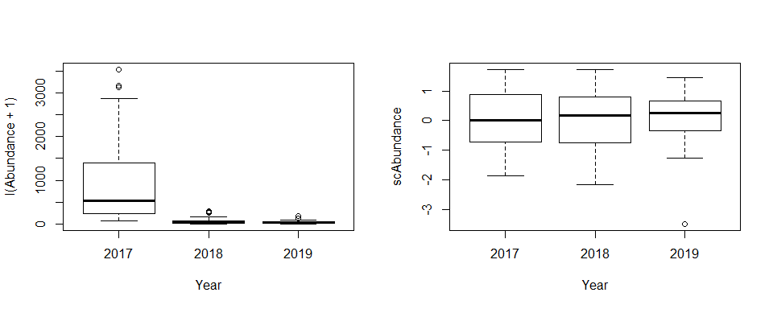

``` r
all_Ts <- 
  lapply(1:11, function(i) {
    mutate(Tslist[[i]], Recipient=names(Tslist)[i])
  }) %>% do.call(rbind, .)
write.csv(all_Ts, "./processed_data/all_Ts240123.csv", row.names=FALSE) # Save processed time series data
```

## Data visualization

### Processing for plotting

``` r
#Abundance.gathered <- read.csv("./processed_data/all_Ts240123.csv", header=TRUE)

Abundance.gathered <- all_Ts

Abundance.gathered_ <- 
  Abundance.gathered %>%
  separate(Year_Tank, into=c("Year", "Tank"), sep="_") %>%
  mutate(Treatment=substr(Tank, start=1, stop=nchar(Tank)-1)) %>%
  mutate(Treatment=factor(Treatment, levels=c("Cont", "Fipro", "Pent", "Joint"))) %>%
  unite(col="Treatment_Tank_Recipient", Treatment, Tank, Recipient, sep="_") %>%
  select(-Abundance) %>%
  spread(key="Treatment_Tank_Recipient", value=scAbundance) %>%
  arrange(Year, Week) %>%
  rbind(., NaN) %>%
  gather(key="Treatment_Tank_Recipient", value="scAbundance", -(1:2)) %>%
  separate(Treatment_Tank_Recipient, into=c("Treatment", "Tank", "Recipient"), sep="_") %>%
  unite(col="Treatment_Recipient", Treatment, Recipient, sep="_") %>% 
  mutate(Tank=substr(Tank, nchar(Tank), nchar(Tank))) %>%
  spread(key="Treatment_Recipient", value="scAbundance") %>% 
  arrange(Tank, Year, Week) %>%
  rbind(., NaN) %>%
  gather(key="Treatment_Recipient", value="scAbundance", -(1:3)) %>%
  separate(Treatment_Recipient, into=c("Treatment", "Recipient"), sep="_") %>%
  unite(col="Tank", Treatment, Tank, remove=FALSE, sep="") %>%
  mutate(Treatment=factor(Treatment, levels=c("Cont", "Fipro", "Pent", "Joint")), 
         Tank=factor(Tank, levels=c("Cont1", "Cont2", "ContNaN", "Fipro1", "Fipro2", "FiproNaN",
                                    "Pent1", "Pent2", "PentNaN", "Joint1", "Joint2", "JointNaN")), 
         Year=as.numeric(Year)) %>%
  mutate(Recipient=factor(Recipient, levels=c("Phytopla1", "Roti1", "Zoopla1", "Mp1", "Det1", "Herb1", "Pred.P1", "Pred.B1", "Pred.S1", "Pred.C1", "Moll1"))) %>%
  arrange(Recipient, Tank, Year, Week)


map <- c("Phytopla1"="Phytoplankton", 
          "Roti1"="Rotifers", 
          "Zoopla1"="Crustacean zooplankton", 
          "Mp1"="Macrophytes", 
          "Det1"="Detritivores", 
          "Herb1"="Herbivores", 
          "Pred.P1"="Phytophilous predators", 
          "Pred.B1"="Benthic predators",
          "Pred.S1"="Neustonic predators", 
          "Pred.C1"="Nektonic predators",
          "Moll1"="Molluscs")

Abundance.gathered_mod <- 
  Abundance.gathered_  %>%
  mutate(Recipient=factor(map[Recipient], 
                      levels=c("Phytoplankton", 
                               "Rotifers", 
                               "Crustacean zooplankton", 
                               "Macrophytes", 
                               "Detritivores", 
                               "Herbivores", 
                               "Phytophilous predators", 
                               "Benthic predators", 
                               "Neustonic predators", 
                               "Molluscs")), 
         Time=rep(1:69, times=nrow(.)/69), 
         Time2=rep(1:276, times=nrow(.)/276)) %>% 
  filter(Recipient!="Pred.C1")
  
g_Aball <- ggplot(Abundance.gathered_mod, aes(x=Time2, y=scAbundance)) +
  geom_line(aes(color=Recipient)) +
  facet_wrap(~Recipient, ncol=2, scales="free", labeller=label_value) + 
  scale_y_continuous(limits=c(-3.1, 3.1), name="Standardized density") +
  scale_x_continuous(name=NULL, breaks=seq(276/48, by=276/24, length=24)-1, 
                     labels=rep(c("'17", "'18", "'19"), times=8), limits=c(1, 276), 
                     sec.axis=sec_axis(~.,
                                       breaks=seq(276/8, by=276/4, length=4)-1, 
                                       labels=c("C", "I", "H", "I+H"))) + 
  theme_test() +
  theme(legend.position="none", 
        axis.ticks.x=element_blank(), strip.background=element_blank(), 
        strip.text.x=element_text(hjust=0), 
        strip.placement="outside") + 
  geom_hline(yintercept=0, linetype=2) + 
  geom_vline(xintercept=seq(276/8, by=(276/8)*2, length=4)-1, color="grey") + 
  geom_vline(xintercept=seq(276/4, by=(276/8)*2, length=3)-1, color="black") +
  scale_color_manual(values=(pal_d3(palette="category10")(10))[c(5:9, 1:4, 10)])
```

### Fig. S2a

``` r
#windows(12, 7.5, rescale="fixed")
g_Aball
```

    ## Warning: Removed 30 row(s) containing missing values (geom_path).

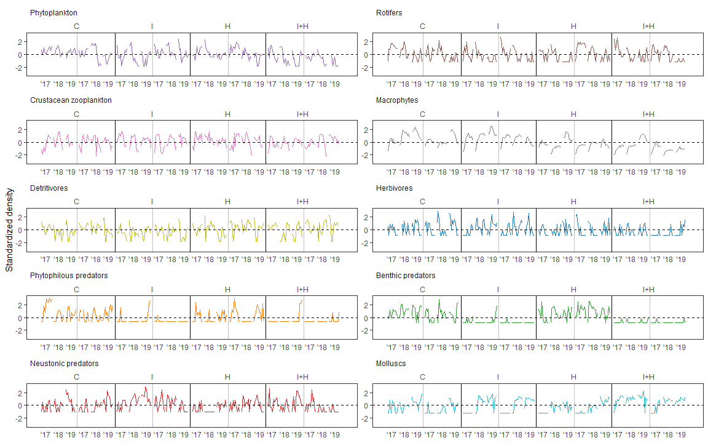

``` r
#ggsave("fig.s3.pdf", fig.s3, device=cairo_pdf, width=12, height=15, unit="in")
```
