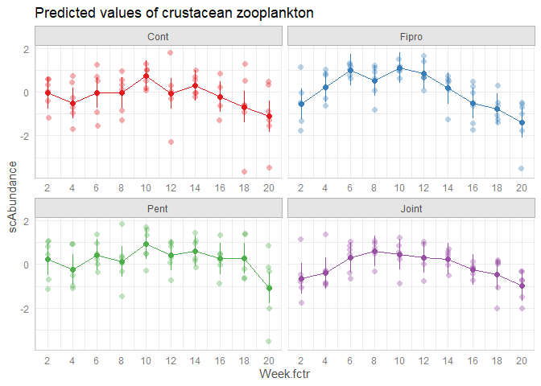

# Treatment effects on population density testetd by LMMs

### Load required packages

``` r
sessionInfo() #save session information (R version 3.6.3 (2020))
```

    ## R version 3.6.3 (2020-02-29)
    ## Platform: x86_64-w64-mingw32/x64 (64-bit)
    ## Running under: Windows 10 x64 (build 19045)
    ## 
    ## Matrix products: default
    ## 
    ## locale:
    ## [1] LC_COLLATE=Japanese_Japan.932  LC_CTYPE=Japanese_Japan.932   
    ## [3] LC_MONETARY=Japanese_Japan.932 LC_NUMERIC=C                  
    ## [5] LC_TIME=Japanese_Japan.932    
    ## 
    ## attached base packages:
    ## [1] stats     graphics  grDevices utils     datasets  methods   base     
    ## 
    ## loaded via a namespace (and not attached):
    ##  [1] compiler_3.6.3  magrittr_2.0.3  fastmap_1.1.0   cli_3.4.1      
    ##  [5] tools_3.6.3     htmltools_0.5.2 rstudioapi_0.11 yaml_2.2.1     
    ##  [9] stringi_1.4.6   rmarkdown_2.5   knitr_1.30      stringr_1.4.0  
    ## [13] xfun_0.19       digest_0.6.27   rlang_1.1.0     evaluate_0.14

``` r
library(dplyr); packageVersion("dplyr") #v.1.0.2
```

    ## 
    ## Attaching package: 'dplyr'

    ## The following objects are masked from 'package:stats':
    ## 
    ##     filter, lag

    ## The following objects are masked from 'package:base':
    ## 
    ##     intersect, setdiff, setequal, union

    ## [1] '1.0.2'

``` r
library(tidyr); packageVersion("tidyr") #v.1.1.2
```

    ## [1] '1.1.2'

``` r
library(RColorBrewer); packageVersion("RColorBrewer") #v.1.1.2
```

    ## [1] '1.1.2'

``` r
library(lme4); packageVersion("lme4") #v.1.1.25
```

    ## Loading required package: Matrix

    ## 
    ## Attaching package: 'Matrix'

    ## The following objects are masked from 'package:tidyr':
    ## 
    ##     expand, pack, unpack

    ## [1] '1.1.25'

``` r
library(glmmTMB); packageVersion("glmmTMB") #v.1.0.2.1
```

    ## [1] '1.0.2.1'

``` r
library(car); packageVersion("car") #v.3.0.10
```

    ## Loading required package: carData

    ## Registered S3 methods overwritten by 'car':
    ##   method                          from
    ##   influence.merMod                lme4
    ##   cooks.distance.influence.merMod lme4
    ##   dfbeta.influence.merMod         lme4
    ##   dfbetas.influence.merMod        lme4

    ## 
    ## Attaching package: 'car'

    ## The following object is masked from 'package:dplyr':
    ## 
    ##     recode

    ## [1] '3.0.10'

``` r
library(DHARMa); packageVersion("DHARMa") #v.0.3.3.0
```

    ## This is DHARMa 0.3.3.0. For overview type '?DHARMa'. For recent changes, type news(package = 'DHARMa') Note: Syntax of plotResiduals has changed in 0.3.0, see ?plotResiduals for details

    ## [1] '0.3.3.0'

``` r
library(emmeans); packageVersion("emmeans") #v.1.5.2.1
```

    ## [1] '1.5.2.1'

``` r
library(ggeffects); packageVersion("ggeffects") #v.1.2.1
```

    ## [1] '1.2.0'

``` r
library(ggplot2); packageVersion("ggplot2") #v.3.3.2
```

    ## [1] '3.3.2'

``` r
library(ggsci); packageVersion("ggsci") #v.2.9
```

    ## [1] '2.9'

``` r
library(patchwork); packageVersion("patchwork") #v.1.1.1
```

    ## [1] '1.1.1'

### Data compilation

``` r
all_Ts <- read.csv("./processed_data/all_Ts240123.csv") 

all_Ts <- 
  all_Ts %>%
  separate(Year_Tank, into=c("Year", "Tank"), sep="_") %>% #year and tank
  mutate(Treatment=substr(Tank, 1, nchar(Tank)-1)) %>% #treatment names
  mutate(Treatment=factor(Treatment, levels=c("Cont", "Fipro", "Pent", "Joint")), #order of treatment names
         Tank=factor(Tank, levels=unique(Tank)), #order of tank names
         Recipient=factor(Recipient, levels=c("Phytopla1", "Roti1", "Zoopla1", "Mp1", 
                                              "Det1", "Herb1", "Pred.P1", "Pred.B1", "Pred.S1", "Moll1"))) 

head(all_Ts)
```

    ##   Week Year  Tank Abundance scAbundance Recipient Treatment
    ## 1    2 2017 Cont1       799  0.70605734 Phytopla1      Cont
    ## 2    4 2017 Cont1        86 -0.11756142 Phytopla1      Cont
    ## 3    6 2017 Cont1      1873  1.02204355 Phytopla1      Cont
    ## 4    8 2017 Cont1       187  0.16847324 Phytopla1      Cont
    ## 5   10 2017 Cont1       127  0.02577338 Phytopla1      Cont
    ## 6   12 2017 Cont1       305  0.34930867 Phytopla1      Cont

## LMM analysis

Assuming the following four random-part parameters

-   ρ（one time step correlation）
-   σ（residual SD）
-   σT（among Tank SD）
-   σY（among Year SD）

Type III LRT

-   <https://cran.r-project.org/web/packages/glmmTMB/vignettes/model_evaluation.pdf>
    -   “The mixed package implements a true “type-3-like”
        parameter-droppin gmechanism for \[g\]lmer models. Something
        like that could in principle be applied here.”

### Phytopla density

Results summary

-   type 3 LRT
-   Treatment: P = 0.60
-   Week: P \< 0.01
-   TxP: P = 0.096

``` r
all_Ts_ <- all_Ts
all_Ts_$Tank_Year <- with(all_Ts_, paste(Tank, Year, sep="_"))
all_Ts_$Week.fctr <- with(all_Ts_, as.factor(Week))
all_Ts_$Year.fctr <- with(all_Ts_, as.factor(Year))

##set contrasts options (required for type III LRT)
options(contrasts = c("contr.sum", "contr.sum"))

##glmmTMB
Ph.Ab.glmmTMB <- glmmTMB(scAbundance ~ Treatment*Week.fctr + (1|Tank) + (1|Year) + #specify fixed and random effects
                           ar1(Week.fctr+0|Tank_Year), #specify AR1 correlation structure per Tank per Year
                         data=subset(na.omit(all_Ts_), Recipient=="Phytopla1"), 
                         REML=FALSE, #set ML
                         dispformula=~0) #remove unnecessary sigma

#type 3 LRT
full.model.mat <- model.matrix(Ph.Ab.glmmTMB) #extract design matrix
Ph.Ab.glmmTMB.red1 <- update(Ph.Ab.glmmTMB, .~.-Treatment:Week.fctr) #remove Interaction effect
Ph.Ab.glmmTMB.red2.int <- update(Ph.Ab.glmmTMB, .~full.model.mat[,-(2:4)] + 0 + (1|Tank) + (1|Year) +
                                   ar1(Week.fctr+0|Tank_Year)) #remove Treatment main effect
```

    ## Warning in fitTMB(TMBStruc): Model convergence problem; false convergence (8).
    ## See vignette('troubleshooting')

``` r
Ph.Ab.glmmTMB.red2.int_ <- update(Ph.Ab.glmmTMB.red2.int, #change optimization options
                                  control=glmmTMBControl(optimizer=optim,optArgs=list(method="BFGS")),
                                  start=list(theta=c(0.0056, 0.047, 0.86, 0.64)))
Ph.Ab.glmmTMB.red3.int <- update(Ph.Ab.glmmTMB, .~full.model.mat[,-(5:13)] + 0 + (1|Tank) + (1|Year) +
                                   ar1(Week.fctr+0|Tank_Year)) #remove Week main effect
anova(Ph.Ab.glmmTMB, Ph.Ab.glmmTMB.red1) #Interaction effect
```

    ## Data: subset(na.omit(all_Ts_), Recipient == "Phytopla1")
    ## Models:
    ## Ph.Ab.glmmTMB.red1: scAbundance ~ Treatment + Week.fctr + (1 | Tank) + (1 | Year) + , zi=~0, disp=~0
    ## Ph.Ab.glmmTMB.red1:     (ar1(Week.fctr + 0 | Tank_Year)), zi=~0, disp=~0
    ## Ph.Ab.glmmTMB: scAbundance ~ Treatment * Week.fctr + (1 | Tank) + (1 | Year) + , zi=~0, disp=~0
    ## Ph.Ab.glmmTMB:     ar1(Week.fctr + 0 | Tank_Year), zi=~0, disp=~0
    ##                    Df    AIC    BIC  logLik deviance  Chisq Chi Df Pr(>Chisq)  
    ## Ph.Ab.glmmTMB.red1 17 559.13 618.30 -262.57   525.13                           
    ## Ph.Ab.glmmTMB      44 576.17 729.31 -244.08   488.17 36.967     27    0.09568 .
    ## ---
    ## Signif. codes:  0 '***' 0.001 '**' 0.01 '*' 0.05 '.' 0.1 ' ' 1

``` r
anova(Ph.Ab.glmmTMB, Ph.Ab.glmmTMB.red2.int_) #type 3 Treatment effect
```

    ## Data: subset(na.omit(all_Ts_), Recipient == "Phytopla1")
    ## Models:
    ## Ph.Ab.glmmTMB.red2.int_: scAbundance ~ full.model.mat[, -(2:4)] + (1 | Tank) + (1 | Year) + , zi=~0, disp=~0
    ## Ph.Ab.glmmTMB.red2.int_:     (ar1(Week.fctr + 0 | Tank_Year)) - 1, zi=~0, disp=~0
    ## Ph.Ab.glmmTMB: scAbundance ~ Treatment * Week.fctr + (1 | Tank) + (1 | Year) + , zi=~0, disp=~0
    ## Ph.Ab.glmmTMB:     ar1(Week.fctr + 0 | Tank_Year), zi=~0, disp=~0
    ##                         Df    AIC    BIC  logLik deviance  Chisq Chi Df
    ## Ph.Ab.glmmTMB.red2.int_ 41 578.40 721.11 -248.20   496.40              
    ## Ph.Ab.glmmTMB           44 576.17 729.31 -244.08   488.17 8.2381      3
    ##                         Pr(>Chisq)  
    ## Ph.Ab.glmmTMB.red2.int_             
    ## Ph.Ab.glmmTMB              0.04134 *
    ## ---
    ## Signif. codes:  0 '***' 0.001 '**' 0.01 '*' 0.05 '.' 0.1 ' ' 1

``` r
anova(Ph.Ab.glmmTMB, Ph.Ab.glmmTMB.red3.int) #type 3 Week effect
```

    ## Data: subset(na.omit(all_Ts_), Recipient == "Phytopla1")
    ## Models:
    ## Ph.Ab.glmmTMB.red3.int: scAbundance ~ full.model.mat[, -(5:13)] + (1 | Tank) + (1 | Year) + , zi=~0, disp=~0
    ## Ph.Ab.glmmTMB.red3.int:     (ar1(Week.fctr + 0 | Tank_Year)) - 1, zi=~0, disp=~0
    ## Ph.Ab.glmmTMB: scAbundance ~ Treatment * Week.fctr + (1 | Tank) + (1 | Year) + , zi=~0, disp=~0
    ## Ph.Ab.glmmTMB:     ar1(Week.fctr + 0 | Tank_Year), zi=~0, disp=~0
    ##                        Df    AIC    BIC  logLik deviance  Chisq Chi Df
    ## Ph.Ab.glmmTMB.red3.int 35 592.81 714.63 -261.40   522.81              
    ## Ph.Ab.glmmTMB          44 576.17 729.31 -244.08   488.17 34.643      9
    ##                        Pr(>Chisq)    
    ## Ph.Ab.glmmTMB.red3.int               
    ## Ph.Ab.glmmTMB           6.887e-05 ***
    ## ---
    ## Signif. codes:  0 '***' 0.001 '**' 0.01 '*' 0.05 '.' 0.1 ' ' 1

``` r
Ph.Ab.glmmTMB.REML <- update(Ph.Ab.glmmTMB, REML=TRUE) #set REML for summarizing model result
```

    ## Warning in fitTMB(TMBStruc): Model convergence problem; false convergence (8).
    ## See vignette('troubleshooting')

``` r
Ph.Ab.glmmTMB.REML_ <- update(Ph.Ab.glmmTMB.REML, control=glmmTMBControl(optimizer=optim,optArgs=list(method="BFGS"))) #change optimizer
plot(simulateResiduals(Ph.Ab.glmmTMB.REML_)) #diagnosis
```


``` r
summary(Ph.Ab.glmmTMB.REML_)
```

    ##  Family: gaussian  ( identity )
    ## Formula:          
    ## scAbundance ~ Treatment * Week.fctr + (1 | Tank) + (1 | Year) +  
    ##     ar1(Week.fctr + 0 | Tank_Year)
    ## Dispersion:                   ~0
    ## Data: subset(na.omit(all_Ts_), Recipient == "Phytopla1")
    ## 
    ##      AIC      BIC   logLik deviance df.resid 
    ##    648.7    801.9   -280.4    560.7      236 
    ## 
    ## Random effects:
    ## 
    ## Conditional model:
    ##  Groups    Name        Variance  Std.Dev. Corr      
    ##  Tank      (Intercept) 2.876e-05 0.005363           
    ##  Year      (Intercept) 3.878e-02 0.196933           
    ##  Tank_Year Week.fctr2  7.666e-01 0.875568 0.58 (ar1)
    ## Number of obs: 240, groups:  Tank, 8; Year, 3; Tank_Year, 24
    ## 
    ## Conditional model:
    ##                         Estimate Std. Error z value Pr(>|z|)    
    ## (Intercept)           -1.614e-16  1.510e-01   0.000  1.00000    
    ## Treatment1             2.892e-01  1.722e-01   1.679  0.09314 .  
    ## Treatment2             1.166e-02  1.722e-01   0.068  0.94603    
    ## Treatment3             1.639e-01  1.722e-01   0.952  0.34118    
    ## Week.fctr1             7.930e-01  1.635e-01   4.849 1.24e-06 ***
    ## Week.fctr2             4.122e-01  1.520e-01   2.712  0.00669 ** 
    ## Week.fctr3             3.101e-01  1.451e-01   2.138  0.03252 *  
    ## Week.fctr4            -1.833e-01  1.412e-01  -1.298  0.19438    
    ## Week.fctr5            -3.021e-01  1.395e-01  -2.165  0.03037 *  
    ## Week.fctr6            -2.581e-01  1.395e-01  -1.850  0.06432 .  
    ## Week.fctr7            -2.877e-01  1.412e-01  -2.037  0.04166 *  
    ## Week.fctr8            -7.968e-02  1.451e-01  -0.549  0.58280    
    ## Week.fctr9            -1.117e-01  1.520e-01  -0.735  0.46232    
    ## Treatment1:Week.fctr1 -6.725e-01  2.833e-01  -2.374  0.01758 *  
    ## Treatment2:Week.fctr1  6.528e-01  2.833e-01   2.305  0.02118 *  
    ## Treatment3:Week.fctr1 -7.399e-01  2.833e-01  -2.612  0.00900 ** 
    ## Treatment1:Week.fctr2 -6.151e-01  2.632e-01  -2.337  0.01944 *  
    ## Treatment2:Week.fctr2  2.563e-01  2.632e-01   0.974  0.33022    
    ## Treatment3:Week.fctr2 -1.661e-01  2.632e-01  -0.631  0.52807    
    ## Treatment1:Week.fctr3  7.990e-02  2.512e-01   0.318  0.75046    
    ## Treatment2:Week.fctr3  2.874e-02  2.512e-01   0.114  0.90892    
    ## Treatment3:Week.fctr3 -3.945e-01  2.512e-01  -1.570  0.11641    
    ## Treatment1:Week.fctr4  2.881e-01  2.446e-01   1.178  0.23893    
    ## Treatment2:Week.fctr4 -2.375e-01  2.446e-01  -0.971  0.33153    
    ## Treatment3:Week.fctr4 -2.128e-02  2.446e-01  -0.087  0.93068    
    ## Treatment1:Week.fctr5  4.101e-01  2.417e-01   1.697  0.08968 .  
    ## Treatment2:Week.fctr5 -5.069e-01  2.417e-01  -2.097  0.03597 *  
    ## Treatment3:Week.fctr5  2.028e-01  2.417e-01   0.839  0.40130    
    ## Treatment1:Week.fctr6  2.000e-01  2.417e-01   0.827  0.40800    
    ## Treatment2:Week.fctr6 -3.343e-01  2.417e-01  -1.383  0.16664    
    ## Treatment3:Week.fctr6  1.004e-01  2.417e-01   0.415  0.67782    
    ## Treatment1:Week.fctr7  1.323e-01  2.446e-01   0.541  0.58858    
    ## Treatment2:Week.fctr7  1.594e-03  2.446e-01   0.007  0.99480    
    ## Treatment3:Week.fctr7  3.395e-01  2.446e-01   1.388  0.16510    
    ## Treatment1:Week.fctr8 -3.313e-03  2.512e-01  -0.013  0.98948    
    ## Treatment2:Week.fctr8  2.647e-01  2.512e-01   1.054  0.29207    
    ## Treatment3:Week.fctr8  1.741e-01  2.512e-01   0.693  0.48830    
    ## Treatment1:Week.fctr9  9.357e-02  2.632e-01   0.355  0.72223    
    ## Treatment2:Week.fctr9 -1.599e-01  2.632e-01  -0.607  0.54364    
    ## Treatment3:Week.fctr9  3.569e-01  2.632e-01   1.356  0.17513    
    ## ---
    ## Signif. codes:  0 '***' 0.001 '**' 0.01 '*' 0.05 '.' 0.1 ' ' 1

``` r
Trt.Ph <- emmeans(Ph.Ab.glmmTMB.REML_, specs="Treatment")
```

    ## NOTE: Results may be misleading due to involvement in interactions

``` r
contrast(Trt.Ph, method="trt.vs.ctrl") #Dunnet test
```

    ##  contrast     estimate    SE  df t.ratio p.value
    ##  Fipro - Cont   -0.278 0.281 236 -0.987  0.6213 
    ##  Pent - Cont    -0.125 0.281 236 -0.445  0.9175 
    ##  Joint - Cont   -0.754 0.281 236 -2.681  0.0221 
    ## 
    ## Results are averaged over the levels of: Week.fctr 
    ## P value adjustment: dunnettx method for 3 tests

``` r
plot(ggemmeans(Ph.Ab.glmmTMB.REML_, terms=c("Week.fctr", "Treatment")), 
     facets=TRUE, connect.lines=TRUE, rawdata=TRUE) + ggtitle("Predicted values of phytoplankton")
```


### Rotifer density

-   type 3 LRT
-   Treatment: P = 0.04
-   Week: P \< 0.001
-   TxP: P = 0.096

``` r
Ro.Ab.glmmTMB <- glmmTMB(scAbundance ~ Treatment*Week.fctr + (1|Tank) + (1|Year) +
                           ar1(Week.fctr+0|Tank_Year), data=subset(na.omit(all_Ts_), Recipient=="Roti1"), REML=FALSE, 
                         dispformula=~0)
Ro.Ab.glmmTMB.red1 <- update(Ro.Ab.glmmTMB, .~.-Treatment:Week.fctr)
full.model.mat <- model.matrix(Ro.Ab.glmmTMB)
Ro.Ab.glmmTMB.red2.int <- update(Ro.Ab.glmmTMB, .~full.model.mat[,-(2:4)] + 0 + (1|Tank) + (1|Year) +
                                   ar1(Week.fctr+0|Tank_Year))
```

    ## Warning in fitTMB(TMBStruc): Model convergence problem; false convergence (8).
    ## See vignette('troubleshooting')

``` r
Ro.Ab.glmmTMB.red2.int_ <- update(Ro.Ab.glmmTMB.red2.int, 
                                  control=glmmTMBControl(optimizer=optim,optArgs=list(method="BFGS")), 
                                  start=list(theta=c(1.68, 0.00000011, 0.89, 0.55)))
Ro.Ab.glmmTMB.red3.int <- update(Ro.Ab.glmmTMB, .~full.model.mat[,-(5:13)] + 0 + (1|Tank) + (1|Year) +
                                   ar1(Week.fctr+0|Tank_Year))
Ro.Ab.glmmTMB.red3.int_ <- update(Ro.Ab.glmmTMB.red3.int, 
                                  control=glmmTMBControl(optimizer=optim,optArgs=list(method="BFGS")))
anova(Ro.Ab.glmmTMB, Ro.Ab.glmmTMB.red1) #interaction effect
```

    ## Data: subset(na.omit(all_Ts_), Recipient == "Roti1")
    ## Models:
    ## Ro.Ab.glmmTMB.red1: scAbundance ~ Treatment + Week.fctr + (1 | Tank) + (1 | Year) + , zi=~0, disp=~0
    ## Ro.Ab.glmmTMB.red1:     (ar1(Week.fctr + 0 | Tank_Year)), zi=~0, disp=~0
    ## Ro.Ab.glmmTMB: scAbundance ~ Treatment * Week.fctr + (1 | Tank) + (1 | Year) + , zi=~0, disp=~0
    ## Ro.Ab.glmmTMB:     ar1(Week.fctr + 0 | Tank_Year), zi=~0, disp=~0
    ##                    Df    AIC    BIC  logLik deviance  Chisq Chi Df Pr(>Chisq)  
    ## Ro.Ab.glmmTMB.red1 17 597.12 656.29 -281.56   563.12                           
    ## Ro.Ab.glmmTMB      44 614.17 767.32 -263.09   526.17 36.943     27    0.09613 .
    ## ---
    ## Signif. codes:  0 '***' 0.001 '**' 0.01 '*' 0.05 '.' 0.1 ' ' 1

``` r
anova(Ro.Ab.glmmTMB, Ro.Ab.glmmTMB.red2.int_) #type 3 effect
```

    ## Data: subset(na.omit(all_Ts_), Recipient == "Roti1")
    ## Models:
    ## Ro.Ab.glmmTMB.red2.int_: scAbundance ~ full.model.mat[, -(2:4)] + (1 | Tank) + (1 | Year) + , zi=~0, disp=~0
    ## Ro.Ab.glmmTMB.red2.int_:     (ar1(Week.fctr + 0 | Tank_Year)) - 1, zi=~0, disp=~0
    ## Ro.Ab.glmmTMB: scAbundance ~ Treatment * Week.fctr + (1 | Tank) + (1 | Year) + , zi=~0, disp=~0
    ## Ro.Ab.glmmTMB:     ar1(Week.fctr + 0 | Tank_Year), zi=~0, disp=~0
    ##                         Df    AIC    BIC  logLik deviance  Chisq Chi Df
    ## Ro.Ab.glmmTMB.red2.int_ 41 610.03 752.74 -264.02   528.03              
    ## Ro.Ab.glmmTMB           44 614.17 767.32 -263.09   526.17 1.8615      3
    ##                         Pr(>Chisq)
    ## Ro.Ab.glmmTMB.red2.int_           
    ## Ro.Ab.glmmTMB               0.6016

``` r
anova(Ro.Ab.glmmTMB, Ro.Ab.glmmTMB.red3.int_) #type 3 effect
```

    ## Data: subset(na.omit(all_Ts_), Recipient == "Roti1")
    ## Models:
    ## Ro.Ab.glmmTMB.red3.int_: scAbundance ~ full.model.mat[, -(5:13)] + (1 | Tank) + (1 | Year) + , zi=~0, disp=~0
    ## Ro.Ab.glmmTMB.red3.int_:     (ar1(Week.fctr + 0 | Tank_Year)) - 1, zi=~0, disp=~0
    ## Ro.Ab.glmmTMB: scAbundance ~ Treatment * Week.fctr + (1 | Tank) + (1 | Year) + , zi=~0, disp=~0
    ## Ro.Ab.glmmTMB:     ar1(Week.fctr + 0 | Tank_Year), zi=~0, disp=~0
    ##                         Df    AIC    BIC  logLik deviance  Chisq Chi Df
    ## Ro.Ab.glmmTMB.red3.int_ 35 620.72 742.54 -275.36   550.72              
    ## Ro.Ab.glmmTMB           44 614.17 767.32 -263.09   526.17 24.544      9
    ##                         Pr(>Chisq)   
    ## Ro.Ab.glmmTMB.red3.int_              
    ## Ro.Ab.glmmTMB             0.003519 **
    ## ---
    ## Signif. codes:  0 '***' 0.001 '**' 0.01 '*' 0.05 '.' 0.1 ' ' 1

``` r
Ro.Ab.glmmTMB.REML <- update(Ro.Ab.glmmTMB, REML=TRUE)
plot(simulateResiduals(Ro.Ab.glmmTMB.REML))
```


``` r
summary(Ro.Ab.glmmTMB.REML)
```

    ##  Family: gaussian  ( identity )
    ## Formula:          
    ## scAbundance ~ Treatment * Week.fctr + (1 | Tank) + (1 | Year) +  
    ##     ar1(Week.fctr + 0 | Tank_Year)
    ## Dispersion:                   ~0
    ## Data: subset(na.omit(all_Ts_), Recipient == "Roti1")
    ## 
    ##      AIC      BIC   logLik deviance df.resid 
    ##    678.7    831.9   -295.4    590.7      236 
    ## 
    ## Random effects:
    ## 
    ## Conditional model:
    ##  Groups    Name        Variance Std.Dev. Corr      
    ##  Tank      (Intercept) 0.02073  0.1440             
    ##  Year      (Intercept) 0.39886  0.6316             
    ##  Tank_Year Week.fctr2  0.64817  0.8051   0.30 (ar1)
    ## Number of obs: 240, groups:  Tank, 8; Year, 3; Tank_Year, 24
    ## 
    ## Conditional model:
    ##                         Estimate Std. Error z value Pr(>|z|)   
    ## (Intercept)           -1.255e-15  3.744e-01   0.000  1.00000   
    ## Treatment1             1.199e-01  1.474e-01   0.813  0.41606   
    ## Treatment2            -1.183e-01  1.474e-01  -0.803  0.42216   
    ## Treatment3             5.552e-02  1.474e-01   0.377  0.70640   
    ## Week.fctr1            -8.318e-02  1.549e-01  -0.537  0.59117   
    ## Week.fctr2             3.591e-01  1.496e-01   2.400  0.01637 * 
    ## Week.fctr3             3.947e-01  1.480e-01   2.667  0.00766 **
    ## Week.fctr4             3.529e-01  1.476e-01   2.392  0.01678 * 
    ## Week.fctr5             2.206e-01  1.474e-01   1.496  0.13460   
    ## Week.fctr6            -2.440e-01  1.474e-01  -1.655  0.09786 . 
    ## Week.fctr7            -3.006e-01  1.476e-01  -2.037  0.04161 * 
    ## Week.fctr8            -3.981e-01  1.480e-01  -2.690  0.00715 **
    ## Week.fctr9            -1.364e-01  1.496e-01  -0.912  0.36197   
    ## Treatment1:Week.fctr1 -6.999e-01  2.682e-01  -2.609  0.00908 **
    ## Treatment2:Week.fctr1  8.610e-01  2.682e-01   3.210  0.00133 **
    ## Treatment3:Week.fctr1 -4.097e-01  2.682e-01  -1.527  0.12670   
    ## Treatment1:Week.fctr2 -5.745e-01  2.591e-01  -2.217  0.02662 * 
    ## Treatment2:Week.fctr2  5.219e-01  2.591e-01   2.014  0.04400 * 
    ## Treatment3:Week.fctr2 -3.386e-01  2.591e-01  -1.307  0.19130   
    ## Treatment1:Week.fctr3  4.143e-01  2.564e-01   1.616  0.10614   
    ## Treatment2:Week.fctr3 -2.899e-01  2.564e-01  -1.131  0.25819   
    ## Treatment3:Week.fctr3 -2.455e-01  2.564e-01  -0.957  0.33834   
    ## Treatment1:Week.fctr4  3.445e-02  2.556e-01   0.135  0.89278   
    ## Treatment2:Week.fctr4  1.025e-01  2.556e-01   0.401  0.68843   
    ## Treatment3:Week.fctr4 -2.415e-01  2.556e-01  -0.945  0.34459   
    ## Treatment1:Week.fctr5  3.354e-01  2.553e-01   1.313  0.18906   
    ## Treatment2:Week.fctr5 -3.789e-01  2.553e-01  -1.484  0.13781   
    ## Treatment3:Week.fctr5  2.617e-01  2.553e-01   1.025  0.30534   
    ## Treatment1:Week.fctr6 -2.885e-03  2.553e-01  -0.011  0.99099   
    ## Treatment2:Week.fctr6 -3.177e-01  2.553e-01  -1.244  0.21348   
    ## Treatment3:Week.fctr6  3.888e-01  2.553e-01   1.522  0.12790   
    ## Treatment1:Week.fctr7  6.164e-02  2.556e-01   0.241  0.80941   
    ## Treatment2:Week.fctr7 -9.935e-02  2.556e-01  -0.389  0.69747   
    ## Treatment3:Week.fctr7  2.661e-01  2.556e-01   1.041  0.29778   
    ## Treatment1:Week.fctr8  3.000e-01  2.564e-01   1.170  0.24190   
    ## Treatment2:Week.fctr8 -1.661e-01  2.564e-01  -0.648  0.51702   
    ## Treatment3:Week.fctr8  8.595e-02  2.564e-01   0.335  0.73744   
    ## Treatment1:Week.fctr9  2.124e-01  2.591e-01   0.819  0.41251   
    ## Treatment2:Week.fctr9 -3.843e-01  2.591e-01  -1.483  0.13806   
    ## Treatment3:Week.fctr9  2.346e-01  2.591e-01   0.905  0.36525   
    ## ---
    ## Signif. codes:  0 '***' 0.001 '**' 0.01 '*' 0.05 '.' 0.1 ' ' 1

``` r
Trt.Ro <- emmeans(Ro.Ab.glmmTMB.REML, specs="Treatment")
```

    ## NOTE: Results may be misleading due to involvement in interactions

``` r
contrast(Trt.Ro, method="trt.vs.ctrl")
```

    ##  contrast     estimate    SE  df t.ratio p.value
    ##  Fipro - Cont  -0.2382 0.241 236 -0.990  0.6195 
    ##  Pent - Cont   -0.0644 0.241 236 -0.267  0.9711 
    ##  Joint - Cont  -0.1770 0.241 236 -0.735  0.7769 
    ## 
    ## Results are averaged over the levels of: Week.fctr 
    ## P value adjustment: dunnettx method for 3 tests

``` r
plot(ggemmeans(Ro.Ab.glmmTMB.REML, terms=c("Week.fctr", "Treatment")), 
     facets=TRUE, connect.lines=TRUE, rawdata=TRUE) + ggtitle("Predicted values of rotifers")
```


### Zoopla density

-   type 3 LRT
-   Treatment: P = 0.41
-   Week: P \< 0.001
-   TxP: P = 0.32

``` r
Zo.Ab.glmmTMB <- glmmTMB(scAbundance ~ Treatment*Week.fctr + (1|Tank) + (1|Year) +
                           ar1(Week.fctr+0|Tank_Year), data=subset(na.omit(all_Ts_), Recipient=="Zoopla1"), REML=FALSE, 
                         dispformula=~0)
Zo.Ab.glmmTMB.red1 <- update(Zo.Ab.glmmTMB, .~.-Treatment:Week.fctr)
full.model.mat <- model.matrix(Zo.Ab.glmmTMB)
Zo.Ab.glmmTMB.red2.int <- update(Zo.Ab.glmmTMB, .~full.model.mat[,-(2:4)] + 0 + (1|Tank) + (1|Year) +
                                   ar1(Week.fctr+0|Tank_Year))
Zo.Ab.glmmTMB.red3.int <- update(Zo.Ab.glmmTMB, .~full.model.mat[,-(5:13)] + 0 + (1|Tank) + (1|Year) +
                                   ar1(Week.fctr+0|Tank_Year))
anova(Zo.Ab.glmmTMB, Zo.Ab.glmmTMB.red1) #interaction effect
```

    ## Data: subset(na.omit(all_Ts_), Recipient == "Zoopla1")
    ## Models:
    ## Zo.Ab.glmmTMB.red1: scAbundance ~ Treatment + Week.fctr + (1 | Tank) + (1 | Year) + , zi=~0, disp=~0
    ## Zo.Ab.glmmTMB.red1:     (ar1(Week.fctr + 0 | Tank_Year)), zi=~0, disp=~0
    ## Zo.Ab.glmmTMB: scAbundance ~ Treatment * Week.fctr + (1 | Tank) + (1 | Year) + , zi=~0, disp=~0
    ## Zo.Ab.glmmTMB:     ar1(Week.fctr + 0 | Tank_Year), zi=~0, disp=~0
    ##                    Df    AIC    BIC  logLik deviance  Chisq Chi Df Pr(>Chisq)
    ## Zo.Ab.glmmTMB.red1 17 582.20 641.37 -274.10   548.20                         
    ## Zo.Ab.glmmTMB      44 606.39 759.54 -259.19   518.39 29.812     27     0.3227

``` r
anova(Zo.Ab.glmmTMB, Zo.Ab.glmmTMB.red2.int) #type 3 effect
```

    ## Data: subset(na.omit(all_Ts_), Recipient == "Zoopla1")
    ## Models:
    ## Zo.Ab.glmmTMB.red2.int: scAbundance ~ full.model.mat[, -(2:4)] + (1 | Tank) + (1 | Year) + , zi=~0, disp=~0
    ## Zo.Ab.glmmTMB.red2.int:     (ar1(Week.fctr + 0 | Tank_Year)) - 1, zi=~0, disp=~0
    ## Zo.Ab.glmmTMB: scAbundance ~ Treatment * Week.fctr + (1 | Tank) + (1 | Year) + , zi=~0, disp=~0
    ## Zo.Ab.glmmTMB:     ar1(Week.fctr + 0 | Tank_Year), zi=~0, disp=~0
    ##                        Df    AIC    BIC  logLik deviance  Chisq Chi Df
    ## Zo.Ab.glmmTMB.red2.int 41 603.28 745.99 -260.64   521.28              
    ## Zo.Ab.glmmTMB          44 606.39 759.54 -259.19   518.39 2.8919      3
    ##                        Pr(>Chisq)
    ## Zo.Ab.glmmTMB.red2.int           
    ## Zo.Ab.glmmTMB              0.4086

``` r
anova(Zo.Ab.glmmTMB, Zo.Ab.glmmTMB.red3.int) #type 3 effect
```

    ## Data: subset(na.omit(all_Ts_), Recipient == "Zoopla1")
    ## Models:
    ## Zo.Ab.glmmTMB.red3.int: scAbundance ~ full.model.mat[, -(5:13)] + (1 | Tank) + (1 | Year) + , zi=~0, disp=~0
    ## Zo.Ab.glmmTMB.red3.int:     (ar1(Week.fctr + 0 | Tank_Year)) - 1, zi=~0, disp=~0
    ## Zo.Ab.glmmTMB: scAbundance ~ Treatment * Week.fctr + (1 | Tank) + (1 | Year) + , zi=~0, disp=~0
    ## Zo.Ab.glmmTMB:     ar1(Week.fctr + 0 | Tank_Year), zi=~0, disp=~0
    ##                        Df    AIC    BIC  logLik deviance  Chisq Chi Df
    ## Zo.Ab.glmmTMB.red3.int 35 665.25 787.07 -297.62   595.25              
    ## Zo.Ab.glmmTMB          44 606.39 759.54 -259.19   518.39 76.856      9
    ##                        Pr(>Chisq)    
    ## Zo.Ab.glmmTMB.red3.int               
    ## Zo.Ab.glmmTMB           6.788e-13 ***
    ## ---
    ## Signif. codes:  0 '***' 0.001 '**' 0.01 '*' 0.05 '.' 0.1 ' ' 1

``` r
Zo.Ab.glmmTMB.REML <- update(Zo.Ab.glmmTMB, REML=TRUE)
```

    ## Warning in fitTMB(TMBStruc): Model convergence problem; false convergence (8).
    ## See vignette('troubleshooting')

``` r
Zo.Ab.glmmTMB.REML_ <- update(Zo.Ab.glmmTMB.REML, control=glmmTMBControl(optimizer=optim,optArgs=list(method="BFGS")))
plot(simulateResiduals(Zo.Ab.glmmTMB.REML_))
```


``` r
summary(Zo.Ab.glmmTMB.REML_)
```

    ##  Family: gaussian  ( identity )
    ## Formula:          
    ## scAbundance ~ Treatment * Week.fctr + (1 | Tank) + (1 | Year) +  
    ##     ar1(Week.fctr + 0 | Tank_Year)
    ## Dispersion:                   ~0
    ## Data: subset(na.omit(all_Ts_), Recipient == "Zoopla1")
    ## 
    ##      AIC      BIC   logLik deviance df.resid 
    ##    674.3    827.4   -293.1    586.3      236 
    ## 
    ## Random effects:
    ## 
    ## Conditional model:
    ##  Groups    Name        Variance  Std.Dev. Corr      
    ##  Tank      (Intercept) 5.115e-05 0.007152           
    ##  Year      (Intercept) 2.153e-06 0.001467           
    ##  Tank_Year Week.fctr2  7.657e-01 0.875062 0.47 (ar1)
    ## Number of obs: 240, groups:  Tank, 8; Year, 3; Tank_Year, 24
    ## 
    ## Conditional model:
    ##                         Estimate Std. Error z value Pr(>|z|)    
    ## (Intercept)            4.749e-17  8.860e-02   0.000  1.00000    
    ## Treatment1            -1.723e-01  1.534e-01  -1.123  0.26152    
    ## Treatment2             6.340e-02  1.534e-01   0.413  0.67948    
    ## Treatment3             1.936e-01  1.534e-01   1.262  0.20708    
    ## Week.fctr1            -2.581e-01  1.662e-01  -1.552  0.12056    
    ## Week.fctr2            -2.332e-01  1.569e-01  -1.487  0.13713    
    ## Week.fctr3             4.286e-01  1.523e-01   2.813  0.00490 ** 
    ## Week.fctr4             3.061e-01  1.502e-01   2.038  0.04155 *  
    ## Week.fctr5             8.035e-01  1.494e-01   5.380 7.47e-08 ***
    ## Week.fctr6             3.653e-01  1.494e-01   2.446  0.01446 *  
    ## Week.fctr7             3.289e-01  1.502e-01   2.190  0.02855 *  
    ## Week.fctr8            -1.827e-01  1.523e-01  -1.200  0.23032    
    ## Week.fctr9            -4.144e-01  1.569e-01  -2.641  0.00827 ** 
    ## Treatment1:Week.fctr1  3.773e-01  2.879e-01   1.310  0.19005    
    ## Treatment2:Week.fctr1 -3.567e-01  2.879e-01  -1.239  0.21536    
    ## Treatment3:Week.fctr1  2.848e-01  2.879e-01   0.989  0.32259    
    ## Treatment1:Week.fctr2 -1.008e-01  2.718e-01  -0.371  0.71063    
    ## Treatment2:Week.fctr2  3.935e-01  2.718e-01   1.448  0.14764    
    ## Treatment3:Week.fctr2 -2.051e-01  2.718e-01  -0.755  0.45051    
    ## Treatment1:Week.fctr3 -2.931e-01  2.638e-01  -1.111  0.26663    
    ## Treatment2:Week.fctr3  5.182e-01  2.638e-01   1.964  0.04951 *  
    ## Treatment3:Week.fctr3 -1.861e-01  2.638e-01  -0.705  0.48051    
    ## Treatment1:Week.fctr4 -1.683e-01  2.601e-01  -0.647  0.51771    
    ## Treatment2:Week.fctr4  1.539e-01  2.601e-01   0.592  0.55413    
    ## Treatment3:Week.fctr4 -3.681e-01  2.601e-01  -1.415  0.15703    
    ## Treatment1:Week.fctr5  9.580e-02  2.587e-01   0.370  0.71114    
    ## Treatment2:Week.fctr5  2.284e-01  2.587e-01   0.883  0.37728    
    ## Treatment3:Week.fctr5 -6.026e-02  2.587e-01  -0.233  0.81582    
    ## Treatment1:Week.fctr6 -2.798e-01  2.587e-01  -1.082  0.27945    
    ## Treatment2:Week.fctr6  4.128e-01  2.587e-01   1.595  0.11060    
    ## Treatment3:Week.fctr6 -1.488e-01  2.587e-01  -0.575  0.56508    
    ## Treatment1:Week.fctr7  1.363e-01  2.601e-01   0.524  0.60042    
    ## Treatment2:Week.fctr7 -2.252e-01  2.601e-01  -0.866  0.38666    
    ## Treatment3:Week.fctr7  8.240e-02  2.601e-01   0.317  0.75144    
    ## Treatment1:Week.fctr8  1.344e-01  2.638e-01   0.510  0.61037    
    ## Treatment2:Week.fctr8 -3.933e-01  2.638e-01  -1.491  0.13602    
    ## Treatment3:Week.fctr8  2.456e-01  2.638e-01   0.931  0.35188    
    ## Treatment1:Week.fctr9 -9.788e-02  2.718e-01  -0.360  0.71872    
    ## Treatment2:Week.fctr9 -4.185e-01  2.718e-01  -1.540  0.12359    
    ## Treatment3:Week.fctr9  4.806e-01  2.718e-01   1.768  0.07700 .  
    ## ---
    ## Signif. codes:  0 '***' 0.001 '**' 0.01 '*' 0.05 '.' 0.1 ' ' 1

``` r
Trt.Zo <- lsmeans(Zo.Ab.glmmTMB.REML_, specs="Treatment")
```

    ## NOTE: Results may be misleading due to involvement in interactions

``` r
contrast(Trt.Zo, method="trt.vs.ctrl")
```

    ##  contrast     estimate    SE  df t.ratio p.value
    ##  Fipro - Cont   0.2357 0.251 236 0.941   0.6510 
    ##  Pent - Cont    0.3659 0.251 236 1.460   0.3334 
    ##  Joint - Cont   0.0876 0.251 236 0.350   0.9498 
    ## 
    ## Results are averaged over the levels of: Week.fctr 
    ## P value adjustment: dunnettx method for 3 tests

``` r
plot(ggemmeans(Zo.Ab.glmmTMB.REML_, terms=c("Week.fctr", "Treatment")), 
     facets=TRUE, connect.lines=TRUE, rawdata=TRUE) + ggtitle("Predicted values of crustacean zooplankton")
```



### Macrophyte density

-   type 3 LRT
-   Treatment: P \< 0.01
-   Week: P \< 0.001
-   TxP: P = 0.26

``` r
Mp.Ab.glmmTMB <- glmmTMB(scAbundance ~ Treatment*Week.fctr + (1|Tank) + (1|Year) +
                           ar1(Week.fctr+0|Tank_Year), data=subset(na.omit(all_Ts_), Recipient=="Mp1"), REML=FALSE, 
                         dispformula=~0)
```

    ## Warning in fitTMB(TMBStruc): Model convergence problem; false convergence (8).
    ## See vignette('troubleshooting')

``` r
Mp.Ab.glmmTMB <- update(Mp.Ab.glmmTMB, control=glmmTMBControl(optimizer=optim,optArgs=list(method="BFGS")), 
                        start=list(theta=c(0.014, 0.24, 0.607, 0.9)))
Mp.Ab.glmmTMB.red1 <- update(Mp.Ab.glmmTMB, .~.-Treatment:Week.fctr)
full.model.mat <- model.matrix(Mp.Ab.glmmTMB)
Mp.Ab.glmmTMB.red2.int <- update(Mp.Ab.glmmTMB, .~full.model.mat[,-(2:4)] + 0 + (1|Tank) + (1|Year) +
                                   ar1(Week.fctr+0|Tank_Year))
```

    ## Warning in fitTMB(TMBStruc): Model convergence problem; non-positive-definite
    ## Hessian matrix. See vignette('troubleshooting')

    ## Warning in fitTMB(TMBStruc): Model convergence problem; . See
    ## vignette('troubleshooting')

``` r
Mp.Ab.glmmTMB.red2.int_ <- update(Mp.Ab.glmmTMB.red2.int, start=list(theta=c(0.495, 0.062, 0.692, 0.92)))
Mp.Ab.glmmTMB.red3.int <- update(Mp.Ab.glmmTMB, .~full.model.mat[,-(5:13)] + 0 + (1|Tank) + (1|Year) +
                                   ar1(Week.fctr+0|Tank_Year))
```

    ## Warning in fitTMB(TMBStruc): Model convergence problem; . See
    ## vignette('troubleshooting')

``` r
Mp.Ab.glmmTMB.red3.int_ <- update(Mp.Ab.glmmTMB.red3.int, start=list(theta=c(0.141, 0.00082, 0.86, 0.89)))
anova(Mp.Ab.glmmTMB, Mp.Ab.glmmTMB.red1) #interaction effect
```

    ## Data: subset(na.omit(all_Ts_), Recipient == "Mp1")
    ## Models:
    ## Mp.Ab.glmmTMB.red1: scAbundance ~ Treatment + Week.fctr + (1 | Tank) + (1 | Year) + , zi=~0, disp=~0
    ## Mp.Ab.glmmTMB.red1:     (ar1(Week.fctr + 0 | Tank_Year)), zi=~0, disp=~0
    ## Mp.Ab.glmmTMB: scAbundance ~ Treatment * Week.fctr + (1 | Tank) + (1 | Year) + , zi=~0, disp=~0
    ## Mp.Ab.glmmTMB:     ar1(Week.fctr + 0 | Tank_Year), zi=~0, disp=~0
    ##                    Df    AIC    BIC  logLik deviance  Chisq Chi Df Pr(>Chisq)
    ## Mp.Ab.glmmTMB.red1 17 146.21 204.80 -56.105  112.210                         
    ## Mp.Ab.glmmTMB      44 168.84 320.49 -40.419   80.837 31.373     27     0.2561

``` r
anova(Mp.Ab.glmmTMB, Mp.Ab.glmmTMB.red2.int_) #type 3 effect
```

    ## Data: subset(na.omit(all_Ts_), Recipient == "Mp1")
    ## Models:
    ## Mp.Ab.glmmTMB.red2.int_: scAbundance ~ full.model.mat[, -(2:4)] + (1 | Tank) + (1 | Year) + , zi=~0, disp=~0
    ## Mp.Ab.glmmTMB.red2.int_:     (ar1(Week.fctr + 0 | Tank_Year)) - 1, zi=~0, disp=~0
    ## Mp.Ab.glmmTMB: scAbundance ~ Treatment * Week.fctr + (1 | Tank) + (1 | Year) + , zi=~0, disp=~0
    ## Mp.Ab.glmmTMB:     ar1(Week.fctr + 0 | Tank_Year), zi=~0, disp=~0
    ##                         Df    AIC    BIC  logLik deviance  Chisq Chi Df
    ## Mp.Ab.glmmTMB.red2.int_ 41 177.22 318.54 -47.611   95.223              
    ## Mp.Ab.glmmTMB           44 168.84 320.49 -40.419   80.837 14.386      3
    ##                         Pr(>Chisq)   
    ## Mp.Ab.glmmTMB.red2.int_              
    ## Mp.Ab.glmmTMB             0.002424 **
    ## ---
    ## Signif. codes:  0 '***' 0.001 '**' 0.01 '*' 0.05 '.' 0.1 ' ' 1

``` r
anova(Mp.Ab.glmmTMB, Mp.Ab.glmmTMB.red3.int_) #type 3 effect
```

    ## Data: subset(na.omit(all_Ts_), Recipient == "Mp1")
    ## Models:
    ## Mp.Ab.glmmTMB.red3.int_: scAbundance ~ full.model.mat[, -(5:13)] + (1 | Tank) + (1 | Year) + , zi=~0, disp=~0
    ## Mp.Ab.glmmTMB.red3.int_:     (ar1(Week.fctr + 0 | Tank_Year)) - 1, zi=~0, disp=~0
    ## Mp.Ab.glmmTMB: scAbundance ~ Treatment * Week.fctr + (1 | Tank) + (1 | Year) + , zi=~0, disp=~0
    ## Mp.Ab.glmmTMB:     ar1(Week.fctr + 0 | Tank_Year), zi=~0, disp=~0
    ##                         Df    AIC    BIC   logLik deviance Chisq Chi Df
    ## Mp.Ab.glmmTMB.red3.int_ 35 323.54 444.17 -126.769  253.538             
    ## Mp.Ab.glmmTMB           44 168.84 320.49  -40.419   80.837 172.7      9
    ##                         Pr(>Chisq)    
    ## Mp.Ab.glmmTMB.red3.int_               
    ## Mp.Ab.glmmTMB            < 2.2e-16 ***
    ## ---
    ## Signif. codes:  0 '***' 0.001 '**' 0.01 '*' 0.05 '.' 0.1 ' ' 1

``` r
Mp.Ab.glmmTMB.REML <- update(Mp.Ab.glmmTMB, REML=TRUE)
plot(simulateResiduals(Mp.Ab.glmmTMB.REML))
```


``` r
summary(Mp.Ab.glmmTMB.REML)
```

    ##  Family: gaussian  ( identity )
    ## Formula:          
    ## scAbundance ~ Treatment * Week.fctr + (1 | Tank) + (1 | Year) +  
    ##     ar1(Week.fctr + 0 | Tank_Year)
    ## Dispersion:                   ~0
    ## Data: subset(na.omit(all_Ts_), Recipient == "Mp1")
    ## 
    ##      AIC      BIC   logLik deviance df.resid 
    ##    307.1    458.7   -109.5    219.1      228 
    ## 
    ## Random effects:
    ## 
    ## Conditional model:
    ##  Groups    Name        Variance  Std.Dev. Corr      
    ##  Tank      (Intercept) 0.0001998 0.01414            
    ##  Year      (Intercept) 0.0986489 0.31408            
    ##  Tank_Year Week.fctr2  0.4359071 0.66023  0.90 (ar1)
    ## Number of obs: 232, groups:  Tank, 8; Year, 3; Tank_Year, 24
    ## 
    ## Conditional model:
    ##                        Estimate Std. Error z value Pr(>|z|)    
    ## (Intercept)           -0.007606   0.214776  -0.035  0.97175    
    ## Treatment1             0.515407   0.199336   2.586  0.00972 ** 
    ## Treatment2             0.581302   0.199335   2.916  0.00354 ** 
    ## Treatment3            -0.353801   0.199335  -1.775  0.07591 .  
    ## Week.fctr1            -1.018855   0.096061 -10.606  < 2e-16 ***
    ## Week.fctr2            -0.482099   0.076745  -6.282 3.35e-10 ***
    ## Week.fctr3             0.102059   0.067147   1.520  0.12853    
    ## Week.fctr4             0.468938   0.059971   7.819 5.31e-15 ***
    ## Week.fctr5             0.437474   0.056062   7.803 6.03e-15 ***
    ## Week.fctr6             0.377515   0.056062   6.734 1.65e-11 ***
    ## Week.fctr7             0.182796   0.059971   3.048  0.00230 ** 
    ## Week.fctr8             0.063471   0.067147   0.945  0.34453    
    ## Week.fctr9             0.020728   0.076745   0.270  0.78710    
    ## Treatment1:Week.fctr1  0.243823   0.165686   1.472  0.14113    
    ## Treatment2:Week.fctr1 -0.440670   0.165587  -2.661  0.00778 ** 
    ## Treatment3:Week.fctr1  0.136107   0.165591   0.822  0.41110    
    ## Treatment1:Week.fctr2  0.270594   0.132916   2.036  0.04177 *  
    ## Treatment2:Week.fctr2 -0.255978   0.132914  -1.926  0.05412 .  
    ## Treatment3:Week.fctr2  0.045100   0.132914   0.339  0.73437    
    ## Treatment1:Week.fctr3  0.291966   0.116290   2.511  0.01205 *  
    ## Treatment2:Week.fctr3 -0.108751   0.116289  -0.935  0.34969    
    ## Treatment3:Week.fctr3 -0.030888   0.116289  -0.266  0.79054    
    ## Treatment1:Week.fctr4  0.248035   0.103860   2.388  0.01693 *  
    ## Treatment2:Week.fctr4  0.015916   0.103858   0.153  0.87820    
    ## Treatment3:Week.fctr4  0.032040   0.103858   0.308  0.75771    
    ## Treatment1:Week.fctr5 -0.007831   0.097088  -0.081  0.93572    
    ## Treatment2:Week.fctr5  0.094873   0.097086   0.977  0.32847    
    ## Treatment3:Week.fctr5 -0.024358   0.097086  -0.251  0.80190    
    ## Treatment1:Week.fctr6 -0.033358   0.097088  -0.344  0.73116    
    ## Treatment2:Week.fctr6  0.145333   0.097086   1.497  0.13441    
    ## Treatment3:Week.fctr6 -0.137746   0.097086  -1.419  0.15596    
    ## Treatment1:Week.fctr7 -0.137841   0.103860  -1.327  0.18445    
    ## Treatment2:Week.fctr7  0.166705   0.103858   1.605  0.10847    
    ## Treatment3:Week.fctr7 -0.059383   0.103858  -0.572  0.56747    
    ## Treatment1:Week.fctr8 -0.303471   0.116290  -2.610  0.00906 ** 
    ## Treatment2:Week.fctr8  0.134054   0.116289   1.153  0.24900    
    ## Treatment3:Week.fctr8  0.033821   0.116289   0.291  0.77118    
    ## Treatment1:Week.fctr9 -0.279725   0.132916  -2.105  0.03533 *  
    ## Treatment2:Week.fctr9  0.200544   0.132914   1.509  0.13135    
    ## Treatment3:Week.fctr9 -0.051666   0.132914  -0.389  0.69749    
    ## ---
    ## Signif. codes:  0 '***' 0.001 '**' 0.01 '*' 0.05 '.' 0.1 ' ' 1

``` r
Trt.Mp <- lsmeans(Mp.Ab.glmmTMB.REML, specs="Treatment")
```

    ## NOTE: Results may be misleading due to involvement in interactions

``` r
contrast(Trt.Mp, method="trt.vs.ctrl")
```

    ##  contrast     estimate    SE  df t.ratio p.value
    ##  Fipro - Cont   0.0659 0.326 228  0.202  0.9837 
    ##  Pent - Cont   -0.8692 0.326 228 -2.670  0.0228 
    ##  Joint - Cont  -1.2583 0.326 228 -3.866  0.0004 
    ## 
    ## Results are averaged over the levels of: Week.fctr 
    ## P value adjustment: dunnettx method for 3 tests

``` r
plot(ggemmeans(Mp.Ab.glmmTMB.REML, terms=c("Week.fctr", "Treatment")), 
     facets=TRUE, connect.lines=TRUE, rawdata=TRUE) + ggtitle("Predicted values of macrophytes")
```


### Detritivore density

-   type 3 LRT
-   Treatment: P = 0.12
-   Week: P \< 0.001
-   TxP: P = 0.67

``` r
Det.Ab.glmmTMB <- glmmTMB(scAbundance ~ Treatment*Week.fctr + (1|Tank) + (1|Year) +
                            ar1(Week.fctr+0|Tank_Year), data=subset(na.omit(all_Ts_), Recipient=="Det1"), REML=FALSE, 
                          dispformula=~0)
```

    ## Warning in fitTMB(TMBStruc): Model convergence problem; false convergence (8).
    ## See vignette('troubleshooting')

``` r
Det.Ab.glmmTMB <- update(Det.Ab.glmmTMB, 
                         control=glmmTMBControl(optimizer=optim,optArgs=list(method="BFGS")), 
                         start=list(theta=c(0.0000000011, 0.0000011, 7.99, 0.3)))
Det.Ab.glmmTMB.red1 <- update(Det.Ab.glmmTMB, .~.-Treatment:Week.fctr)
full.model.mat <- model.matrix(Det.Ab.glmmTMB)
Det.Ab.glmmTMB.red2.int <- update(Det.Ab.glmmTMB, .~full.model.mat[,-(2:4)] + 0 + (1|Tank) + (1|Year) +
                                    ar1(Week.fctr+0|Tank_Year))
Det.Ab.glmmTMB.red3.int <- update(Det.Ab.glmmTMB, .~full.model.mat[,-(5:13)] + 0 + (1|Tank) + (1|Year) +
                                    ar1(Week.fctr+0|Tank_Year))
anova(Det.Ab.glmmTMB, Det.Ab.glmmTMB.red1) #interaction effect
```

    ## Data: subset(na.omit(all_Ts_), Recipient == "Det1")
    ## Models:
    ## Det.Ab.glmmTMB.red1: scAbundance ~ Treatment + Week.fctr + (1 | Tank) + (1 | Year) + , zi=~0, disp=~0
    ## Det.Ab.glmmTMB.red1:     (ar1(Week.fctr + 0 | Tank_Year)), zi=~0, disp=~0
    ## Det.Ab.glmmTMB: scAbundance ~ Treatment * Week.fctr + (1 | Tank) + (1 | Year) + , zi=~0, disp=~0
    ## Det.Ab.glmmTMB:     ar1(Week.fctr + 0 | Tank_Year), zi=~0, disp=~0
    ##                     Df    AIC    BIC  logLik deviance  Chisq Chi Df Pr(>Chisq)
    ## Det.Ab.glmmTMB.red1 17 634.18 693.36 -300.09   600.18                         
    ## Det.Ab.glmmTMB      44 664.96 818.11 -288.48   576.96 23.222     27      0.673

``` r
anova(Det.Ab.glmmTMB, Det.Ab.glmmTMB.red2.int) #type 3 effect
```

    ## Data: subset(na.omit(all_Ts_), Recipient == "Det1")
    ## Models:
    ## Det.Ab.glmmTMB.red2.int: scAbundance ~ full.model.mat[, -(2:4)] + (1 | Tank) + (1 | Year) + , zi=~0, disp=~0
    ## Det.Ab.glmmTMB.red2.int:     (ar1(Week.fctr + 0 | Tank_Year)) - 1, zi=~0, disp=~0
    ## Det.Ab.glmmTMB: scAbundance ~ Treatment * Week.fctr + (1 | Tank) + (1 | Year) + , zi=~0, disp=~0
    ## Det.Ab.glmmTMB:     ar1(Week.fctr + 0 | Tank_Year), zi=~0, disp=~0
    ##                         Df    AIC    BIC  logLik deviance  Chisq Chi Df
    ## Det.Ab.glmmTMB.red2.int 41 664.89 807.59 -291.44   582.89              
    ## Det.Ab.glmmTMB          44 664.96 818.11 -288.48   576.96 5.9255      3
    ##                         Pr(>Chisq)
    ## Det.Ab.glmmTMB.red2.int           
    ## Det.Ab.glmmTMB              0.1153

``` r
anova(Det.Ab.glmmTMB, Det.Ab.glmmTMB.red3.int) #type 3 effect
```

    ## Data: subset(na.omit(all_Ts_), Recipient == "Det1")
    ## Models:
    ## Det.Ab.glmmTMB.red3.int: scAbundance ~ full.model.mat[, -(5:13)] + (1 | Tank) + (1 | Year) + , zi=~0, disp=~0
    ## Det.Ab.glmmTMB.red3.int:     (ar1(Week.fctr + 0 | Tank_Year)) - 1, zi=~0, disp=~0
    ## Det.Ab.glmmTMB: scAbundance ~ Treatment * Week.fctr + (1 | Tank) + (1 | Year) + , zi=~0, disp=~0
    ## Det.Ab.glmmTMB:     ar1(Week.fctr + 0 | Tank_Year), zi=~0, disp=~0
    ##                         Df    AIC    BIC  logLik deviance  Chisq Chi Df
    ## Det.Ab.glmmTMB.red3.int 35 691.54 813.36 -310.77   621.54              
    ## Det.Ab.glmmTMB          44 664.96 818.11 -288.48   576.96 44.575      9
    ##                         Pr(>Chisq)    
    ## Det.Ab.glmmTMB.red3.int               
    ## Det.Ab.glmmTMB           1.106e-06 ***
    ## ---
    ## Signif. codes:  0 '***' 0.001 '**' 0.01 '*' 0.05 '.' 0.1 ' ' 1

``` r
Det.Ab.glmmTMB.REML <- update(Det.Ab.glmmTMB, REML=TRUE)
plot(simulateResiduals(Det.Ab.glmmTMB.REML))
```


``` r
summary(Det.Ab.glmmTMB.REML)
```

    ##  Family: gaussian  ( identity )
    ## Formula:          
    ## scAbundance ~ Treatment * Week.fctr + (1 | Tank) + (1 | Year) +  
    ##     ar1(Week.fctr + 0 | Tank_Year)
    ## Dispersion:                   ~0
    ## Data: subset(na.omit(all_Ts_), Recipient == "Det1")
    ## 
    ##      AIC      BIC   logLik deviance df.resid 
    ##    721.3    874.4   -316.6    633.3      236 
    ## 
    ## Random effects:
    ## 
    ## Conditional model:
    ##  Groups    Name        Variance Std.Dev. Corr      
    ##  Tank      (Intercept) 0.05945  0.2438             
    ##  Year      (Intercept) 0.02855  0.1690             
    ##  Tank_Year Week.fctr2  0.80071  0.8948   0.27 (ar1)
    ## Number of obs: 240, groups:  Tank, 8; Year, 3; Tank_Year, 24
    ## 
    ## Conditional model:
    ##                         Estimate Std. Error z value Pr(>|z|)    
    ## (Intercept)            6.859e-16  1.496e-01   0.000 1.000000    
    ## Treatment1            -2.596e-03  1.964e-01  -0.013 0.989453    
    ## Treatment2            -4.010e-01  1.964e-01  -2.042 0.041134 *  
    ## Treatment3             2.061e-01  1.964e-01   1.050 0.293925    
    ## Week.fctr1             8.144e-01  1.723e-01   4.726 2.29e-06 ***
    ## Week.fctr2            -6.948e-02  1.671e-01  -0.416 0.677560    
    ## Week.fctr3            -3.992e-01  1.657e-01  -2.409 0.015989 *  
    ## Week.fctr4            -5.902e-01  1.653e-01  -3.570 0.000357 ***
    ## Week.fctr5            -2.260e-01  1.652e-01  -1.368 0.171385    
    ## Week.fctr6            -3.253e-02  1.652e-01  -0.197 0.843901    
    ## Week.fctr7             3.397e-01  1.653e-01   2.055 0.039916 *  
    ## Week.fctr8             1.632e-01  1.657e-01   0.985 0.324726    
    ## Week.fctr9             2.082e-01  1.671e-01   1.246 0.212860    
    ## Treatment1:Week.fctr1  3.317e-01  2.985e-01   1.111 0.266478    
    ## Treatment2:Week.fctr1  1.816e-02  2.985e-01   0.061 0.951479    
    ## Treatment3:Week.fctr1  2.869e-01  2.985e-01   0.961 0.336495    
    ## Treatment1:Week.fctr2  4.188e-01  2.894e-01   1.447 0.147888    
    ## Treatment2:Week.fctr2  4.747e-02  2.894e-01   0.164 0.869719    
    ## Treatment3:Week.fctr2 -1.089e-01  2.894e-01  -0.376 0.706806    
    ## Treatment1:Week.fctr3 -1.104e-02  2.870e-01  -0.038 0.969301    
    ## Treatment2:Week.fctr3  1.720e-01  2.870e-01   0.599 0.549056    
    ## Treatment3:Week.fctr3 -7.422e-02  2.870e-01  -0.259 0.795934    
    ## Treatment1:Week.fctr4  6.012e-04  2.863e-01   0.002 0.998325    
    ## Treatment2:Week.fctr4  3.994e-01  2.863e-01   1.395 0.163093    
    ## Treatment3:Week.fctr4 -3.301e-01  2.863e-01  -1.153 0.249061    
    ## Treatment1:Week.fctr5  1.232e-01  2.862e-01   0.431 0.666750    
    ## Treatment2:Week.fctr5  1.706e-01  2.862e-01   0.596 0.550987    
    ## Treatment3:Week.fctr5 -4.531e-01  2.862e-01  -1.583 0.113380    
    ## Treatment1:Week.fctr6 -2.880e-01  2.862e-01  -1.006 0.314220    
    ## Treatment2:Week.fctr6 -2.234e-01  2.862e-01  -0.781 0.434960    
    ## Treatment3:Week.fctr6  6.200e-01  2.862e-01   2.166 0.030277 *  
    ## Treatment1:Week.fctr7 -1.485e-01  2.863e-01  -0.518 0.604125    
    ## Treatment2:Week.fctr7 -1.975e-01  2.863e-01  -0.690 0.490303    
    ## Treatment3:Week.fctr7  3.313e-02  2.863e-01   0.116 0.907902    
    ## Treatment1:Week.fctr8 -2.987e-01  2.870e-01  -1.041 0.297965    
    ## Treatment2:Week.fctr8 -1.986e-02  2.870e-01  -0.069 0.944825    
    ## Treatment3:Week.fctr8 -9.930e-02  2.870e-01  -0.346 0.729338    
    ## Treatment1:Week.fctr9 -2.670e-01  2.894e-01  -0.923 0.356261    
    ## Treatment2:Week.fctr9 -1.162e-01  2.894e-01  -0.401 0.688135    
    ## Treatment3:Week.fctr9 -3.997e-02  2.894e-01  -0.138 0.890161    
    ## ---
    ## Signif. codes:  0 '***' 0.001 '**' 0.01 '*' 0.05 '.' 0.1 ' ' 1

``` r
Trt.Det <- lsmeans(Det.Ab.glmmTMB.REML, specs="Treatment")
```

    ## NOTE: Results may be misleading due to involvement in interactions

``` r
contrast(Trt.Det, method="trt.vs.ctrl")
```

    ##  contrast     estimate    SE  df t.ratio p.value
    ##  Fipro - Cont   -0.398 0.321 236 -1.242  0.4585 
    ##  Pent - Cont     0.209 0.321 236  0.651  0.8236 
    ##  Joint - Cont    0.200 0.321 236  0.624  0.8375 
    ## 
    ## Results are averaged over the levels of: Week.fctr 
    ## P value adjustment: dunnettx method for 3 tests

``` r
plot(ggemmeans(Det.Ab.glmmTMB.REML, terms=c("Week.fctr", "Treatment")), 
     facets=TRUE, connect.lines=TRUE, rawdata=TRUE) + ggtitle("Predicted values of detritivores")
```


### Herbivore density

-   type 3 LRT
-   Treatment: P \< 0.01
-   Week: P \< 0.01
-   TxP: P \< 0.001

``` r
Herb.Ab.glmmTMB <- glmmTMB(scAbundance ~ Treatment*Week.fctr + (1|Tank) + (1|Year) +
                             ar1(Week.fctr+0|Tank_Year), data=subset(na.omit(all_Ts_), Recipient=="Herb1"), REML=FALSE, 
                           dispformula=~0)
Herb.Ab.glmmTMB.red1 <- update(Herb.Ab.glmmTMB, .~.-Treatment:Week.fctr)
full.model.mat <- model.matrix(Herb.Ab.glmmTMB)
Herb.Ab.glmmTMB.red2.int <- update(Herb.Ab.glmmTMB, .~full.model.mat[,-(2:4)] + 0 + (1|Tank) + (1|Year) +
                                     ar1(Week.fctr+0|Tank_Year))
```

    ## Warning in fitTMB(TMBStruc): Model convergence problem; false convergence (8).
    ## See vignette('troubleshooting')

``` r
Herb.Ab.glmmTMB.red2.int_ <- update(Herb.Ab.glmmTMB.red2.int, 
                                    control=glmmTMBControl(optimizer=optim,optArgs=list(method="BFGS")), 
                                    start=list(theta=c(0.00000000062, 0.00000000035, 0.94, 0.46)))
Herb.Ab.glmmTMB.red3.int <- update(Herb.Ab.glmmTMB, .~full.model.mat[,-(5:13)] + 0 + (1|Tank) + (1|Year) +
                                     ar1(Week.fctr+0|Tank_Year))
anova(Herb.Ab.glmmTMB, Herb.Ab.glmmTMB.red1) #interaction effect
```

    ## Data: subset(na.omit(all_Ts_), Recipient == "Herb1")
    ## Models:
    ## Herb.Ab.glmmTMB.red1: scAbundance ~ Treatment + Week.fctr + (1 | Tank) + (1 | Year) + , zi=~0, disp=~0
    ## Herb.Ab.glmmTMB.red1:     (ar1(Week.fctr + 0 | Tank_Year)), zi=~0, disp=~0
    ## Herb.Ab.glmmTMB: scAbundance ~ Treatment * Week.fctr + (1 | Tank) + (1 | Year) + , zi=~0, disp=~0
    ## Herb.Ab.glmmTMB:     ar1(Week.fctr + 0 | Tank_Year), zi=~0, disp=~0
    ##                      Df    AIC    BIC  logLik deviance  Chisq Chi Df Pr(>Chisq)
    ## Herb.Ab.glmmTMB.red1 17 663.68 722.85 -314.84   629.68                         
    ## Herb.Ab.glmmTMB      44 652.45 805.60 -282.23   564.45 65.232     27  5.226e-05
    ##                         
    ## Herb.Ab.glmmTMB.red1    
    ## Herb.Ab.glmmTMB      ***
    ## ---
    ## Signif. codes:  0 '***' 0.001 '**' 0.01 '*' 0.05 '.' 0.1 ' ' 1

``` r
anova(Herb.Ab.glmmTMB, Herb.Ab.glmmTMB.red2.int_) #type 3 effect
```

    ## Data: subset(na.omit(all_Ts_), Recipient == "Herb1")
    ## Models:
    ## Herb.Ab.glmmTMB.red2.int_: scAbundance ~ full.model.mat[, -(2:4)] + (1 | Tank) + (1 | Year) + , zi=~0, disp=~0
    ## Herb.Ab.glmmTMB.red2.int_:     (ar1(Week.fctr + 0 | Tank_Year)) - 1, zi=~0, disp=~0
    ## Herb.Ab.glmmTMB: scAbundance ~ Treatment * Week.fctr + (1 | Tank) + (1 | Year) + , zi=~0, disp=~0
    ## Herb.Ab.glmmTMB:     ar1(Week.fctr + 0 | Tank_Year), zi=~0, disp=~0
    ##                           Df    AIC    BIC  logLik deviance  Chisq Chi Df
    ## Herb.Ab.glmmTMB.red2.int_ 41 659.48 802.19 -288.74   577.48              
    ## Herb.Ab.glmmTMB           44 652.45 805.60 -282.23   564.45 13.028      3
    ##                           Pr(>Chisq)   
    ## Herb.Ab.glmmTMB.red2.int_              
    ## Herb.Ab.glmmTMB             0.004575 **
    ## ---
    ## Signif. codes:  0 '***' 0.001 '**' 0.01 '*' 0.05 '.' 0.1 ' ' 1

``` r
anova(Herb.Ab.glmmTMB, Herb.Ab.glmmTMB.red3.int) #type 3 effect
```

    ## Data: subset(na.omit(all_Ts_), Recipient == "Herb1")
    ## Models:
    ## Herb.Ab.glmmTMB.red3.int: scAbundance ~ full.model.mat[, -(5:13)] + (1 | Tank) + (1 | Year) + , zi=~0, disp=~0
    ## Herb.Ab.glmmTMB.red3.int:     (ar1(Week.fctr + 0 | Tank_Year)) - 1, zi=~0, disp=~0
    ## Herb.Ab.glmmTMB: scAbundance ~ Treatment * Week.fctr + (1 | Tank) + (1 | Year) + , zi=~0, disp=~0
    ## Herb.Ab.glmmTMB:     ar1(Week.fctr + 0 | Tank_Year), zi=~0, disp=~0
    ##                          Df    AIC    BIC  logLik deviance  Chisq Chi Df
    ## Herb.Ab.glmmTMB.red3.int 35 658.29 780.12 -294.15   588.29              
    ## Herb.Ab.glmmTMB          44 652.45 805.60 -282.23   564.45 23.843      9
    ##                          Pr(>Chisq)   
    ## Herb.Ab.glmmTMB.red3.int              
    ## Herb.Ab.glmmTMB            0.004556 **
    ## ---
    ## Signif. codes:  0 '***' 0.001 '**' 0.01 '*' 0.05 '.' 0.1 ' ' 1

``` r
Herb.Ab.glmmTMB.REML <- update(Herb.Ab.glmmTMB, REML=TRUE)
```

    ## Warning in fitTMB(TMBStruc): Model convergence problem; false convergence (8).
    ## See vignette('troubleshooting')

``` r
Herb.Ab.glmmTMB.REML_ <- update(Herb.Ab.glmmTMB.REML, control=glmmTMBControl(optimizer=optim,optArgs=list(method="BFGS")))
plot(simulateResiduals(Herb.Ab.glmmTMB.REML_))
```


``` r
summary(Herb.Ab.glmmTMB.REML_)
```

    ##  Family: gaussian  ( identity )
    ## Formula:          
    ## scAbundance ~ Treatment * Week.fctr + (1 | Tank) + (1 | Year) +  
    ##     ar1(Week.fctr + 0 | Tank_Year)
    ## Dispersion:                   ~0
    ## Data: subset(na.omit(all_Ts_), Recipient == "Herb1")
    ## 
    ##      AIC      BIC   logLik deviance df.resid 
    ##    711.9    865.1   -312.0    623.9      236 
    ## 
    ## Random effects:
    ## 
    ## Conditional model:
    ##  Groups    Name        Variance  Std.Dev. Corr      
    ##  Tank      (Intercept) 1.278e-05 0.003575           
    ##  Year      (Intercept) 5.041e-02 0.224512           
    ##  Tank_Year Week.fctr2  7.402e-01 0.860328 0.16 (ar1)
    ## Number of obs: 240, groups:  Tank, 8; Year, 3; Tank_Year, 24
    ## 
    ## Conditional model:
    ##                         Estimate Std. Error z value Pr(>|z|)    
    ## (Intercept)           -5.711e-16  1.446e-01   0.000 1.000000    
    ## Treatment1             2.831e-01  1.110e-01   2.550 0.010782 *  
    ## Treatment2             1.772e-01  1.110e-01   1.596 0.110476    
    ## Treatment3            -6.861e-02  1.110e-01  -0.618 0.536581    
    ## Week.fctr1             1.355e-01  1.662e-01   0.815 0.414929    
    ## Week.fctr2             5.913e-01  1.632e-01   3.623 0.000292 ***
    ## Week.fctr3             1.826e-02  1.627e-01   0.112 0.910683    
    ## Week.fctr4            -6.563e-02  1.627e-01  -0.403 0.686638    
    ## Week.fctr5             1.923e-01  1.627e-01   1.182 0.237186    
    ## Week.fctr6            -3.012e-02  1.627e-01  -0.185 0.853090    
    ## Week.fctr7            -1.364e-01  1.627e-01  -0.839 0.401730    
    ## Week.fctr8            -3.802e-02  1.627e-01  -0.234 0.815300    
    ## Week.fctr9            -2.163e-01  1.632e-01  -1.325 0.185015    
    ## Treatment1:Week.fctr1  5.347e-01  2.878e-01   1.858 0.063217 .  
    ## Treatment2:Week.fctr1 -8.860e-01  2.878e-01  -3.078 0.002084 ** 
    ## Treatment3:Week.fctr1  7.274e-01  2.878e-01   2.527 0.011508 *  
    ## Treatment1:Week.fctr2  8.602e-01  2.827e-01   3.043 0.002345 ** 
    ## Treatment2:Week.fctr2 -4.440e-01  2.827e-01  -1.570 0.116327    
    ## Treatment3:Week.fctr2  7.266e-02  2.827e-01   0.257 0.797172    
    ## Treatment1:Week.fctr3 -2.253e-02  2.819e-01  -0.080 0.936297    
    ## Treatment2:Week.fctr3 -1.041e-02  2.819e-01  -0.037 0.970544    
    ## Treatment3:Week.fctr3 -9.690e-02  2.819e-01  -0.344 0.731019    
    ## Treatment1:Week.fctr4  2.217e-01  2.818e-01   0.787 0.431306    
    ## Treatment2:Week.fctr4 -3.373e-02  2.818e-01  -0.120 0.904697    
    ## Treatment3:Week.fctr4  2.121e-01  2.818e-01   0.753 0.451645    
    ## Treatment1:Week.fctr5  2.620e-01  2.817e-01   0.930 0.352390    
    ## Treatment2:Week.fctr5  2.756e-01  2.817e-01   0.978 0.327900    
    ## Treatment3:Week.fctr5  1.203e-01  2.817e-01   0.427 0.669323    
    ## Treatment1:Week.fctr6  2.825e-01  2.817e-01   1.003 0.315958    
    ## Treatment2:Week.fctr6 -5.326e-01  2.817e-01  -1.891 0.058678 .  
    ## Treatment3:Week.fctr6 -3.915e-01  2.817e-01  -1.390 0.164645    
    ## Treatment1:Week.fctr7 -1.194e-01  2.818e-01  -0.424 0.671716    
    ## Treatment2:Week.fctr7 -1.639e-01  2.818e-01  -0.582 0.560728    
    ## Treatment3:Week.fctr7  1.408e-01  2.818e-01   0.500 0.617186    
    ## Treatment1:Week.fctr8 -6.306e-01  2.819e-01  -2.237 0.025276 *  
    ## Treatment2:Week.fctr8  5.898e-01  2.819e-01   2.092 0.036408 *  
    ## Treatment3:Week.fctr8 -6.087e-01  2.819e-01  -2.159 0.030820 *  
    ## Treatment1:Week.fctr9 -6.990e-01  2.827e-01  -2.472 0.013420 *  
    ## Treatment2:Week.fctr9  8.454e-01  2.827e-01   2.990 0.002785 ** 
    ## Treatment3:Week.fctr9 -1.222e-01  2.827e-01  -0.432 0.665548    
    ## ---
    ## Signif. codes:  0 '***' 0.001 '**' 0.01 '*' 0.05 '.' 0.1 ' ' 1

``` r
Trt.Herb <- lsmeans(Herb.Ab.glmmTMB.REML_, specs="Treatment")
```

    ## NOTE: Results may be misleading due to involvement in interactions

``` r
contrast(Trt.Herb, method="trt.vs.ctrl")
```

    ##  contrast     estimate    SE  df t.ratio p.value
    ##  Fipro - Cont   -0.106 0.181 236 -0.584  0.8575 
    ##  Pent - Cont    -0.352 0.181 236 -1.940  0.1374 
    ##  Joint - Cont   -0.675 0.181 236 -3.722  0.0007 
    ## 
    ## Results are averaged over the levels of: Week.fctr 
    ## P value adjustment: dunnettx method for 3 tests

``` r
plot(ggemmeans(Herb.Ab.glmmTMB.REML_, terms=c("Week.fctr", "Treatment")), 
     facets=TRUE, connect.lines=TRUE, rawdata=TRUE) + ggtitle("Predicted values of herbivores")
```


### Phytophilous predator density

-   type 3 LRT
-   Treatment: P \< 0.01
-   Week: P \< 0.01
-   TxP: P = 0.43

``` r
PP.Ab.glmmTMB <- glmmTMB(scAbundance ~ Treatment*Week.fctr + (1|Tank) + (1|Year) +
                           ar1(Week.fctr+0|Tank_Year), data=subset(na.omit(all_Ts_), Recipient=="Pred.P1"), REML=FALSE, 
                         dispformula=~0)
PP.Ab.glmmTMB.red1 <- update(PP.Ab.glmmTMB, .~.-Treatment:Week.fctr)
PP.Ab.glmmTMB.red3 <- update(PP.Ab.glmmTMB.red1, .~.-Week.fctr)
full.model.mat <- model.matrix(PP.Ab.glmmTMB)
PP.Ab.glmmTMB.red2.int <- update(PP.Ab.glmmTMB, .~full.model.mat[,-(2:4)] + 0 + (1|Tank) + (1|Year) +
                                   ar1(Week.fctr+0|Tank_Year))
```

    ## Warning in fitTMB(TMBStruc): Model convergence problem; false convergence (8).
    ## See vignette('troubleshooting')

``` r
PP.Ab.glmmTMB.red2.int_ <- update(PP.Ab.glmmTMB.red2.int, 
                                  control=glmmTMBControl(optimizer=optim,optArgs=list(method="BFGS")), 
                                  start=list(theta=c(3.6, 0.00000072, 0.83, 0.47)))
PP.Ab.glmmTMB.red3.int <- update(PP.Ab.glmmTMB, .~full.model.mat[,-(5:13)] + 0 + (1|Tank) + (1|Year) +
                                   ar1(Week.fctr+0|Tank_Year))
anova(PP.Ab.glmmTMB, PP.Ab.glmmTMB.red1) #interaction effect
```

    ## Data: subset(na.omit(all_Ts_), Recipient == "Pred.P1")
    ## Models:
    ## PP.Ab.glmmTMB.red1: scAbundance ~ Treatment + Week.fctr + (1 | Tank) + (1 | Year) + , zi=~0, disp=~0
    ## PP.Ab.glmmTMB.red1:     (ar1(Week.fctr + 0 | Tank_Year)), zi=~0, disp=~0
    ## PP.Ab.glmmTMB: scAbundance ~ Treatment * Week.fctr + (1 | Tank) + (1 | Year) + , zi=~0, disp=~0
    ## PP.Ab.glmmTMB:     ar1(Week.fctr + 0 | Tank_Year), zi=~0, disp=~0
    ##                    Df    AIC    BIC  logLik deviance  Chisq Chi Df Pr(>Chisq)
    ## PP.Ab.glmmTMB.red1 17 579.00 638.17 -272.50   545.00                         
    ## PP.Ab.glmmTMB      44 605.34 758.49 -258.67   517.34 27.663     27     0.4285

``` r
anova(PP.Ab.glmmTMB, PP.Ab.glmmTMB.red2.int_) #type 3 effect
```

    ## Data: subset(na.omit(all_Ts_), Recipient == "Pred.P1")
    ## Models:
    ## PP.Ab.glmmTMB.red2.int_: scAbundance ~ full.model.mat[, -(2:4)] + (1 | Tank) + (1 | Year) + , zi=~0, disp=~0
    ## PP.Ab.glmmTMB.red2.int_:     (ar1(Week.fctr + 0 | Tank_Year)) - 1, zi=~0, disp=~0
    ## PP.Ab.glmmTMB: scAbundance ~ Treatment * Week.fctr + (1 | Tank) + (1 | Year) + , zi=~0, disp=~0
    ## PP.Ab.glmmTMB:     ar1(Week.fctr + 0 | Tank_Year), zi=~0, disp=~0
    ##                         Df    AIC    BIC  logLik deviance  Chisq Chi Df
    ## PP.Ab.glmmTMB.red2.int_ 41 613.88 756.59 -265.94   531.88              
    ## PP.Ab.glmmTMB           44 605.34 758.49 -258.67   517.34 14.541      3
    ##                         Pr(>Chisq)   
    ## PP.Ab.glmmTMB.red2.int_              
    ## PP.Ab.glmmTMB             0.002255 **
    ## ---
    ## Signif. codes:  0 '***' 0.001 '**' 0.01 '*' 0.05 '.' 0.1 ' ' 1

``` r
anova(PP.Ab.glmmTMB, PP.Ab.glmmTMB.red3.int) #type 3 effect
```

    ## Data: subset(na.omit(all_Ts_), Recipient == "Pred.P1")
    ## Models:
    ## PP.Ab.glmmTMB.red3.int: scAbundance ~ full.model.mat[, -(5:13)] + (1 | Tank) + (1 | Year) + , zi=~0, disp=~0
    ## PP.Ab.glmmTMB.red3.int:     (ar1(Week.fctr + 0 | Tank_Year)) - 1, zi=~0, disp=~0
    ## PP.Ab.glmmTMB: scAbundance ~ Treatment * Week.fctr + (1 | Tank) + (1 | Year) + , zi=~0, disp=~0
    ## PP.Ab.glmmTMB:     ar1(Week.fctr + 0 | Tank_Year), zi=~0, disp=~0
    ##                        Df    AIC    BIC  logLik deviance Chisq Chi Df
    ## PP.Ab.glmmTMB.red3.int 35 611.07 732.89 -270.53   541.07             
    ## PP.Ab.glmmTMB          44 605.34 758.49 -258.67   517.34 23.73      9
    ##                        Pr(>Chisq)   
    ## PP.Ab.glmmTMB.red3.int              
    ## PP.Ab.glmmTMB            0.004749 **
    ## ---
    ## Signif. codes:  0 '***' 0.001 '**' 0.01 '*' 0.05 '.' 0.1 ' ' 1

``` r
PP.Ab.glmmTMB.REML <- update(PP.Ab.glmmTMB, REML=TRUE)
```

    ## Warning in fitTMB(TMBStruc): Model convergence problem; false convergence (8).
    ## See vignette('troubleshooting')

``` r
PP.Ab.glmmTMB.REML_ <- update(PP.Ab.glmmTMB.REML, control=glmmTMBControl(optimizer=optim,optArgs=list(method="BFGS")))
plot(simulateResiduals(PP.Ab.glmmTMB.REML_))
```


``` r
summary(PP.Ab.glmmTMB.REML)
```

    ##  Family: gaussian  ( identity )
    ## Formula:          
    ## scAbundance ~ Treatment * Week.fctr + (1 | Tank) + (1 | Year) +  
    ##     ar1(Week.fctr + 0 | Tank_Year)
    ## Dispersion:                   ~0
    ## Data: subset(na.omit(all_Ts_), Recipient == "Pred.P1")
    ## 
    ##      AIC      BIC   logLik deviance df.resid 
    ##    672.5    825.7   -292.3    584.5      236 
    ## 
    ## Random effects:
    ## 
    ## Conditional model:
    ##  Groups    Name        Variance  Std.Dev.  Corr      
    ##  Tank      (Intercept) 4.911e-08 0.0002216           
    ##  Year      (Intercept) 1.095e-01 0.3309156           
    ##  Tank_Year Week.fctr2  7.119e-01 0.8437170 0.43 (ar1)
    ## Number of obs: 240, groups:  Tank, 8; Year, 3; Tank_Year, 24
    ## 
    ## Conditional model:
    ##                         Estimate Std. Error z value Pr(>|z|)    
    ## (Intercept)            2.975e-16  2.077e-01   0.000 1.000000    
    ## Treatment1             6.119e-01  1.412e-01   4.332 1.48e-05 ***
    ## Treatment2            -3.696e-01  1.412e-01  -2.617 0.008871 ** 
    ## Treatment3             1.530e-01  1.412e-01   1.083 0.278604    
    ## Week.fctr1            -5.316e-01  1.610e-01  -3.303 0.000958 ***
    ## Week.fctr2            -3.992e-01  1.529e-01  -2.612 0.009013 ** 
    ## Week.fctr3            -5.091e-02  1.493e-01  -0.341 0.733063    
    ## Week.fctr4             4.169e-01  1.477e-01   2.822 0.004779 ** 
    ## Week.fctr5             1.516e-01  1.472e-01   1.030 0.303090    
    ## Week.fctr6             3.298e-02  1.472e-01   0.224 0.822730    
    ## Week.fctr7            -2.462e-02  1.477e-01  -0.167 0.867658    
    ## Week.fctr8             1.618e-01  1.493e-01   1.084 0.278471    
    ## Week.fctr9             1.029e-01  1.529e-01   0.673 0.500772    
    ## Treatment1:Week.fctr1 -6.733e-01  2.788e-01  -2.415 0.015742 *  
    ## Treatment2:Week.fctr1  3.081e-01  2.788e-01   1.105 0.269087    
    ## Treatment3:Week.fctr1  3.134e-02  2.788e-01   0.112 0.910500    
    ## Treatment1:Week.fctr2 -3.405e-01  2.648e-01  -1.286 0.198515    
    ## Treatment2:Week.fctr2  1.757e-01  2.648e-01   0.664 0.506879    
    ## Treatment3:Week.fctr2 -3.670e-02  2.648e-01  -0.139 0.889762    
    ## Treatment1:Week.fctr3  4.587e-01  2.585e-01   1.774 0.076037 .  
    ## Treatment2:Week.fctr3 -1.726e-01  2.585e-01  -0.668 0.504435    
    ## Treatment3:Week.fctr3 -1.392e-01  2.585e-01  -0.538 0.590280    
    ## Treatment1:Week.fctr4  3.291e-01  2.559e-01   1.286 0.198416    
    ## Treatment2:Week.fctr4 -1.252e-01  2.559e-01  -0.489 0.624747    
    ## Treatment3:Week.fctr4  1.649e-01  2.559e-01   0.645 0.519224    
    ## Treatment1:Week.fctr5  1.909e-01  2.549e-01   0.749 0.454078    
    ## Treatment2:Week.fctr5 -3.751e-01  2.549e-01  -1.471 0.141221    
    ## Treatment3:Week.fctr5  5.336e-01  2.549e-01   2.093 0.036336 *  
    ## Treatment1:Week.fctr6  2.915e-02  2.549e-01   0.114 0.908968    
    ## Treatment2:Week.fctr6 -2.565e-01  2.549e-01  -1.006 0.314399    
    ## Treatment3:Week.fctr6  4.581e-01  2.549e-01   1.797 0.072337 .  
    ## Treatment1:Week.fctr7  7.230e-02  2.559e-01   0.283 0.777527    
    ## Treatment2:Week.fctr7 -4.379e-02  2.559e-01  -0.171 0.864137    
    ## Treatment3:Week.fctr7  1.447e-01  2.559e-01   0.565 0.571813    
    ## Treatment1:Week.fctr8 -1.703e-01  2.585e-01  -0.659 0.510044    
    ## Treatment2:Week.fctr8  1.064e-01  2.585e-01   0.411 0.680813    
    ## Treatment3:Week.fctr8 -4.171e-02  2.585e-01  -0.161 0.871830    
    ## Treatment1:Week.fctr9  9.128e-03  2.648e-01   0.034 0.972498    
    ## Treatment2:Week.fctr9  2.101e-01  2.648e-01   0.794 0.427480    
    ## Treatment3:Week.fctr9 -3.838e-01  2.648e-01  -1.449 0.147232    
    ## ---
    ## Signif. codes:  0 '***' 0.001 '**' 0.01 '*' 0.05 '.' 0.1 ' ' 1

``` r
Trt.PP <- lsmeans(PP.Ab.glmmTMB.REML_, specs="Treatment")
```

    ## NOTE: Results may be misleading due to involvement in interactions

``` r
contrast(Trt.PP, method="trt.vs.ctrl")
```

    ##  contrast     estimate    SE  df t.ratio p.value
    ##  Fipro - Cont   -0.981 0.231 236 -4.246  0.0001 
    ##  Pent - Cont    -0.459 0.231 236 -1.985  0.1247 
    ##  Joint - Cont   -1.007 0.231 236 -4.357  0.0001 
    ## 
    ## Results are averaged over the levels of: Week.fctr 
    ## P value adjustment: dunnettx method for 3 tests

``` r
plot(ggemmeans(PP.Ab.glmmTMB.REML, terms=c("Week.fctr", "Treatment")), 
     facets=TRUE, connect.lines=TRUE, rawdata=TRUE) + ggtitle("Predicted values of phytophilous predators")
```


### Benthic predator density

-   type 3 LRT
-   Treatment: P \< 0.001
-   Week: P \< 0.01
-   TxP: P = 0.12

``` r
PB.Ab.glmmTMB <- glmmTMB(scAbundance ~ Treatment*Week.fctr + (1|Tank) + (1|Year) +
                           ar1(Week.fctr+0|Tank_Year), data=subset(na.omit(all_Ts_), Recipient=="Pred.B1"), REML=FALSE, 
                         dispformula=~0)
PB.Ab.glmmTMB.red1 <- update(PB.Ab.glmmTMB, .~.-Treatment:Week.fctr)
full.model.mat <- model.matrix(PB.Ab.glmmTMB)
PB.Ab.glmmTMB.red2.int <- update(PB.Ab.glmmTMB, .~full.model.mat[,-(2:4)] + 0 + (1|Tank) + (1|Year) +
                                   ar1(Week.fctr+0|Tank_Year))
PB.Ab.glmmTMB.red3.int <- update(PB.Ab.glmmTMB, .~full.model.mat[,-(5:13)] + 0 + (1|Tank) + (1|Year) +
                                   ar1(Week.fctr+0|Tank_Year))
anova(PB.Ab.glmmTMB, PB.Ab.glmmTMB.red1) #interaction effect
```

    ## Data: subset(na.omit(all_Ts_), Recipient == "Pred.B1")
    ## Models:
    ## PB.Ab.glmmTMB.red1: scAbundance ~ Treatment + Week.fctr + (1 | Tank) + (1 | Year) + , zi=~0, disp=~0
    ## PB.Ab.glmmTMB.red1:     (ar1(Week.fctr + 0 | Tank_Year)), zi=~0, disp=~0
    ## PB.Ab.glmmTMB: scAbundance ~ Treatment * Week.fctr + (1 | Tank) + (1 | Year) + , zi=~0, disp=~0
    ## PB.Ab.glmmTMB:     ar1(Week.fctr + 0 | Tank_Year), zi=~0, disp=~0
    ##                    Df    AIC    BIC  logLik deviance  Chisq Chi Df Pr(>Chisq)
    ## PB.Ab.glmmTMB.red1 17 517.60 576.77 -241.80   483.60                         
    ## PB.Ab.glmmTMB      44 535.68 688.83 -223.84   447.68 35.919     27     0.1171

``` r
anova(PB.Ab.glmmTMB, PB.Ab.glmmTMB.red2.int) #type 3 effect
```

    ## Data: subset(na.omit(all_Ts_), Recipient == "Pred.B1")
    ## Models:
    ## PB.Ab.glmmTMB.red2.int: scAbundance ~ full.model.mat[, -(2:4)] + (1 | Tank) + (1 | Year) + , zi=~0, disp=~0
    ## PB.Ab.glmmTMB.red2.int:     (ar1(Week.fctr + 0 | Tank_Year)) - 1, zi=~0, disp=~0
    ## PB.Ab.glmmTMB: scAbundance ~ Treatment * Week.fctr + (1 | Tank) + (1 | Year) + , zi=~0, disp=~0
    ## PB.Ab.glmmTMB:     ar1(Week.fctr + 0 | Tank_Year), zi=~0, disp=~0
    ##                        Df    AIC    BIC  logLik deviance  Chisq Chi Df
    ## PB.Ab.glmmTMB.red2.int 41 552.11 694.82 -235.06   470.11              
    ## PB.Ab.glmmTMB          44 535.68 688.83 -223.84   447.68 22.429      3
    ##                        Pr(>Chisq)    
    ## PB.Ab.glmmTMB.red2.int               
    ## PB.Ab.glmmTMB            5.31e-05 ***
    ## ---
    ## Signif. codes:  0 '***' 0.001 '**' 0.01 '*' 0.05 '.' 0.1 ' ' 1

``` r
anova(PB.Ab.glmmTMB, PB.Ab.glmmTMB.red3.int) #type 3 effect
```

    ## Data: subset(na.omit(all_Ts_), Recipient == "Pred.B1")
    ## Models:
    ## PB.Ab.glmmTMB.red3.int: scAbundance ~ full.model.mat[, -(5:13)] + (1 | Tank) + (1 | Year) + , zi=~0, disp=~0
    ## PB.Ab.glmmTMB.red3.int:     (ar1(Week.fctr + 0 | Tank_Year)) - 1, zi=~0, disp=~0
    ## PB.Ab.glmmTMB: scAbundance ~ Treatment * Week.fctr + (1 | Tank) + (1 | Year) + , zi=~0, disp=~0
    ## PB.Ab.glmmTMB:     ar1(Week.fctr + 0 | Tank_Year), zi=~0, disp=~0
    ##                        Df    AIC    BIC  logLik deviance  Chisq Chi Df
    ## PB.Ab.glmmTMB.red3.int 35 542.36 664.18 -236.18   472.36              
    ## PB.Ab.glmmTMB          44 535.68 688.83 -223.84   447.68 24.677      9
    ##                        Pr(>Chisq)   
    ## PB.Ab.glmmTMB.red3.int              
    ## PB.Ab.glmmTMB             0.00335 **
    ## ---
    ## Signif. codes:  0 '***' 0.001 '**' 0.01 '*' 0.05 '.' 0.1 ' ' 1

``` r
PB.Ab.glmmTMB.REML <- update(PB.Ab.glmmTMB, REML=TRUE)
plot(simulateResiduals(PB.Ab.glmmTMB.REML))
```


``` r
summary(PB.Ab.glmmTMB.REML)
```

    ##  Family: gaussian  ( identity )
    ## Formula:          
    ## scAbundance ~ Treatment * Week.fctr + (1 | Tank) + (1 | Year) +  
    ##     ar1(Week.fctr + 0 | Tank_Year)
    ## Dispersion:                   ~0
    ## Data: subset(na.omit(all_Ts_), Recipient == "Pred.B1")
    ## 
    ##      AIC      BIC   logLik deviance df.resid 
    ##    613.4    766.6   -262.7    525.4      236 
    ## 
    ## Random effects:
    ## 
    ## Conditional model:
    ##  Groups    Name        Variance Std.Dev. Corr      
    ##  Tank      (Intercept) 0.038269 0.19562            
    ##  Year      (Intercept) 0.004731 0.06878            
    ##  Tank_Year Week.fctr2  0.456815 0.67588  0.21 (ar1)
    ## Number of obs: 240, groups:  Tank, 8; Year, 3; Tank_Year, 24
    ## 
    ## Conditional model:
    ##                         Estimate Std. Error z value Pr(>|z|)    
    ## (Intercept)            2.266e-17  9.566e-02   0.000  1.00000    
    ## Treatment1             6.742e-01  1.507e-01   4.473 7.73e-06 ***
    ## Treatment2            -6.516e-01  1.507e-01  -4.322 1.54e-05 ***
    ## Treatment3             7.126e-01  1.507e-01   4.727 2.27e-06 ***
    ## Week.fctr1            -3.465e-01  1.304e-01  -2.657  0.00787 ** 
    ## Week.fctr2             9.933e-02  1.273e-01   0.780  0.43514    
    ## Week.fctr3             3.446e-01  1.266e-01   2.722  0.00649 ** 
    ## Week.fctr4             2.413e-01  1.265e-01   1.908  0.05639 .  
    ## Week.fctr5            -2.130e-01  1.264e-01  -1.685  0.09203 .  
    ## Week.fctr6            -5.707e-02  1.264e-01  -0.451  0.65174    
    ## Week.fctr7            -2.151e-01  1.265e-01  -1.701  0.08900 .  
    ## Week.fctr8            -2.294e-02  1.266e-01  -0.181  0.85622    
    ## Week.fctr9             8.384e-02  1.273e-01   0.659  0.51009    
    ## Treatment1:Week.fctr1 -1.040e-01  2.258e-01  -0.461  0.64502    
    ## Treatment2:Week.fctr1  1.999e-01  2.258e-01   0.885  0.37606    
    ## Treatment3:Week.fctr1 -3.795e-01  2.258e-01  -1.680  0.09287 .  
    ## Treatment1:Week.fctr2  9.953e-02  2.205e-01   0.451  0.65165    
    ## Treatment2:Week.fctr2 -2.459e-01  2.205e-01  -1.116  0.26463    
    ## Treatment3:Week.fctr2  2.038e-01  2.205e-01   0.925  0.35519    
    ## Treatment1:Week.fctr3  5.171e-01  2.193e-01   2.358  0.01839 *  
    ## Treatment2:Week.fctr3 -4.912e-01  2.193e-01  -2.240  0.02510 *  
    ## Treatment3:Week.fctr3  3.816e-01  2.193e-01   1.740  0.08184 .  
    ## Treatment1:Week.fctr4 -4.662e-02  2.191e-01  -0.213  0.83146    
    ## Treatment2:Week.fctr4 -2.832e-01  2.191e-01  -1.293  0.19615    
    ## Treatment3:Week.fctr4  5.292e-01  2.191e-01   2.416  0.01570 *  
    ## Treatment1:Week.fctr5 -3.698e-01  2.190e-01  -1.689  0.09129 .  
    ## Treatment2:Week.fctr5  6.644e-02  2.190e-01   0.303  0.76160    
    ## Treatment3:Week.fctr5  1.532e-01  2.190e-01   0.699  0.48425    
    ## Treatment1:Week.fctr6 -2.728e-01  2.190e-01  -1.246  0.21289    
    ## Treatment2:Week.fctr6  1.200e-01  2.190e-01   0.548  0.58381    
    ## Treatment3:Week.fctr6  5.386e-02  2.190e-01   0.246  0.80575    
    ## Treatment1:Week.fctr7 -3.445e-01  2.191e-01  -1.572  0.11584    
    ## Treatment2:Week.fctr7  1.732e-01  2.191e-01   0.791  0.42901    
    ## Treatment3:Week.fctr7  1.897e-02  2.191e-01   0.087  0.93098    
    ## Treatment1:Week.fctr8  3.588e-01  2.193e-01   1.636  0.10179    
    ## Treatment2:Week.fctr8 -1.890e-02  2.193e-01  -0.086  0.93132    
    ## Treatment3:Week.fctr8 -4.048e-01  2.193e-01  -1.846  0.06493 .  
    ## Treatment1:Week.fctr9  7.272e-02  2.205e-01   0.330  0.74149    
    ## Treatment2:Week.fctr9  1.175e-01  2.205e-01   0.533  0.59391    
    ## Treatment3:Week.fctr9 -1.483e-01  2.205e-01  -0.673  0.50106    
    ## ---
    ## Signif. codes:  0 '***' 0.001 '**' 0.01 '*' 0.05 '.' 0.1 ' ' 1

``` r
Trt.PB <- lsmeans(PB.Ab.glmmTMB.REML, specs="Treatment")
```

    ## NOTE: Results may be misleading due to involvement in interactions

``` r
contrast(Trt.PB, method="trt.vs.ctrl")
```

    ##  contrast     estimate    SE  df t.ratio p.value
    ##  Fipro - Cont  -1.3258 0.246 236 -5.386  <.0001 
    ##  Pent - Cont    0.0384 0.246 236  0.156  0.9905 
    ##  Joint - Cont  -1.4095 0.246 236 -5.726  <.0001 
    ## 
    ## Results are averaged over the levels of: Week.fctr 
    ## P value adjustment: dunnettx method for 3 tests

``` r
plot(ggemmeans(PB.Ab.glmmTMB.REML, terms=c("Week.fctr", "Treatment")), 
     facets=TRUE, connect.lines=TRUE, rawdata=TRUE) + ggtitle("Predicted values of benthic predators")
```


### Neustonic predator density

-   type 3 LRT
-   Treatment: P = 0.18
-   Week: P \< 0.001
-   TxP: P = 0.31

``` r
PS.Ab.glmmTMB <- glmmTMB(scAbundance ~ Treatment*Week.fctr + (1|Tank) + (1|Year) +
                           ar1(Week.fctr+0|Tank_Year), data=subset(na.omit(all_Ts_), Recipient=="Pred.S1"), REML=FALSE, 
                         dispformula=~0)
```

    ## Warning in fitTMB(TMBStruc): Model convergence problem; false convergence (8).
    ## See vignette('troubleshooting')

``` r
PS.Ab.glmmTMB <- update(PS.Ab.glmmTMB, 
                        control=glmmTMBControl(optimizer=optim,optArgs=list(method="BFGS")), 
                        start=list(theta=c(0.029, 0.000000069, 1.1, 0.65)))
PS.Ab.glmmTMB.red1 <- update(PS.Ab.glmmTMB, .~.-Treatment:Week.fctr)
full.model.mat <- model.matrix(PS.Ab.glmmTMB)
PS.Ab.glmmTMB.red2.int <- update(PS.Ab.glmmTMB, .~full.model.mat[,-(2:4)] + 0 + (1|Tank) + (1|Year) +
                                   ar1(Week.fctr+0|Tank_Year))
PS.Ab.glmmTMB.red3.int <- update(PS.Ab.glmmTMB, .~full.model.mat[,-(5:13)] + 0 + (1|Tank) + (1|Year) +
                                   ar1(Week.fctr+0|Tank_Year))
anova(PS.Ab.glmmTMB, PS.Ab.glmmTMB.red1) #interaction effect
```

    ## Data: subset(na.omit(all_Ts_), Recipient == "Pred.S1")
    ## Models:
    ## PS.Ab.glmmTMB.red1: scAbundance ~ Treatment + Week.fctr + (1 | Tank) + (1 | Year) + , zi=~0, disp=~0
    ## PS.Ab.glmmTMB.red1:     (ar1(Week.fctr + 0 | Tank_Year)), zi=~0, disp=~0
    ## PS.Ab.glmmTMB: scAbundance ~ Treatment * Week.fctr + (1 | Tank) + (1 | Year) + , zi=~0, disp=~0
    ## PS.Ab.glmmTMB:     ar1(Week.fctr + 0 | Tank_Year), zi=~0, disp=~0
    ##                    Df    AIC    BIC  logLik deviance  Chisq Chi Df Pr(>Chisq)
    ## PS.Ab.glmmTMB.red1 17 631.39 690.56 -298.69   597.39                         
    ## PS.Ab.glmmTMB      44 655.22 808.37 -283.61   567.22 30.167     27     0.3067

``` r
anova(PS.Ab.glmmTMB, PS.Ab.glmmTMB.red2.int) #type 3 effect
```

    ## Data: subset(na.omit(all_Ts_), Recipient == "Pred.S1")
    ## Models:
    ## PS.Ab.glmmTMB.red2.int: scAbundance ~ full.model.mat[, -(2:4)] + (1 | Tank) + (1 | Year) + , zi=~0, disp=~0
    ## PS.Ab.glmmTMB.red2.int:     (ar1(Week.fctr + 0 | Tank_Year)) - 1, zi=~0, disp=~0
    ## PS.Ab.glmmTMB: scAbundance ~ Treatment * Week.fctr + (1 | Tank) + (1 | Year) + , zi=~0, disp=~0
    ## PS.Ab.glmmTMB:     ar1(Week.fctr + 0 | Tank_Year), zi=~0, disp=~0
    ##                        Df    AIC    BIC  logLik deviance  Chisq Chi Df
    ## PS.Ab.glmmTMB.red2.int 41 654.08 796.78 -286.04   572.08              
    ## PS.Ab.glmmTMB          44 655.22 808.37 -283.61   567.22 4.8575      3
    ##                        Pr(>Chisq)
    ## PS.Ab.glmmTMB.red2.int           
    ## PS.Ab.glmmTMB              0.1825

``` r
anova(PS.Ab.glmmTMB, PS.Ab.glmmTMB.red3.int) #type 3 effect
```

    ## Data: subset(na.omit(all_Ts_), Recipient == "Pred.S1")
    ## Models:
    ## PS.Ab.glmmTMB.red3.int: scAbundance ~ full.model.mat[, -(5:13)] + (1 | Tank) + (1 | Year) + , zi=~0, disp=~0
    ## PS.Ab.glmmTMB.red3.int:     (ar1(Week.fctr + 0 | Tank_Year)) - 1, zi=~0, disp=~0
    ## PS.Ab.glmmTMB: scAbundance ~ Treatment * Week.fctr + (1 | Tank) + (1 | Year) + , zi=~0, disp=~0
    ## PS.Ab.glmmTMB:     ar1(Week.fctr + 0 | Tank_Year), zi=~0, disp=~0
    ##                        Df    AIC    BIC  logLik deviance  Chisq Chi Df
    ## PS.Ab.glmmTMB.red3.int 35 684.04 805.86 -307.02   614.04              
    ## PS.Ab.glmmTMB          44 655.22 808.37 -283.61   567.22 46.822      9
    ##                        Pr(>Chisq)    
    ## PS.Ab.glmmTMB.red3.int               
    ## PS.Ab.glmmTMB           4.235e-07 ***
    ## ---
    ## Signif. codes:  0 '***' 0.001 '**' 0.01 '*' 0.05 '.' 0.1 ' ' 1

``` r
PS.Ab.glmmTMB.REML <- update(PS.Ab.glmmTMB, REML=TRUE)
plot(simulateResiduals(PS.Ab.glmmTMB.REML))
```


``` r
summary(PS.Ab.glmmTMB.REML)
```

    ##  Family: gaussian  ( identity )
    ## Formula:          
    ## scAbundance ~ Treatment * Week.fctr + (1 | Tank) + (1 | Year) +  
    ##     ar1(Week.fctr + 0 | Tank_Year)
    ## Dispersion:                   ~0
    ## Data: subset(na.omit(all_Ts_), Recipient == "Pred.S1")
    ## 
    ##      AIC      BIC   logLik deviance df.resid 
    ##    713.5    866.6   -312.7    625.5      236 
    ## 
    ## Random effects:
    ## 
    ## Conditional model:
    ##  Groups    Name        Variance Std.Dev. Corr      
    ##  Tank      (Intercept) 0.07457  0.2731             
    ##  Year      (Intercept) 0.01738  0.1319             
    ##  Tank_Year Week.fctr2  0.85023  0.9221   0.40 (ar1)
    ## Number of obs: 240, groups:  Tank, 8; Year, 3; Tank_Year, 24
    ## 
    ## Conditional model:
    ##                         Estimate Std. Error z value Pr(>|z|)   
    ## (Intercept)            8.460e-16  1.505e-01   0.000  1.00000   
    ## Treatment1            -6.201e-02  2.248e-01  -0.276  0.78268   
    ## Treatment2             4.035e-01  2.248e-01   1.795  0.07265 . 
    ## Treatment3            -2.322e-01  2.248e-01  -1.033  0.30160   
    ## Week.fctr1            -5.482e-01  1.763e-01  -3.110  0.00187 **
    ## Week.fctr2             5.482e-01  1.680e-01   3.263  0.00110 **
    ## Week.fctr3            -7.558e-02  1.646e-01  -0.459  0.64603   
    ## Week.fctr4            -1.888e-01  1.632e-01  -1.157  0.24741   
    ## Week.fctr5             8.567e-02  1.627e-01   0.527  0.59854   
    ## Week.fctr6             2.710e-01  1.627e-01   1.666  0.09575 . 
    ## Week.fctr7             4.030e-01  1.632e-01   2.470  0.01353 * 
    ## Week.fctr8             1.096e-02  1.646e-01   0.067  0.94689   
    ## Week.fctr9            -6.801e-02  1.680e-01  -0.405  0.68564   
    ## Treatment1:Week.fctr1  4.832e-01  3.054e-01   1.582  0.11360   
    ## Treatment2:Week.fctr1 -3.674e-01  3.054e-01  -1.203  0.22898   
    ## Treatment3:Week.fctr1  3.564e-03  3.054e-01   0.012  0.99069   
    ## Treatment1:Week.fctr2  1.214e-02  2.910e-01   0.042  0.96673   
    ## Treatment2:Week.fctr2 -5.025e-02  2.910e-01  -0.173  0.86291   
    ## Treatment3:Week.fctr2  8.669e-02  2.910e-01   0.298  0.76580   
    ## Treatment1:Week.fctr3 -1.351e-01  2.850e-01  -0.474  0.63550   
    ## Treatment2:Week.fctr3  1.266e-01  2.850e-01   0.444  0.65689   
    ## Treatment3:Week.fctr3  2.582e-01  2.850e-01   0.906  0.36504   
    ## Treatment1:Week.fctr4 -4.835e-01  2.827e-01  -1.711  0.08715 . 
    ## Treatment2:Week.fctr4  1.329e-01  2.827e-01   0.470  0.63829   
    ## Treatment3:Week.fctr4  2.773e-01  2.827e-01   0.981  0.32661   
    ## Treatment1:Week.fctr5  2.930e-01  2.818e-01   1.040  0.29857   
    ## Treatment2:Week.fctr5 -1.353e-01  2.818e-01  -0.480  0.63120   
    ## Treatment3:Week.fctr5 -2.316e-02  2.818e-01  -0.082  0.93450   
    ## Treatment1:Week.fctr6 -1.611e-01  2.818e-01  -0.572  0.56765   
    ## Treatment2:Week.fctr6  3.595e-01  2.818e-01   1.276  0.20209   
    ## Treatment3:Week.fctr6 -2.209e-01  2.818e-01  -0.784  0.43320   
    ## Treatment1:Week.fctr7  1.900e-02  2.827e-01   0.067  0.94641   
    ## Treatment2:Week.fctr7 -3.265e-01  2.827e-01  -1.155  0.24810   
    ## Treatment3:Week.fctr7 -7.564e-02  2.827e-01  -0.268  0.78901   
    ## Treatment1:Week.fctr8  3.437e-01  2.850e-01   1.206  0.22784   
    ## Treatment2:Week.fctr8  1.857e-01  2.850e-01   0.651  0.51477   
    ## Treatment3:Week.fctr8 -6.881e-01  2.850e-01  -2.414  0.01578 * 
    ## Treatment1:Week.fctr9 -4.370e-01  2.910e-01  -1.502  0.13319   
    ## Treatment2:Week.fctr9 -2.034e-02  2.910e-01  -0.070  0.94429   
    ## Treatment3:Week.fctr9  3.134e-01  2.910e-01   1.077  0.28154   
    ## ---
    ## Signif. codes:  0 '***' 0.001 '**' 0.01 '*' 0.05 '.' 0.1 ' ' 1

``` r
Trt.PS <- lsmeans(PS.Ab.glmmTMB.REML, specs="Treatment")
```

    ## NOTE: Results may be misleading due to involvement in interactions

``` r
contrast(Trt.PS, method="trt.vs.ctrl")
```

    ##  contrast     estimate    SE  df t.ratio p.value
    ##  Fipro - Cont   0.4656 0.367 236  1.268  0.4429 
    ##  Pent - Cont   -0.1702 0.367 236 -0.464  0.9104 
    ##  Joint - Cont  -0.0473 0.367 236 -0.129  0.9936 
    ## 
    ## Results are averaged over the levels of: Week.fctr 
    ## P value adjustment: dunnettx method for 3 tests

``` r
plot(ggemmeans(PS.Ab.glmmTMB.REML, terms=c("Week.fctr", "Treatment")), 
     facets=TRUE, connect.lines=TRUE, rawdata=TRUE) + ggtitle("Predicted values of neustonic predators")
```


### Mollusca density

-   type 3 LRT
-   Treatment: P \< 0.01
-   Week: P = 0.24
-   TxP: P = 0.48

``` r
Moll.Ab.glmmTMB <- glmmTMB(scAbundance ~ Treatment*Week.fctr + (1|Tank) + (1|Year) +
                             ar1(Week.fctr+0|Tank_Year), data=subset(na.omit(all_Ts_), Recipient=="Moll1"), REML=FALSE, 
                           dispformula=~0)
```

    ## Warning in fitTMB(TMBStruc): Model convergence problem; false convergence (8).
    ## See vignette('troubleshooting')

``` r
Moll.Ab.glmmTMB <- update(Moll.Ab.glmmTMB, 
                          control=glmmTMBControl(optimizer=optim,optArgs=list(method="BFGS")), 
                          start=list(theta=c(0.000019, 0.000000091, 1.01, 0.43)))
Moll.Ab.glmmTMB.red1 <- update(Moll.Ab.glmmTMB, .~.-Treatment:Week.fctr)
full.model.mat <- model.matrix(Moll.Ab.glmmTMB)
Moll.Ab.glmmTMB.red2.int <- update(Moll.Ab.glmmTMB, .~full.model.mat[,-(2:4)] + 0 + (1|Tank) + (1|Year) +
                                     ar1(Week.fctr+0|Tank_Year))
Moll.Ab.glmmTMB.red3.int <- update(Moll.Ab.glmmTMB, .~full.model.mat[,-(5:13)] + 0 + (1|Tank) + (1|Year) +
                                     ar1(Week.fctr+0|Tank_Year))
anova(Moll.Ab.glmmTMB, Moll.Ab.glmmTMB.red1) #interaction effect
```

    ## Data: subset(na.omit(all_Ts_), Recipient == "Moll1")
    ## Models:
    ## Moll.Ab.glmmTMB.red1: scAbundance ~ Treatment + Week.fctr + (1 | Tank) + (1 | Year) + , zi=~0, disp=~0
    ## Moll.Ab.glmmTMB.red1:     (ar1(Week.fctr + 0 | Tank_Year)), zi=~0, disp=~0
    ## Moll.Ab.glmmTMB: scAbundance ~ Treatment * Week.fctr + (1 | Tank) + (1 | Year) + , zi=~0, disp=~0
    ## Moll.Ab.glmmTMB:     ar1(Week.fctr + 0 | Tank_Year), zi=~0, disp=~0
    ##                      Df    AIC    BIC  logLik deviance  Chisq Chi Df Pr(>Chisq)
    ## Moll.Ab.glmmTMB.red1 17 500.00 559.17 -233.00   466.00                         
    ## Moll.Ab.glmmTMB      44 527.22 680.37 -219.61   439.22 26.783     27     0.4756

``` r
anova(Moll.Ab.glmmTMB, Moll.Ab.glmmTMB.red2.int) #type 3 effect
```

    ## Data: subset(na.omit(all_Ts_), Recipient == "Moll1")
    ## Models:
    ## Moll.Ab.glmmTMB.red2.int: scAbundance ~ full.model.mat[, -(2:4)] + (1 | Tank) + (1 | Year) + , zi=~0, disp=~0
    ## Moll.Ab.glmmTMB.red2.int:     (ar1(Week.fctr + 0 | Tank_Year)) - 1, zi=~0, disp=~0
    ## Moll.Ab.glmmTMB: scAbundance ~ Treatment * Week.fctr + (1 | Tank) + (1 | Year) + , zi=~0, disp=~0
    ## Moll.Ab.glmmTMB:     ar1(Week.fctr + 0 | Tank_Year), zi=~0, disp=~0
    ##                          Df    AIC    BIC  logLik deviance  Chisq Chi Df
    ## Moll.Ab.glmmTMB.red2.int 41 532.71 675.41 -225.35   450.71              
    ## Moll.Ab.glmmTMB          44 527.22 680.37 -219.61   439.22 11.488      3
    ##                          Pr(>Chisq)   
    ## Moll.Ab.glmmTMB.red2.int              
    ## Moll.Ab.glmmTMB            0.009358 **
    ## ---
    ## Signif. codes:  0 '***' 0.001 '**' 0.01 '*' 0.05 '.' 0.1 ' ' 1

``` r
anova(Moll.Ab.glmmTMB, Moll.Ab.glmmTMB.red3.int) #type 3 effect
```

    ## Data: subset(na.omit(all_Ts_), Recipient == "Moll1")
    ## Models:
    ## Moll.Ab.glmmTMB.red3.int: scAbundance ~ full.model.mat[, -(5:13)] + (1 | Tank) + (1 | Year) + , zi=~0, disp=~0
    ## Moll.Ab.glmmTMB.red3.int:     (ar1(Week.fctr + 0 | Tank_Year)) - 1, zi=~0, disp=~0
    ## Moll.Ab.glmmTMB: scAbundance ~ Treatment * Week.fctr + (1 | Tank) + (1 | Year) + , zi=~0, disp=~0
    ## Moll.Ab.glmmTMB:     ar1(Week.fctr + 0 | Tank_Year), zi=~0, disp=~0
    ##                          Df    AIC    BIC  logLik deviance Chisq Chi Df
    ## Moll.Ab.glmmTMB.red3.int 35 520.84 642.66 -225.42   450.84             
    ## Moll.Ab.glmmTMB          44 527.22 680.37 -219.61   439.22 11.62      9
    ##                          Pr(>Chisq)
    ## Moll.Ab.glmmTMB.red3.int           
    ## Moll.Ab.glmmTMB              0.2356

``` r
Moll.Ab.glmmTMB.REML <- update(Moll.Ab.glmmTMB, REML=TRUE)
plot(simulateResiduals(Moll.Ab.glmmTMB.REML))
```


``` r
summary(Moll.Ab.glmmTMB.REML)
```

    ##  Family: gaussian  ( identity )
    ## Formula:          
    ## scAbundance ~ Treatment * Week.fctr + (1 | Tank) + (1 | Year) +  
    ##     ar1(Week.fctr + 0 | Tank_Year)
    ## Dispersion:                   ~0
    ## Data: subset(na.omit(all_Ts_), Recipient == "Moll1")
    ## 
    ##      AIC      BIC   logLik deviance df.resid 
    ##    605.2    758.3   -258.6    517.2      236 
    ## 
    ## Random effects:
    ## 
    ## Conditional model:
    ##  Groups    Name        Variance Std.Dev. Corr      
    ##  Tank      (Intercept) 0.05462  0.2337             
    ##  Year      (Intercept) 0.50772  0.7125             
    ##  Tank_Year Week.fctr2  0.48492  0.6964   0.42 (ar1)
    ## Number of obs: 240, groups:  Tank, 8; Year, 3; Tank_Year, 24
    ## 
    ## Conditional model:
    ##                         Estimate Std. Error z value Pr(>|z|)  
    ## (Intercept)            2.294e-16  4.248e-01   0.000   1.0000  
    ## Treatment1            -3.128e-01  1.837e-01  -1.702   0.0887 .
    ## Treatment2             4.644e-02  1.837e-01   0.253   0.8005  
    ## Treatment3            -4.079e-01  1.837e-01  -2.220   0.0264 *
    ## Week.fctr1            -2.530e-01  1.330e-01  -1.902   0.0572 .
    ## Week.fctr2            -9.719e-02  1.265e-01  -0.768   0.4423  
    ## Week.fctr3            -1.391e-01  1.237e-01  -1.125   0.2607  
    ## Week.fctr4            -1.096e-01  1.225e-01  -0.894   0.3711  
    ## Week.fctr5             2.531e-01  1.221e-01   2.074   0.0381 *
    ## Week.fctr6             1.135e-01  1.221e-01   0.929   0.3527  
    ## Week.fctr7            -3.793e-03  1.225e-01  -0.031   0.9753  
    ## Week.fctr8             7.918e-02  1.237e-01   0.640   0.5220  
    ## Week.fctr9             7.080e-02  1.265e-01   0.560   0.5757  
    ## Treatment1:Week.fctr1  4.413e-01  2.303e-01   1.916   0.0554 .
    ## Treatment2:Week.fctr1 -4.550e-01  2.303e-01  -1.975   0.0483 *
    ## Treatment3:Week.fctr1  2.894e-01  2.303e-01   1.256   0.2090  
    ## Treatment1:Week.fctr2  2.497e-02  2.191e-01   0.114   0.9093  
    ## Treatment2:Week.fctr2 -4.945e-01  2.191e-01  -2.257   0.0240 *
    ## Treatment3:Week.fctr2  4.534e-01  2.191e-01   2.070   0.0385 *
    ## Treatment1:Week.fctr3  8.473e-02  2.142e-01   0.396   0.6924  
    ## Treatment2:Week.fctr3  5.739e-02  2.142e-01   0.268   0.7887  
    ## Treatment3:Week.fctr3  1.168e-01  2.142e-01   0.545   0.5856  
    ## Treatment1:Week.fctr4 -4.033e-02  2.122e-01  -0.190   0.8493  
    ## Treatment2:Week.fctr4  3.588e-01  2.122e-01   1.691   0.0909 .
    ## Treatment3:Week.fctr4 -3.330e-01  2.122e-01  -1.569   0.1165  
    ## Treatment1:Week.fctr5 -7.219e-03  2.115e-01  -0.034   0.9728  
    ## Treatment2:Week.fctr5  1.847e-01  2.115e-01   0.873   0.3825  
    ## Treatment3:Week.fctr5 -1.058e-01  2.115e-01  -0.500   0.6167  
    ## Treatment1:Week.fctr6 -1.979e-01  2.115e-01  -0.936   0.3492  
    ## Treatment2:Week.fctr6  2.099e-01  2.115e-01   0.993   0.3208  
    ## Treatment3:Week.fctr6 -1.288e-01  2.115e-01  -0.609   0.5423  
    ## Treatment1:Week.fctr7 -5.797e-03  2.122e-01  -0.027   0.9782  
    ## Treatment2:Week.fctr7 -1.162e-01  2.122e-01  -0.547   0.5841  
    ## Treatment3:Week.fctr7  9.994e-02  2.122e-01   0.471   0.6376  
    ## Treatment1:Week.fctr8 -1.722e-01  2.142e-01  -0.804   0.4215  
    ## Treatment2:Week.fctr8  5.708e-02  2.142e-01   0.266   0.7899  
    ## Treatment3:Week.fctr8 -1.469e-01  2.142e-01  -0.686   0.4927  
    ## Treatment1:Week.fctr9 -2.298e-01  2.191e-01  -1.049   0.2941  
    ## Treatment2:Week.fctr9  1.902e-01  2.191e-01   0.868   0.3854  
    ## Treatment3:Week.fctr9 -1.374e-02  2.191e-01  -0.063   0.9500  
    ## ---
    ## Signif. codes:  0 '***' 0.001 '**' 0.01 '*' 0.05 '.' 0.1 ' ' 1

``` r
Trt.Moll <- lsmeans(Moll.Ab.glmmTMB.REML, specs="Treatment")
```

    ## NOTE: Results may be misleading due to involvement in interactions

``` r
contrast(Trt.Moll, method="trt.vs.ctrl")
```

    ##  contrast     estimate  SE  df t.ratio p.value
    ##  Fipro - Cont   0.3592 0.3 236  1.197  0.4867 
    ##  Pent - Cont   -0.0951 0.3 236 -0.317  0.9590 
    ##  Joint - Cont   0.9870 0.3 236  3.289  0.0034 
    ## 
    ## Results are averaged over the levels of: Week.fctr 
    ## P value adjustment: dunnettx method for 3 tests

``` r
plot(ggemmeans(Moll.Ab.glmmTMB.REML, terms=c("Week.fctr", "Treatment")), 
     facets=TRUE, connect.lines=TRUE, rawdata=TRUE) + ggtitle("Predicted values of molluscs")
```


## Visualize data (Fig. 2a)

``` r
# Visualize data

labeli <- as_labeller(c(`Phytopla1`="Phytoplankton", #map facet labels
                        `Roti1`="Rotifers",
                        `Zoopla1`="Crustacean\nzooplankton",
                        `Mp1`="Macrophytes",
                        `Det1`="Detritivores",
                        `Herb1`="Herbivores",
                        `Pred.P1`="Phytophilous\npredators",
                        `Pred.B1`="Benthic\npredators",
                        `Pred.S1`="Neustonic\npredators",
                        `Moll1`="Molluscs"))
lab <- data.frame(lab="*", 
                  Recipient=factor(c("Phytopla1", "Mp1", "Mp1", 
                                 "Herb1", "Pred.P1", "Pred.P1", 
                                 "Pred.B1", "Pred.B1", "Moll1"), 
                               levels=c("Phytopla1", "Roti1", "Zoopla1", "Mp1", 
                                        "Det1", "Herb1", "Pred.P1", "Pred.B1", "Pred.S1", "Moll1")))

palSet1 <- brewer.pal(9, "Set1")

theme_custom <- function() {
  theme_bw() + 
    theme(axis.text=element_text(colour="black"), 
          axis.ticks=element_line(colour="black"),
          panel.border=element_rect(fill=NA, 
                                    colour="black"), 
          panel.spacing=unit(3, "pt"),
          strip.text=element_text(colour="black", lineheight=0.7))
}

set.seed(1)
density.boxplot_gg <- 
  ggplot(na.omit(filter(all_Ts, Recipient!="Pred.C1")), mapping=aes(x=Treatment, y=scAbundance)) +
  geom_boxplot(mapping=aes(fill=Treatment), outlier.shape=NA, size=0.3, colour="black") + 
  scale_fill_manual(values=palSet1[c(9, 1, 2, 3)]) + 
  geom_jitter(width=0.2, size=0.1) + 
  facet_wrap(~Recipient, nrow=2, labeller=labeli) + 
  scale_x_discrete(labels=c("C", "I", "H", "I+H")) + 
  theme_custom() + #theme
  theme(strip.background=element_blank(), legend.position="none") +
  geom_text(data=lab, aes(label=lab), x=c(4, 3, 4, 4, 2, 4, 2, 4, 4), y=2.5, size=10) +
  labs(y="Standardized density") 

density.boxplot_gg # Fig. 2a
```


