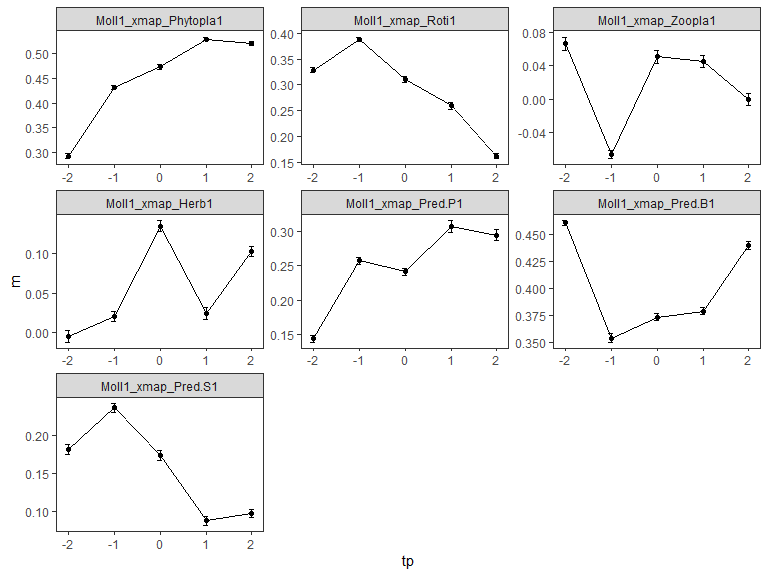

# Determine optimal time lags by lagged-CCM

## Set up

### Load packages

``` r
sessionInfo(); #R v.3.6.3
```

    ## R version 3.6.3 (2020-02-29)
    ## Platform: x86_64-w64-mingw32/x64 (64-bit)
    ## Running under: Windows 10 x64 (build 19045)
    ## 
    ## Matrix products: default
    ## 
    ## locale:
    ## [1] LC_COLLATE=Japanese_Japan.932  LC_CTYPE=Japanese_Japan.932   
    ## [3] LC_MONETARY=Japanese_Japan.932 LC_NUMERIC=C                  
    ## [5] LC_TIME=Japanese_Japan.932    
    ## 
    ## attached base packages:
    ## [1] stats     graphics  grDevices utils     datasets  methods   base     
    ## 
    ## loaded via a namespace (and not attached):
    ##  [1] compiler_3.6.3  magrittr_2.0.3  fastmap_1.1.0   cli_3.4.1      
    ##  [5] tools_3.6.3     htmltools_0.5.2 rstudioapi_0.11 yaml_2.2.1     
    ##  [9] stringi_1.4.6   rmarkdown_2.5   knitr_1.30      stringr_1.4.0  
    ## [13] xfun_0.19       digest_0.6.27   rlang_1.1.0     evaluate_0.14

``` r
library(rEDM); packageVersion("rEDM") #v.0.7.5
```

    ## [1] '0.7.5'

``` r
library(tidyr); packageVersion("tidyr") #v.1.1.2
```

    ## [1] '1.1.2'

``` r
library(dplyr); packageVersion("dplyr") #v.1.0.2
```

    ## 
    ## Attaching package: 'dplyr'

    ## The following objects are masked from 'package:stats':
    ## 
    ##     filter, lag

    ## The following objects are masked from 'package:base':
    ## 
    ##     intersect, setdiff, setequal, union

    ## [1] '1.0.2'

``` r
library(ggplot2); packageVersion("ggplot2") #v.3.3.2
```

    ## [1] '3.3.2'

### Data compile

``` r
all_Ts <- read.csv("../processed_data/all_Ts240123.csv") 

all_Ts <- 
  all_Ts %>%
  separate(Year_Tank, into=c("Year", "Tank"), sep="_") %>% #year and tank
  mutate(Treatment=substr(Tank, 1, nchar(Tank)-1)) %>% #treatment names
  mutate(Treatment=factor(Treatment, levels=c("Cont", "Fipro", "Pent", "Joint")), #order of treatment names
         Tank=factor(Tank, levels=unique(Tank)), #order of tank names
         Recipient=factor(Recipient, levels=c("Phytopla1", "Roti1", "Zoopla1", "Mp1", 
                                              "Det1", "Herb1", "Pred.P1", "Pred.B1", "Pred.S1", "Moll1"))) 

all_Ts$Recipient <- factor(all_Ts$Recipient, levels=unique(all_Ts$Recipient))
Tslist <- split(all_Ts, all_Ts$Recipient)

Phytopla1 <- subset(all_Ts, Recipient=="Phytopla1")
Roti1 <- subset(all_Ts, Recipient=="Roti1")
Zoopla1 <- subset(all_Ts, Recipient=="Zoopla1")
Mp1 <- subset(all_Ts, Recipient=="Mp1")
Det1 <- subset(all_Ts, Recipient=="Det1")
Herb1 <- subset(all_Ts, Recipient=="Herb1")
Pred.P1 <- subset(all_Ts, Recipient=="Pred.P1")
Pred.B1 <- subset(all_Ts, Recipient=="Pred.B1")
Pred.S1 <- subset(all_Ts, Recipient=="Pred.S1")
Moll1 <- subset(all_Ts, Recipient=="Moll1")
```

### Define combinations

``` r
targetlist <- c("Phytopla1", "Roti1", "Zoopla1", "Mp1", "Det1", "Herb1", "Pred.P1", "Pred.S1", "Moll1")

#ph
heterosp_Ph <- data.frame(Roti1=Tslist[["Roti1"]]$scAbundance, 
                          Det1=Tslist[["Det1"]]$scAbundance, 
                          Pred.P1=Tslist[["Pred.P1"]]$scAbundance, 
                          Pred.B1=Tslist[["Pred.B1"]]$scAbundance)

#roti
heterosp_Roti <- data.frame(Phytopla1=Tslist[["Phytopla1"]]$scAbundance, 
                            Zoopla1=Tslist[["Zoopla1"]]$scAbundance, 
                            Herb1=Tslist[["Herb1"]]$scAbundance, 
                            Pred.P1=Tslist[["Pred.P1"]]$scAbundance, 
                            Pred.B1=Tslist[["Pred.B1"]]$scAbundance, 
                            Moll1=Tslist[["Moll1"]]$scAbundance)

#zo
heterosp_Zo <- data.frame(Roti1=Tslist[["Roti1"]]$scAbundance, 
                          Herb1=Tslist[["Herb1"]]$scAbundance, 
                          Pred.P1=Tslist[["Pred.P1"]]$scAbundance, 
                          Pred.B1=Tslist[["Pred.B1"]]$scAbundance, 
                          Pred.S1=Tslist[["Pred.S1"]]$scAbundance)

#mp
heterosp_Mp <- data.frame(Phytopla1=Tslist[["Phytopla1"]]$scAbundance, 
                          Roti1=Tslist[["Roti1"]]$scAbundance, 
                          Zoopla1=Tslist[["Zoopla1"]]$scAbundance, 
                          Det1=Tslist[["Det1"]]$scAbundance, 
                          Herb1=Tslist[["Herb1"]]$scAbundance, 
                          Pred.P1=Tslist[["Pred.P1"]]$scAbundance, 
                          Pred.B1=Tslist[["Pred.B1"]]$scAbundance, 
                          Pred.S1=Tslist[["Pred.S1"]]$scAbundance, 
                          Moll1=Tslist[["Moll1"]]$scAbundance)

#det
heterosp_Det <- data.frame(Phytopla1=Tslist[["Phytopla1"]]$scAbundance, 
                           Roti1=Tslist[["Roti1"]]$scAbundance, 
                           Mp1=Tslist[["Mp1"]]$scAbundance, 
                           Herb1=Tslist[["Herb1"]]$scAbundance)

#herb
heterosp_Herb <- data.frame(Phytopla1=Tslist[["Phytopla1"]]$scAbundance, 
                            Mp1=Tslist[["Mp1"]]$scAbundance, 
                            Det1=Tslist[["Det1"]]$scAbundance, 
                            Pred.P1=Tslist[["Pred.P1"]]$scAbundance, 
                            Pred.B1=Tslist[["Pred.B1"]]$scAbundance)

#pp
heterosp_PP <- data.frame(Roti1=Tslist[["Roti1"]]$scAbundance)

#ps
heterosp_PS <- data.frame(Mp1=Tslist[["Mp1"]]$scAbundance, 
                          Pred.B1=Tslist[["Pred.B1"]]$scAbundance)

#moll
heterosp_Moll <- data.frame(Phytopla1=Tslist[["Phytopla1"]]$scAbundance, 
                            Roti1=Tslist[["Roti1"]]$scAbundance, 
                            Zoopla1=Tslist[["Zoopla1"]]$scAbundance, 
                            Herb1=Tslist[["Herb1"]]$scAbundance, 
                            Pred.P1=Tslist[["Pred.P1"]]$scAbundance, 
                            Pred.B1=Tslist[["Pred.B1"]]$scAbundance, 
                            Pred.S1=Tslist[["Pred.S1"]]$scAbundance)

heterosp_list <- 
  list("heterosp_Ph"=heterosp_Ph, 
       "heterosp_Roit"=heterosp_Roti, 
       "heterosp_Zo"=heterosp_Zo, 
       "heterosp_Mp"=heterosp_Mp, 
       "heterosp_Det"=heterosp_Det, 
       "heterosp_Herb"=heterosp_Herb, 
       "heterosp_PP"=heterosp_PP, 
       "heterosp_PS"=heterosp_PS, 
       "heterosp_Moll"=heterosp_Moll
  )
```

### Save best embeding dimensions and library and set params

-   See “Characteristics of time series (2017-2019 composite).html”

``` r
EPh <- 5; ERo <- 6; EZo <- 6; EMp <- 5; EDet <- 4; EHerb <- 6; EPP <- 5; EPB <- 2; EPS <- 5; EMoll=4
E_list <- c(EPh, ERo, EZo, EMp, EDet, EHerb, EPP, EPB, EPS, EMoll)
E_list_ <- E_list[-8]

lib_custom <- matrix(c(c(1,10, 12,21, 23,32, 34,43, 45,54, 56,65, 67,76, 78,87), #define library
                       c(1,10, 12,21, 23,32, 34,43, 45,54, 56,65, 67,76, 78,87)+88, 
                       c(1,10, 12,21, 23,32, 34,43, 45,54, 56,65, 67,76, 78,87)+176), ncol=2, byrow=TRUE)
lib_custom_Mp <- matrix(c(c(1,10, 12,21, 23,32, 34,43, 45,54, 56,65, 67,76, 78,87), #define library of macrophye
                          c(1,10, 12,21, 23,32, 34,43, 45,54, 56,65, 67,76, 78,87)+88, 
                          c(2,10, 13,21, 24,32, 35,43, 46,54, 57,65, 68,76, 79,87)+176), ncol=2, byrow=TRUE)

num_randsamp <- 100
```

## Do lagged CCM repeatedly

``` r
theme_set(theme_test())

ggfigs_list <- NULL
optlags_list <- NULL
medata_list <- NULL

lib_check <- function(k) {
  if (k==4) { 
    return(lib_custom_Mp)
  } else { 
    return(lib_custom)
  }
}

for (k in 1:length(targetlist)) {
  lagccmdata_list <- lapply(1:NCOL(heterosp_list[[k]]), function(j) {
    ccm_output <- lapply(-2:2, function(x) {
      set.seed(1)
      ccm_output_tpx <- 
        lapply(1:num_randsamp, 
               function(i) {
                 xmap_output <- ccm(cbind(Tslist[[targetlist[k]]]$scAbundance, heterosp_list[[k]][j]), E=E_list_[k], 
                                    lib=lib_check(k), #to switch library only when target is macrophytes 
                                    RNGseed=sample(1:1000000000, 1), lib_sizes=70, silent=TRUE, replace=FALSE, tp=x)
                 xmap_means <- ccm_means(xmap_output)
               })
      lag_means_tpx <- do.call(rbind, ccm_output_tpx)
      return(lag_means_tpx)
    }
    )
    lagccmdata <- do.call(rbind, ccm_output)
    return(lagccmdata)
  })
  lagccmdata <- do.call(rbind, lagccmdata_list)
  lagccmdata$Donor <- rep(colnames(heterosp_list[[k]]), each=num_randsamp*5)
  lagccmdata$Recipient <- targetlist[k]
  lagccmdata$xmapname <- with(lagccmdata, paste(Recipient, "_xmap_", Donor, sep=""))
  
  medata_list2 <- lapply(1:NCOL(heterosp_list[[k]]), function(i) {
    m <- with(subset(lagccmdata, Donor==colnames(heterosp_list[[k]][i])), tapply(rho, tp, mean))
    e <- with(subset(lagccmdata, Donor==colnames(heterosp_list[[k]][i])), tapply(rho, tp, sd))
    data.frame(m, e, tp=as.numeric(names(m)), Donor=colnames(heterosp_list[[k]][i]))
  }
  )
  names(medata_list2) <- unique(lagccmdata$xmapname) 
  medata <- do.call(rbind, medata_list2)
  medata$xmapname <- rep(names(medata_list2), each=5)
  medata$xmapname <- factor(medata$xmapname, levels=unique(medata$xmapname))
  
  medata_list <- append(medata_list, list(medata))
  
  ggfigs <- ggplot(medata, aes(x=tp, y=m)) + geom_line() + geom_point() + 
    geom_errorbar(aes(ymax=m+e, ymin=m-e), width=0.1) + 
    facet_wrap(~xmapname, scales="free")
  
  ggfigs_list <- append(ggfigs_list, list(ggfigs))
  
  optlags <- sapply(medata_list2, function(x) subset(x, m==max(m))$tp)
  
  optlags_list <- append(optlags_list, list(optlags))
  
}
```

## Summary of lagged CCM

``` r
Optlag <- do.call(c, optlags_list)
Optlag <- c(Optlag[1:which(names(Optlag)=="Pred.P1_xmap_Roti1")], NA, Optlag[which(names(Optlag)=="Pred.S1_xmap_Mp1"):length(Optlag)])

Effect <- factor(
  c(
    rep("Ph", times=length(optlags_list[[1]])), 
    rep("Ro", times=length(optlags_list[[2]])), 
    rep("Zo", times=length(optlags_list[[3]])), 
    rep("Mp", times=length(optlags_list[[4]])), 
    rep("Det", times=length(optlags_list[[5]])), 
    rep("Herb", times=length(optlags_list[[6]])), 
    rep("PP", times=length(optlags_list[[7]])), 
    rep("PB", times=1),
    rep("PS", times=length(optlags_list[[8]])), 
    rep("Moll", times=length(optlags_list[[9]]))), 
  levels=c("Ph", "Ro", "Zo", "Mp", "Det", "Herb", "PP", "PB", "PS", "Moll"))
Cause <- factor(
  c(
    c("Ro", "Det", "PP", "PB"), 
    c("Ph", "Zo", "Herb", "PP", "PB", "Moll"), 
    c("Ro", "Herb", "PP", "PB", "PS"), 
    c("Ph", "Ro", "Zo", "Det", "Herb", "PP", "PB", "PS", "Moll"), 
    c("Ph", "Ro", "Mp", "Herb"), 
    c("Ph", "Mp", "Det", "PP", "PB"), 
    c("Ro"), 
    c(NA),
    c("Mp", "PB"), 
    c("Ph", "Ro", "Zo", "Herb", "PP", "PB", "PS")), 
  levels=c("Ph", "Ro", "Zo", "Mp", "Det", "Herb", "PP", "PB", "PS", "Moll"))
DataOptlag <- data.frame(Optlag, Effect, Cause)
Optlagmat <- 
  DataOptlag %>%
  spread(key=Effect, value=Optlag) %>%
  head(n=10)
rownames(Optlagmat) <- Optlagmat$Cause
Optlagmat <- t(Optlagmat[,-1])
Optlagmat
```

    ##      Ph Ro Zo Mp Det Herb PP PB PS Moll
    ## Ph   NA -1 NA NA  -1   NA -2  2 NA   NA
    ## Ro   -2 NA  1 NA  NA    0 -2  2 NA    2
    ## Zo   NA -2 NA NA  NA    2  2  2  2   NA
    ## Mp    1 -2  2 NA   2   -1 -1  2  2    1
    ## Det   0 -2 NA -2  NA    2 NA NA NA   NA
    ## Herb  0 NA NA -2  -2   NA  2  2 NA   NA
    ## PP   NA -2 NA NA  NA   NA NA NA NA   NA
    ## PB   NA NA NA NA  NA   NA NA NA NA   NA
    ## PS   NA NA NA -2  NA   NA NA  1 NA   NA
    ## Moll  1 -1 -2 NA  NA    0  1 -2 -1   NA

``` r
write.csv(Optlagmat, "../4_2_CCM/ccm_tables/Optlagmat.csv", row.names=FALSE)
```

``` r
for (i in 1:9) {
  plot(ggfigs_list[[i]])
}
```


