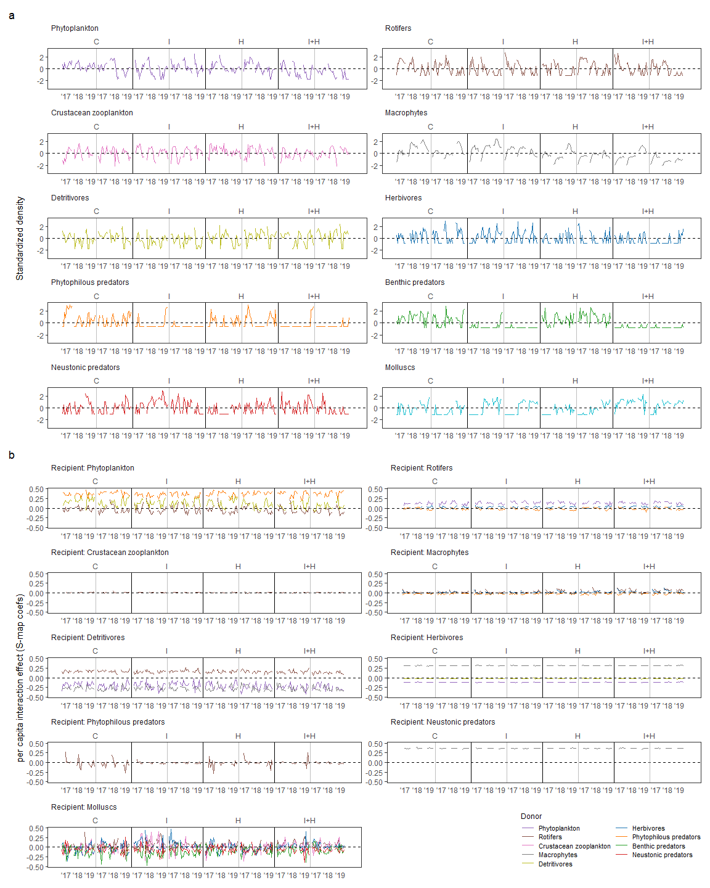

# Estimation of per capita interaction effects by regularized S-map

### Load required packages

``` r
sessionInfo() #save session information
```

    ## R version 3.6.3 (2020-02-29)
    ## Platform: x86_64-w64-mingw32/x64 (64-bit)
    ## Running under: Windows 10 x64 (build 19045)
    ## 
    ## Matrix products: default
    ## 
    ## locale:
    ## [1] LC_COLLATE=Japanese_Japan.932  LC_CTYPE=Japanese_Japan.932   
    ## [3] LC_MONETARY=Japanese_Japan.932 LC_NUMERIC=C                  
    ## [5] LC_TIME=Japanese_Japan.932    
    ## 
    ## attached base packages:
    ## [1] stats     graphics  grDevices utils     datasets  methods   base     
    ## 
    ## loaded via a namespace (and not attached):
    ##  [1] compiler_3.6.3  magrittr_2.0.3  fastmap_1.1.0   cli_3.4.1      
    ##  [5] tools_3.6.3     htmltools_0.5.2 rstudioapi_0.11 yaml_2.2.1     
    ##  [9] stringi_1.4.6   rmarkdown_2.5   knitr_1.30      stringr_1.4.0  
    ## [13] xfun_0.19       digest_0.6.27   rlang_1.1.0     evaluate_0.14

``` r
library(rEDM); packageVersion("rEDM") #0.7.5
```

    ## [1] '0.7.5'

``` r
library(dplyr); packageVersion("dplyr") #1.0.2
```

    ## 
    ## Attaching package: 'dplyr'

    ## The following objects are masked from 'package:stats':
    ## 
    ##     filter, lag

    ## The following objects are masked from 'package:base':
    ## 
    ##     intersect, setdiff, setequal, union

    ## [1] '1.0.2'

``` r
library(tidyr); packageVersion("tidyr") #1.1.2
```

    ## [1] '1.1.2'

``` r
library(ggplot2); packageVersion("ggplot2") #3.3.2
```

    ## [1] '3.3.2'

``` r
library(patchwork); packageVersion("patchwork") #1.1.1
```

    ## [1] '1.1.1'

``` r
library(ggsci); packageVersion("ggsci") #2.9
```

    ## [1] '2.9'

``` r
library(glmnet); packageVersion("glmnet") # 4.1.6, 2022.11.28
```

    ## Loading required package: Matrix

    ## 
    ## Attaching package: 'Matrix'

    ## The following objects are masked from 'package:tidyr':
    ## 
    ##     expand, pack, unpack

    ## Loaded glmnet 4.1-6

    ## [1] '4.1.6'

### Load data

``` r
all_Ts <- read.csv("./processed_data/all_Ts240123.csv", header=TRUE)
all_Ts <- as_tibble(all_Ts)
all_Ts$Recipient <- factor(all_Ts$Recipient, levels=unique(all_Ts$Recipient))
Tslist <- split(all_Ts, all_Ts$Recipient)
```

## Save best embedding dimensions and library

-   See “Determine optimal embedding dimensions E”

``` r
EPh <- 5; ERo <- 6; EZo <- 6; EMp <- 5; EDet <- 4; EHerb <- 6; EPP <- 5; EPB <- 2; EPS <- 5; EMoll <- 4
E_list <- c(EPh, ERo, EZo, EMp, EDet, EHerb, EPP, EPB, EPS, EMoll)
E_list_ <- E_list[-8]

lib_custom_ <- matrix(c(c(1,10, 12,21, 23,32, 34,43, 45,54, 56,65, 67,76, 78,87), #define library
                        c(1,10, 12,21, 23,32, 34,43, 45,54, 56,65, 67,76, 78,87)+88, 
                        c(1,10, 12,21, 23,32, 34,43, 45,54, 56,65, 67,76, 78,87)+176), ncol=2, byrow=TRUE)
lib_custom_Mp_ <- matrix(c(c(1,10, 12,21, 23,32, 34,43, 45,54, 56,65, 67,76, 78,87), #define library of macrophye
                           c(1,10, 12,21, 23,32, 34,43, 45,54, 56,65, 67,76, 78,87)+88, 
                           c(2,10, 13,21, 24,32, 35,43, 46,54, 57,65, 68,76, 79,87)+176), ncol=2, byrow=TRUE)
```

## Do multivariate S-map

-   NOTE: LOOCV algorithm does not need the data at t when predicting
    the target point at t. Therefore, it is OK that the library matrix
    is defined as “1-10, 12-21,…”.

### Define utility functions

-   Source code:
    <https://github.com/ong8181/random-codes/tree/master/02_RegularizedSmap>

``` r
# Make multivariate embedding

make_BLOCK <- function(data, lib, heterosp, E) {
  if (E-ncol(heterosp) < 2) {
    BLOCK <- make_block(data$scAbundance, max_lag=1, lib=lib)
    BLOCK <- 
      BLOCK %>% 
      mutate(KEY=gl(24, 10)) %>% split(., f=.$KEY) %>% 
      lapply(., function(x) rbind(x, rep(NaN, 1))) %>% do.call(rbind, .) %>% select(-time, -KEY)
    BLOCK <- cbind(BLOCK[,1, drop=FALSE], heterosp)
  } else {
    BLOCK <- make_block(data$scAbundance, max_lag=(E-ncol(heterosp)), lib=lib)
    BLOCK <- 
      BLOCK %>% 
      mutate(KEY=gl(24, 10)) %>% split(., f=.$KEY) %>% 
      lapply(., function(x) rbind(x, rep(NaN, (E-ncol(heterosp))))) %>% do.call(rbind, .) %>% select(-time, -KEY)
    BLOCK <- cbind(BLOCK[,1, drop=FALSE], heterosp, BLOCK[,2:(E-ncol(heterosp)), drop=FALSE])
  }
  pcgrowth <- 
    data %>%
    group_by(Year_Tank) %>%
    mutate(pcgrowth=log(lead(Abundance+1)/(Abundance+1))) %>%
    .$pcgrowth
  BLOCK <- cbind(BLOCK, pcgrowth)
  return(BLOCK)
}

# Do ordinary multivariate S-map (not necessary but maybe useful if readers are interested in)

mult_smap_custom <- function(block, tp, target_column, lib, columns, errorindex) {
  #determine optimal theta
  mlt_smap_res.0 <- block_lnlp(block=block, tp=tp, target_column=target_column, lib=lib, columns=columns,
                               method="s-map", theta=seq(0, 10,by=0.1), silent=TRUE)
  
  p1 <- ggplot(mlt_smap_res.0, aes(x=theta, y=rho)) + geom_line() + geom_point()
  p2 <- ggplot(mlt_smap_res.0, aes(x=theta, y=mae)) + geom_line() + geom_point()
  p3 <- ggplot(mlt_smap_res.0, aes(x=theta, y=rmse)) + geom_line() + geom_point()
  optim_theta_fig <- p1 + p2 + p3
  optim_theta_fig
  
  Tm <- mlt_smap_res.0[which.min(mlt_smap_res.0[, errorindex]), "theta"]
  Tm
  
  #track IS
  mlt_smap_res.1 <- block_lnlp(block=block, tp=tp, target_column=target_column, lib=lib, columns=columns,
                               method="s-map", theta=Tm, silent=TRUE, save_smap_coefficients=TRUE)
  
  return(list(optim_theta_fig, Tm, mlt_smap_res.1))
}

# Compile results of ordinary S-map (not necessary but maybe useful if readers are interested in)

mult_smap_datacomp <- function(smap_res, target, heterosp, n) {
  if (n==4) {
    Treatment <- gl(4, 20, labels=c("Cont", "Fipro", "Pent", "Joint")) #save treatment info
    Tank <- rep(paste(rep(unique(Treatment), each=2), as.factor(1:2), sep=""), each=10)
    Week <- seq(2, 20, 2) #save week info
    Year <- rep(c(2017, 2018, 2019), each=80)
    smap_res$smap_coefficients[[1]] <- 
      cbind(smap_res$smap_coefficients[[1]],  
            Treatment=rep(Treatment, times=3)[-seq(161, 231, 10)], 
            Tank=rep(Tank, times=3)[-seq(161, 231, 10)], 
            Week=rep(Week, times=24)[-seq(161, 231, 10)], 
            Year=Year[-seq(161, 231, 10)],
            na.omit(heterosp)[-seq(161, 231, 10), ], na.omit(target)[, "scAbundance"])
    return(smap_res)
  } else {
    Treatment <- gl(4, 20, labels=c("Cont", "Fipro", "Pent", "Joint")) #save treatment info
    Tank <- rep(paste(rep(unique(Treatment), each=2), as.factor(1:2), sep=""), each=10)
    Week <- seq(2, 20, 2) #save week info
    Year <- rep(c(2017, 2018, 2019), each=80)
    smap_res$smap_coefficients[[1]] <- 
      cbind(smap_res$smap_coefficients[[1]], Treatment, Tank, Week, Year, 
            heterosp[-which(is.na(Tslist[["Roti1"]]$scAbundance)), , drop=FALSE], target[-which(is.na(Tslist[["Roti1"]]$scAbundance)), "scAbundance", drop=FALSE])
    return(smap_res)
  }
}

# Do regularized multiple S-map (source code: https://github.com/ong8181/random-codes/tree/master/02_RegularizedSmap)

regulSmap0 <- function(block, tp, target_column, lib, columns) {
  
  ran_seed <- 123
  set.seed(ran_seed)
  
  # Load defined functions
  source("./src/Extended_SSR_v1.R")
  source("./src/Extended_Smap_v1.R")
  
  # Set parameter ranges
  theta_test <- c(0, 0.1, 0.5, 1, 1.5, 2, 2.5, 3, 4, 6, 8)
  lambda_test <- c(0, 1e-4, 1e-3, 1e-2, 0.1, 0.5, 1, 2)
  
  #---------- Manual implementation of the regularized S-map ----------#
  # Register cores
  cl <- parallel::makeCluster(4)
  doParallel::registerDoParallel(cl)
  
  # Prepare result objects
  y1_smap_stats <- y1_ridge_stats <- y1_lasso_stats <-
    data.frame(theta = NA, lambda = NA, N = NA, rho = NA, mae = NA, rmse = NA)
  
  # Check parameter dependence (take time, depending on your environment)
  # If "lambda" value is not provided, 10-fold cross validation will be automatically applied to determine the best lambda.
  for(i in 1:length(theta_test))
  {
    for(j in 1:length(lambda_test))
    {
      y1_smap <- extended_lnlp(block=block, lib=lib, tp=tp, target_column=target_column, lib_column=columns, 
                               theta = theta_test[i], lambda = lambda_test[j],
                               method = "s-map", regularized = F, random_seed = ran_seed, no_parallel = FALSE)
      y1_ridge <- extended_lnlp(block=block, lib=lib, tp=tp, target_column=target_column, lib_column=columns, 
                                theta = theta_test[i], lambda = lambda_test[j],
                                method = "s-map", regularized = T, alpha = 0, random_seed = ran_seed, no_parallel = FALSE)
      # y1_lasso <- extended_lnlp(block=block, lib=lib, tp=tp, target_column=target_column, lib_column=columns, 
      #                           theta = theta_test[i], lambda = lambda_test[j],
      #                           method = "s-map", regularized = T, alpha = 1, random_seed = ran_seed, no_parallel = FALSE)
      
      # Summarize results
      y1_smap_stats[((i-1)*8+j),] <- data.frame(theta = theta_test[i], lambda = lambda_test[j], y1_smap$stats)
      y1_ridge_stats[((i-1)*8+j),] <- data.frame(theta = theta_test[i], lambda = lambda_test[j], y1_ridge$stats)
      # y1_lasso_stats[((i-1)*8+j),] <- data.frame(theta = theta_test[i], lambda = lambda_test[j], y1_lasso$stats)
    }
  }
  parallel::stopCluster(cl)
  
  #---------- Compare results ----------#
  # Combine results
  y1_smap_stats$method <- "smap_manual"
  y1_ridge_stats$method <- "ridge"
  # y1_lasso_stats$method <- "lasso"
  stats_all <- rbind(y1_smap_stats[seq(1, 81, 8),], y1_ridge_stats)
  # stats_all <- rbind(y1_smap_stats[seq(1, 81, 8),], y1_ridge_stats, y1_lasso_stats)
  stats_all$lambda <- factor(stats_all$lambda)
  
  return(stats_all)
}

regulSmap1 <- function(block, tp, target_column, lib, columns, theta, lambda, regularized) {
  
  ran_seed <- 123
  set.seed(ran_seed)
  
  # Load defined functions
  source("./src/Extended_SSR_v1.R")
  source("./src/Extended_Smap_v1.R")
  
  #track IS
  mlt_smap_res.1 <- extended_lnlp(block=block, lib=lib, tp=tp, target_column=target_column, lib_column=columns, 
                                  theta = theta, lambda = lambda,
                                  method = "s-map", regularized = regularized, random_seed = ran_seed, no_parallel = TRUE, 
                                  save_smap_coefficients=TRUE)

  return(mlt_smap_res.1)
}

# Compile results of regularized S-map

regul_smap_datacomp <- function(smap_res, target, heterosp, n) {
  if (n==4) {
    Treatment <- gl(4, 20, labels=c("Cont", "Fipro", "Pent", "Joint")) #save treatment info
    Tank <- rep(paste(rep(unique(Treatment), each=2), as.factor(1:2), sep=""), each=10)
    Week <- seq(2, 20, 2) #save week info
    Year <- rep(c(2017, 2018, 2019), each=80)
    smap_res$smap_coefficients <- smap_res$smap_coefficients[-seq(11, 264, 11), ]
    smap_res$smap_coefficients <- smap_res$smap_coefficients[-seq(161, 231, 10), ]
    smap_res$smap_coefficients <- 
      cbind(smap_res$smap_coefficients,  
            Treatment=rep(Treatment, times=3)[-seq(161, 231, 10)], 
            Tank=rep(Tank, times=3)[-seq(161, 231, 10)], 
            Week=rep(Week, times=24)[-seq(161, 231, 10)], 
            Year=Year[-seq(161, 231, 10)], 
            na.omit(heterosp)[-seq(161, 231, 10), , drop=FALSE], na.omit(target)[, "scAbundance", drop=FALSE])
    return(smap_res)
  } else {
    Treatment <- gl(4, 20, labels=c("Cont", "Fipro", "Pent", "Joint")) #save treatment info
    Tank <- rep(paste(rep(unique(Treatment), each=2), as.factor(1:2), sep=""), each=10)
    Week <- seq(2, 20, 2) #save week info
    Year <- rep(c(2017, 2018, 2019), each=80)
    smap_res$smap_coefficients <- smap_res$smap_coefficients[-seq(11, 264, 11), ]
    smap_res$smap_coefficients <- 
      cbind(smap_res$smap_coefficients, Treatment, Tank, Week, Year, 
            heterosp[-which(is.na(Tslist[["Roti1"]]$scAbundance)), , drop=FALSE], target[-which(is.na(Tslist[["Roti1"]]$scAbundance)), "scAbundance", drop=FALSE])
    return(smap_res)
  }
}
```

### Define combination of organisms

``` r
targetlist <- c("Phytopla1", "Roti1", "Zoopla1", "Mp1", "Det1", "Herb1", "Pred.P1", "Pred.S1", "Moll1")

#ph: rotifer and phytophilous predator were significant, detritivore was marginally significant
heterosp_Ph <- data.frame(Roti1=Tslist[["Roti1"]]$scAbundance, Det1=Tslist[["Det1"]]$scAbundance, Pred.P1=Tslist[["Pred.P1"]]$scAbundance)

#roti: phytopla, herbivore and phytophilous predator were significant
heterosp_Roti <- data.frame(Phytopla1=Tslist[["Phytopla1"]]$scAbundance, Herb1=Tslist[["Herb1"]]$scAbundance, Pred.P1=Tslist[["Pred.P1"]]$scAbundance)

#zo: rotifer was significant
heterosp_Zo <- data.frame(Roti1=Tslist[["Roti1"]]$scAbundance)

#mp: rotifer, herbivore and phytophilous predator were significant
heterosp_Mp <- data.frame(Roti1=Tslist[["Roti1"]]$scAbundance, Herb1=Tslist[["Herb1"]]$scAbundance, Pred.P1=Tslist[["Pred.P1"]]$scAbundance)

#det: phytopla and macrophyte were significant, rotifer was marginally significant
heterosp_Det <- data.frame(Phytopla1=Tslist[["Phytopla1"]]$scAbundance, Roti1=Tslist[["Roti1"]]$scAbundance, Mp1=Tslist[["Mp1"]]$scAbundance)

#herb: phytopla, macrophyte, and detritivore were significant
heterosp_Herb <- data.frame(Phytopla1=Tslist[["Phytopla1"]]$scAbundance, Mp1=Tslist[["Mp1"]]$scAbundance, Det1=Tslist[["Det1"]]$scAbundance)

#pp: rotifer was significant
heterosp_PP <- data.frame(Roti1=Tslist[["Roti1"]]$scAbundance)

#ps: macrophyte was significant
heterosp_PS <- data.frame(Mp1=Tslist[["Mp1"]]$scAbundance)

#moll: rotifer, zoopla, herbivore, benthic predator, and surface predator were significant
heterosp_Moll <- data.frame(Roti1=Tslist[["Roti1"]]$scAbundance, Zoopla1=Tslist[["Zoopla1"]]$scAbundance, Herb1=Tslist[["Herb1"]]$scAbundance, 
                            Pred.B1=Tslist[["Pred.B1"]]$scAbundance, Pred.S1=Tslist[["Pred.S1"]]$scAbundance)

heterosp_list <- 
  list("heterosp_Ph"=heterosp_Ph, 
       "heterosp_Roit"=heterosp_Roti, 
       "heterosp_Zo"=heterosp_Zo, 
       "heterosp_Mp"=heterosp_Mp, 
       "heterosp_Det"=heterosp_Det, 
       "heterosp_Herb"=heterosp_Herb, 
       "heterosp_PP"=heterosp_PP, 
       "heterosp_PS"=heterosp_PS, 
       "heterosp_Moll"=heterosp_Moll
  )
```

### Do regularized S-map repeatedly

-   \*Regularized S-map (ridge regressions) provided almost equivalent
    results relative to using ordinal S-map.

``` r
theme_set(theme_test())

# Make block

BLOCK_list <- lapply(1:9, function(i) {
  make_BLOCK(data=Tslist[[targetlist[i]]], 
             lib=lib_custom_, 
             heterosp=heterosp_list[[i]], 
             E=E_list_[i])
})
names(BLOCK_list) <- targetlist


# Determine optimal parameter combination

regul_smap_res.0_list <- lapply(1:9, function(i) {
  if (i==4) {
    regulSmap0(block=BLOCK_list[[i]], tp=0, target_column=ncol(BLOCK_list[[i]]),
              lib=lib_custom_Mp_, columns=1:(ncol(BLOCK_list[[i]])-1))
  } else {
    regulSmap0(block=BLOCK_list[[i]], tp=0, target_column=ncol(BLOCK_list[[i]]),
              lib=lib_custom_, columns=1:(ncol(BLOCK_list[[i]])-1))

  }
})

rsmap0_figs <- lapply(1:9, function(i) {
  # ggplot visualization
  g1 <- ggplot(regul_smap_res.0_list[[i]], aes(x = theta, y = rmse, color = lambda, facet = method, group = lambda))
  g1 <- g1 + geom_point() + geom_line() + facet_grid(.~method)
  g1 <- g1 + xlab(expression(theta)) + ylab("RMSE")
  g1 <- g1 +  scale_color_discrete(name = expression(lambda))
  g1 <- g1 + labs(title=targetlist[i])
})
rsmap0_figs[[1]]
```


``` r
rsmap0_figs[[2]]
```


``` r
rsmap0_figs[[3]]
```


``` r
rsmap0_figs[[4]]
```


``` r
rsmap0_figs[[5]]
```


``` r
rsmap0_figs[[6]]
```


``` r
rsmap0_figs[[7]]
```


``` r
rsmap0_figs[[8]]
```


``` r
rsmap0_figs[[9]]
```


``` r
optpar <- NULL
for (i in 1:9){
  target <- targetlist[i]
  pars <- filter(regul_smap_res.0_list[[i]], method=="ridge") %>% arrange(rmse) %>% .[1, c("theta", "lambda", "method")]
  pars <- cbind(target, pars)
  optpar <- rbind(optpar, pars)
}
optpar #show optimal parameter values
```

    ##        target theta lambda method
    ## 44  Phytopla1   2.0   0.01  ridge
    ## 29      Roti1   1.0    0.1  ridge
    ## 5     Zoopla1   0.0    0.1  ridge
    ## 77        Mp1   6.0    0.1  ridge
    ## 491      Det1   2.5      0  ridge
    ## 4       Herb1   0.0   0.01  ridge
    ## 88    Pred.P1   8.0      2  ridge
    ## 41    Pred.S1   0.0   0.01  ridge
    ## 79      Moll1   6.0      1  ridge

``` r
# Estimate smap coefficients

regul_smap_res.1_list <- lapply(1:9, function(i) {
  if (i==4) {
    regulSmap1(block=BLOCK_list[[i]], tp=0, target_column=ncol(BLOCK_list[[i]]),
               lib=lib_custom_Mp_, columns=1:(ncol(BLOCK_list[[i]])-1),
               theta=optpar[i, "theta"], lambda=as.numeric(as.character(optpar[i, "lambda"])), regularized=TRUE)
  } else {
    regulSmap1(block=BLOCK_list[[i]], tp=0, target_column=ncol(BLOCK_list[[i]]),
               lib=lib_custom_, columns=1:(ncol(BLOCK_list[[i]])-1),
               theta=optpar[i, "theta"], lambda=as.numeric(as.character(optpar[i, "lambda"])), regularized=TRUE)

  }
})

# Result compilation

regul_smap_res.1_list <- lapply(1:9, function(i) {
  regul_smap_datacomp(smap_res=regul_smap_res.1_list[[i]],
                     target=Tslist[[targetlist[i]]],
                     heterosp=heterosp_list[[i]],
                     n=i)
})
names(regul_smap_res.1_list) <- targetlist

colnames(heterosp_list[[1]])
```

    ## [1] "Roti1"   "Det1"    "Pred.P1"

``` r
figs <- list()
for (z in 1:9) {
  f_list <- lapply(1:ncol(heterosp_list[[z]]), function(i) {
    smapcoefs <- colnames(regul_smap_res.1_list[[z]]$smap_coefficients)[3:(ncol(heterosp_list[[z]])+2)]
    donor <- colnames(heterosp_list[[z]])
    recip <- names(regul_smap_res.1_list)[z]
    ggplot(regul_smap_res.1_list[[z]]$smap_coefficients, aes(x=Treatment, y=!!as.name(smapcoefs[i]), fill=Treatment)) +
      geom_boxplot() + geom_hline(yintercept=0, linetype=2) + ggtitle(paste(recip, donor[i], sep="<-"))
  }
  )
  fig <- f_list[[1]]
  if ((ncol(heterosp_list[[z]])-1)<=0) {
    figs <- c(figs, list(fig))
  } else {
    for (j in 1:(ncol(heterosp_list[[z]])-1)) {
      fig <- fig + f_list[[j+1]]
    }
    figs <- c(figs, list(fig))
  }
}
figs[[9]] <- figs[[9]] + plot_layout(nrow=1)
```

### Visualize treatment effects on S-map coefs

``` r
windows(11, 15, rescale="fixed")
((figs[[1]] + plot_spacer() + plot_spacer() + plot_layout(nrow=1)) /
    (figs[[2]] + plot_spacer() + plot_spacer() + plot_layout(nrow=1)) /
    (figs[[3]] + plot_spacer() + plot_spacer() + plot_spacer() + plot_spacer() + plot_layout(nrow=1)) /
    (figs[[4]] + plot_spacer() + plot_spacer() + plot_layout(nrow=1)) /
    (figs[[5]] + plot_spacer() + plot_spacer() + plot_layout(nrow=1)) /
    (figs[[6]] + plot_spacer() + plot_spacer() + plot_layout(nrow=1)) /
    (figs[[7]] + plot_spacer() + plot_spacer() + plot_spacer() + plot_spacer() + plot_layout(nrow=1)) /
    (figs[[8]] + plot_spacer() + plot_spacer() + plot_spacer() + plot_spacer() + plot_layout(nrow=1)) /
    figs[[9]]  + plot_layout(guides="collect"))&theme(plot.title=element_text(size=rel(0.8)))
```

    ## Warning: Removed 24 rows containing non-finite values (stat_boxplot).

    ## Warning: Removed 24 rows containing non-finite values (stat_boxplot).

    ## Warning: Removed 24 rows containing non-finite values (stat_boxplot).

    ## Warning: Removed 48 rows containing non-finite values (stat_boxplot).

    ## Warning: Removed 48 rows containing non-finite values (stat_boxplot).

    ## Warning: Removed 48 rows containing non-finite values (stat_boxplot).

    ## Warning: Removed 96 rows containing non-finite values (stat_boxplot).

    ## Warning: Removed 24 rows containing non-finite values (stat_boxplot).

    ## Warning: Removed 24 rows containing non-finite values (stat_boxplot).

    ## Warning: Removed 24 rows containing non-finite values (stat_boxplot).

    ## Warning: Removed 8 rows containing non-finite values (stat_boxplot).

    ## Warning: Removed 8 rows containing non-finite values (stat_boxplot).

    ## Warning: Removed 8 rows containing non-finite values (stat_boxplot).

    ## Warning: Removed 48 rows containing non-finite values (stat_boxplot).

    ## Warning: Removed 48 rows containing non-finite values (stat_boxplot).

    ## Warning: Removed 48 rows containing non-finite values (stat_boxplot).

    ## Warning: Removed 72 rows containing non-finite values (stat_boxplot).

    ## Warning: Removed 72 rows containing non-finite values (stat_boxplot).


### Visualize donor- and recipient-density-dependence

``` r
donorfigs <- lapply(1:9, function(i) {
  lapply(1:ncol(heterosp_list[[i]]), function(j) {
    smapcoefs <- paste(rep("c", times=j), 2:(j+1), sep="_")
    ggplot(regul_smap_res.1_list[[i]]$smap_coefficients, 
           aes(x=!!as.name(colnames(heterosp_list[[i]])[j]), y=!!as.name(smapcoefs[j]), color=Treatment)) +
      geom_point(aes(color=Treatment)) +
      geom_smooth(method="lm", alpha=0.2) +
      geom_hline(yintercept=0, linetype=2)
  })
})
names(donorfigs) <- targetlist

rm(figs)

FUNCT <- function(i) {
  fig <- donorfigs[[i]][[1]]
  if ((ncol(heterosp_list[[i]])-1)<=0) { 
    fig <- fig + ggtitle(names(donorfigs)[i]) 
    return(fig)
  } else {
    for (j in 2:(ncol(heterosp_list[[i]]))) {
      fig <- fig + donorfigs[[i]][[j]]  
    }
    fig <- fig + plot_annotation(title=names(donorfigs)[i]) + plot_layout(guides="collect")
    return(fig)
  }
}

FUNCT(1)
```

    ## `geom_smooth()` using formula 'y ~ x'

    ## Warning: Removed 24 rows containing non-finite values (stat_smooth).

    ## Warning: Removed 24 rows containing missing values (geom_point).

    ## `geom_smooth()` using formula 'y ~ x'

    ## Warning: Removed 24 rows containing non-finite values (stat_smooth).

    ## Warning: Removed 24 rows containing missing values (geom_point).

    ## `geom_smooth()` using formula 'y ~ x'

    ## Warning: Removed 24 rows containing non-finite values (stat_smooth).

    ## Warning: Removed 24 rows containing missing values (geom_point).


``` r
FUNCT(2)
```

    ## `geom_smooth()` using formula 'y ~ x'

    ## Warning: Removed 48 rows containing non-finite values (stat_smooth).

    ## Warning: Removed 48 rows containing missing values (geom_point).

    ## `geom_smooth()` using formula 'y ~ x'

    ## Warning: Removed 48 rows containing non-finite values (stat_smooth).

    ## Warning: Removed 48 rows containing missing values (geom_point).

    ## `geom_smooth()` using formula 'y ~ x'

    ## Warning: Removed 48 rows containing non-finite values (stat_smooth).

    ## Warning: Removed 48 rows containing missing values (geom_point).


``` r
FUNCT(3)
```

    ## `geom_smooth()` using formula 'y ~ x'

    ## Warning: Removed 96 rows containing non-finite values (stat_smooth).

    ## Warning: Removed 96 rows containing missing values (geom_point).


``` r
FUNCT(4)
```

    ## `geom_smooth()` using formula 'y ~ x'

    ## Warning: Removed 24 rows containing non-finite values (stat_smooth).

    ## Warning: Removed 24 rows containing missing values (geom_point).

    ## `geom_smooth()` using formula 'y ~ x'

    ## Warning: Removed 24 rows containing non-finite values (stat_smooth).

    ## Warning: Removed 24 rows containing missing values (geom_point).

    ## `geom_smooth()` using formula 'y ~ x'

    ## Warning: Removed 24 rows containing non-finite values (stat_smooth).

    ## Warning: Removed 24 rows containing missing values (geom_point).


``` r
FUNCT(5)
```

    ## `geom_smooth()` using formula 'y ~ x'

    ## Warning: Removed 8 rows containing non-finite values (stat_smooth).

    ## Warning: Removed 8 rows containing missing values (geom_point).

    ## `geom_smooth()` using formula 'y ~ x'

    ## Warning: Removed 8 rows containing non-finite values (stat_smooth).

    ## Warning: Removed 8 rows containing missing values (geom_point).

    ## `geom_smooth()` using formula 'y ~ x'

    ## Warning: Removed 8 rows containing non-finite values (stat_smooth).

    ## Warning: Removed 8 rows containing missing values (geom_point).


``` r
FUNCT(6)
```

    ## `geom_smooth()` using formula 'y ~ x'

    ## Warning: Removed 48 rows containing non-finite values (stat_smooth).

    ## Warning: Removed 48 rows containing missing values (geom_point).

    ## `geom_smooth()` using formula 'y ~ x'

    ## Warning: Removed 48 rows containing non-finite values (stat_smooth).

    ## Warning: Removed 48 rows containing missing values (geom_point).

    ## `geom_smooth()` using formula 'y ~ x'

    ## Warning: Removed 48 rows containing non-finite values (stat_smooth).

    ## Warning: Removed 48 rows containing missing values (geom_point).


``` r
FUNCT(7)
```

    ## `geom_smooth()` using formula 'y ~ x'

    ## Warning: Removed 72 rows containing non-finite values (stat_smooth).

    ## Warning: Removed 72 rows containing missing values (geom_point).


``` r
FUNCT(8)
```

    ## `geom_smooth()` using formula 'y ~ x'

    ## Warning: Removed 72 rows containing non-finite values (stat_smooth).

    ## Warning: Removed 72 rows containing missing values (geom_point).


``` r
FUNCT(9)
```

    ## `geom_smooth()` using formula 'y ~ x'
    ## `geom_smooth()` using formula 'y ~ x'
    ## `geom_smooth()` using formula 'y ~ x'
    ## `geom_smooth()` using formula 'y ~ x'
    ## `geom_smooth()` using formula 'y ~ x'


``` r
recipfigs <- lapply(1:9, function(i) {
  lapply(1:ncol(heterosp_list[[i]]), function(j) {
    smapcoefs <- paste(rep("c", times=j), 2:(j+1), sep="_")
    ggplot(regul_smap_res.1_list[[i]]$smap_coefficients, 
           aes(x=scAbundance, y=!!as.name(smapcoefs[j]), color=Treatment)) +
      geom_point(aes(color=Treatment)) +
      geom_smooth(method="lm", alpha=0.2) +
      geom_hline(yintercept=0, linetype=2)
  })
})
names(recipfigs) <- targetlist


FUNCT2 <- function(i) {
  fig <- recipfigs[[i]][[1]]
  if ((ncol(heterosp_list[[i]])-1)<=0) { 
    fig <- fig + 
      labs(title=names(recipfigs)[i], subtitle=paste("donor", colnames(heterosp_list[[i]])[1], sep=":")) 
    return(fig)
  } else {
    fig <- fig + 
      labs(subtitle=paste("donor", colnames(heterosp_list[[i]])[1], sep=":")) 
    for (j in 2:(ncol(heterosp_list[[i]]))) {
      recipfigs[[i]][[j]] <- recipfigs[[i]][[j]] + 
        labs(subtitle=paste("donor", colnames(heterosp_list[[i]])[j], sep=":"))
      fig <- fig + recipfigs[[i]][[j]]  
    }
    fig <- fig + plot_annotation(title=names(recipfigs)[i]) + plot_layout(guides="collect")
    return(fig)
  }
}

FUNCT2(1)
```

    ## `geom_smooth()` using formula 'y ~ x'

    ## Warning: Removed 24 rows containing non-finite values (stat_smooth).

    ## Warning: Removed 24 rows containing missing values (geom_point).

    ## `geom_smooth()` using formula 'y ~ x'

    ## Warning: Removed 24 rows containing non-finite values (stat_smooth).

    ## Warning: Removed 24 rows containing missing values (geom_point).

    ## `geom_smooth()` using formula 'y ~ x'

    ## Warning: Removed 24 rows containing non-finite values (stat_smooth).

    ## Warning: Removed 24 rows containing missing values (geom_point).


``` r
FUNCT2(2)
```

    ## `geom_smooth()` using formula 'y ~ x'

    ## Warning: Removed 48 rows containing non-finite values (stat_smooth).

    ## Warning: Removed 48 rows containing missing values (geom_point).

    ## `geom_smooth()` using formula 'y ~ x'

    ## Warning: Removed 48 rows containing non-finite values (stat_smooth).

    ## Warning: Removed 48 rows containing missing values (geom_point).

    ## `geom_smooth()` using formula 'y ~ x'

    ## Warning: Removed 48 rows containing non-finite values (stat_smooth).

    ## Warning: Removed 48 rows containing missing values (geom_point).


``` r
FUNCT2(3)
```

    ## `geom_smooth()` using formula 'y ~ x'

    ## Warning: Removed 96 rows containing non-finite values (stat_smooth).

    ## Warning: Removed 96 rows containing missing values (geom_point).


``` r
FUNCT2(4)
```

    ## `geom_smooth()` using formula 'y ~ x'

    ## Warning: Removed 24 rows containing non-finite values (stat_smooth).

    ## Warning: Removed 24 rows containing missing values (geom_point).

    ## `geom_smooth()` using formula 'y ~ x'

    ## Warning: Removed 24 rows containing non-finite values (stat_smooth).

    ## Warning: Removed 24 rows containing missing values (geom_point).

    ## `geom_smooth()` using formula 'y ~ x'

    ## Warning: Removed 24 rows containing non-finite values (stat_smooth).

    ## Warning: Removed 24 rows containing missing values (geom_point).


``` r
FUNCT2(5)
```

    ## `geom_smooth()` using formula 'y ~ x'

    ## Warning: Removed 8 rows containing non-finite values (stat_smooth).

    ## Warning: Removed 8 rows containing missing values (geom_point).

    ## `geom_smooth()` using formula 'y ~ x'

    ## Warning: Removed 8 rows containing non-finite values (stat_smooth).

    ## Warning: Removed 8 rows containing missing values (geom_point).

    ## `geom_smooth()` using formula 'y ~ x'

    ## Warning: Removed 8 rows containing non-finite values (stat_smooth).

    ## Warning: Removed 8 rows containing missing values (geom_point).


``` r
FUNCT2(6)
```

    ## `geom_smooth()` using formula 'y ~ x'

    ## Warning: Removed 48 rows containing non-finite values (stat_smooth).

    ## Warning: Removed 48 rows containing missing values (geom_point).

    ## `geom_smooth()` using formula 'y ~ x'

    ## Warning: Removed 48 rows containing non-finite values (stat_smooth).

    ## Warning: Removed 48 rows containing missing values (geom_point).

    ## `geom_smooth()` using formula 'y ~ x'

    ## Warning: Removed 48 rows containing non-finite values (stat_smooth).

    ## Warning: Removed 48 rows containing missing values (geom_point).


``` r
FUNCT2(7)
```

    ## `geom_smooth()` using formula 'y ~ x'

    ## Warning: Removed 72 rows containing non-finite values (stat_smooth).

    ## Warning: Removed 72 rows containing missing values (geom_point).


``` r
FUNCT2(8)
```

    ## `geom_smooth()` using formula 'y ~ x'

    ## Warning: Removed 72 rows containing non-finite values (stat_smooth).

    ## Warning: Removed 72 rows containing missing values (geom_point).


``` r
FUNCT2(9)
```

    ## `geom_smooth()` using formula 'y ~ x'
    ## `geom_smooth()` using formula 'y ~ x'
    ## `geom_smooth()` using formula 'y ~ x'
    ## `geom_smooth()` using formula 'y ~ x'
    ## `geom_smooth()` using formula 'y ~ x'


## Export S-map outputs

``` r
all_regulsmap_model_outputs <- 
  lapply(1:9, function(i) {
    regul_smap_res.1_list[[i]]$model_output %>%
      mutate(target=targetlist[i]) 
  }) %>% do.call(rbind, .)

all_regulsmap_coefs <- 
  lapply(1:9, function(i) {
    regul_smap_res.1_list[[i]]$smap_coefficients %>%
      select(2:(ncol(BLOCK_list[[i]])+5)) %>%
      gather(-((ncol(BLOCK_list[[i]])+1):(ncol(BLOCK_list[[i]])+4)), key=r_d, value=smap_coef) %>%
      mutate(Recipient=targetlist[i], 
             Donor=rep(c(colnames(BLOCK_list[[i]])[-which(colnames(BLOCK_list[[i]])=="pcgrowth")], 0), each=ifelse(i==4, 232, 240))) %>%
      mutate(Donor=sub("col1", targetlist[i], Donor))
  }) %>% do.call(rbind, .)

head(all_regulsmap_model_outputs)
```

    ##   time        obs        pred    target
    ## 1    1 -2.2187036         NaN Phytopla1
    ## 2    2  3.0699223 -0.17494158 Phytopla1
    ## 3    3 -2.2993885 -0.69417259 Phytopla1
    ## 4    4 -0.3844117 -0.05691758 Phytopla1
    ## 5    5  0.8715548  0.63859515 Phytopla1
    ## 6    6  1.1861682  0.09632185 Phytopla1

``` r
head(all_regulsmap_coefs)
```

    ##   Treatment  Tank Week Year r_d smap_coef Recipient     Donor
    ## 1      Cont Cont1    2 2017 c_1       NaN Phytopla1 Phytopla1
    ## 2      Cont Cont1    4 2017 c_1 -1.139396 Phytopla1 Phytopla1
    ## 3      Cont Cont1    6 2017 c_1 -1.127893 Phytopla1 Phytopla1
    ## 4      Cont Cont1    8 2017 c_1 -1.101508 Phytopla1 Phytopla1
    ## 5      Cont Cont1   10 2017 c_1 -1.134545 Phytopla1 Phytopla1
    ## 6      Cont Cont1   12 2017 c_1 -1.154388 Phytopla1 Phytopla1

``` r
write.csv(all_regulsmap_model_outputs, "./processed_data/all_regulsmap_model_outputs240123.csv", row.names=FALSE)
write.csv(all_regulsmap_coefs, "./processed_data/all_regulsmap_coefs240123.csv", row.names=FALSE)
```

## Data visualization

### Processing for plotting

``` r
Abundance.gathered <- read.csv("./processed_data/all_Ts240123.csv", header=TRUE)

Abundance.gathered <- all_Ts

Abundance.gathered_ <- 
  Abundance.gathered %>%
  separate(Year_Tank, into=c("Year", "Tank"), sep="_") %>%
  mutate(Treatment=substr(Tank, start=1, stop=nchar(Tank)-1)) %>%
  mutate(Treatment=factor(Treatment, levels=c("Cont", "Fipro", "Pent", "Joint"))) %>%
  unite(col="Treatment_Tank_Recipient", Treatment, Tank, Recipient, sep="_") %>%
  select(-Abundance) %>%
  spread(key="Treatment_Tank_Recipient", value=scAbundance) %>%
  arrange(Year, Week) %>%
  rbind(., NaN) %>%
  gather(key="Treatment_Tank_Recipient", value="scAbundance", -(1:2)) %>%
  separate(Treatment_Tank_Recipient, into=c("Treatment", "Tank", "Recipient"), sep="_") %>%
  unite(col="Treatment_Recipient", Treatment, Recipient, sep="_") %>% 
  mutate(Tank=substr(Tank, nchar(Tank), nchar(Tank))) %>%
  spread(key="Treatment_Recipient", value="scAbundance") %>% 
  arrange(Tank, Year, Week) %>%
  rbind(., NaN) %>%
  gather(key="Treatment_Recipient", value="scAbundance", -(1:3)) %>%
  separate(Treatment_Recipient, into=c("Treatment", "Recipient"), sep="_") %>%
  unite(col="Tank", Treatment, Tank, remove=FALSE, sep="") %>%
  mutate(Treatment=factor(Treatment, levels=c("Cont", "Fipro", "Pent", "Joint")), 
         Tank=factor(Tank, levels=c("Cont1", "Cont2", "ContNaN", "Fipro1", "Fipro2", "FiproNaN",
                                    "Pent1", "Pent2", "PentNaN", "Joint1", "Joint2", "JointNaN")), 
         Year=as.numeric(Year)) %>%
  mutate(Recipient=factor(Recipient, levels=c("Phytopla1", "Roti1", "Zoopla1", "Mp1", "Det1", "Herb1", "Pred.P1", "Pred.B1", "Pred.S1", "Pred.C1", "Moll1"))) %>%
  arrange(Recipient, Tank, Year, Week)


map <- c("Phytopla1"="Phytoplankton", 
          "Roti1"="Rotifers", 
          "Zoopla1"="Crustacean zooplankton", 
          "Mp1"="Macrophytes", 
          "Det1"="Detritivores", 
          "Herb1"="Herbivores", 
          "Pred.P1"="Phytophilous predators", 
          "Pred.B1"="Benthic predators",
          "Pred.S1"="Neustonic predators", 
          "Pred.C1"="Nektonic predators",
          "Moll1"="Molluscs")

Abundance.gathered_mod <- 
  Abundance.gathered_  %>%
  mutate(Recipient=factor(map[Recipient], 
                      levels=c("Phytoplankton", 
                               "Rotifers", 
                               "Crustacean zooplankton", 
                               "Macrophytes", 
                               "Detritivores", 
                               "Herbivores", 
                               "Phytophilous predators", 
                               "Benthic predators", 
                               "Neustonic predators", 
                               "Molluscs")), 
         Time=rep(1:69, times=nrow(.)/69), 
         Time2=rep(1:276, times=nrow(.)/276)) %>% 
  filter(Recipient!="Pred.C1")
  
g_Aball <- ggplot(Abundance.gathered_mod, aes(x=Time2, y=scAbundance)) +
  geom_line(aes(color=Recipient)) +
  facet_wrap(~Recipient, ncol=2, scales="free", labeller=label_value) + 
  scale_y_continuous(limits=c(-3.1, 3.1), name="Standardized density") +
  scale_x_continuous(name=NULL, breaks=seq(276/48, by=276/24, length=24)-1, 
                     labels=rep(c("'17", "'18", "'19"), times=8), limits=c(1, 276), 
                     sec.axis=sec_axis(~.,
                                       breaks=seq(276/8, by=276/4, length=4)-1, 
                                       labels=c("C", "I", "H", "I+H"))) + 
  theme_test() +
  theme(legend.position="none", 
        axis.ticks.x=element_blank(), strip.background=element_blank(), 
        strip.text.x=element_text(hjust=0), 
        strip.placement="outside") + 
  geom_hline(yintercept=0, linetype=2) + 
  geom_vline(xintercept=seq(276/8, by=(276/8)*2, length=4)-1, color="grey") + 
  geom_vline(xintercept=seq(276/4, by=(276/8)*2, length=3)-1, color="black") +
  scale_color_manual(values=(pal_d3(palette="category10")(10))[c(5:9, 1:4, 10)])
```

``` r
All_smap_coef <- all_regulsmap_coefs

All_smap_coef$Treatment <- 
  factor(All_smap_coef$Treatment, levels=c("Cont", "Fipro", "Pent", "Joint"))
All_smap_coef$Tank <- factor(All_smap_coef$Tank, levels=c("Cont1", "Cont2", "Fipro1", "Fipro2", "Pent1", "Pent2", "Joint1", "Joint2"))


All_smap_coef <- 
  All_smap_coef %>%
  separate(Donor, into=c("Donor_", "delay"), sep="_", remove=FALSE) %>% #preparation to omit conspecific effects
  filter(Recipient!=Donor_ & r_d!="c_0") %>% #omit conspecific effects and intercepts
  select(-Donor_, - delay)%>% #omit unnecessary columns
  unite("Year_Tank", Year, Tank, remove=FALSE) %>%
  ungroup(.)
```

    ## Warning: Expected 2 pieces. Missing pieces filled with `NA` in 9800 rows [1, 2,
    ## 3, 4, 5, 6, 7, 8, 9, 10, 11, 12, 13, 14, 15, 16, 17, 18, 19, 20, ...].

``` r
smap_coef.gathered_ <- 
  All_smap_coef %>%
  unite("Recipient_Donor", Recipient, Donor) %>%
  unite(col="Treatment-Tank-Year-Recipient_Donor", Treatment, Tank, Year, Recipient_Donor, sep="-") %>%
  select(-r_d, -Year_Tank) %>%
  spread(key="Treatment-Tank-Year-Recipient_Donor", value="smap_coef") %>%
  rbind(., NaN) %>%
  gather(key="Treatment-Tank-Year-Recipient_Donor", value="smap_coef", -1) %>%
  separate("Treatment-Tank-Year-Recipient_Donor", into=c("Treatment", "Tank", "Year", "Recipient_Donor"), sep="-") %>%
  unite(col="Treatment-Tank-Recipient_Donor", Treatment, Tank, Recipient_Donor, sep="-") %>%
  spread(key="Treatment-Tank-Recipient_Donor", value="smap_coef") %>%
  arrange(Year, Week) %>%
  rbind(., NaN) %>%
  gather(key="Treatment-Tank-Recipient_Donor", value="smap_coef", -(1:2)) %>%
  separate("Treatment-Tank-Recipient_Donor", into=c("Treatment", "Tank", "Recipient_Donor"), sep="-") %>%
  unite(col="Treatment-Recipient_Donor", Treatment, Recipient_Donor, sep="-") %>% 
  mutate(Tank=substr(Tank, nchar(Tank), nchar(Tank))) %>%
  spread(key="Treatment-Recipient_Donor", value="smap_coef") %>% 
  arrange(Tank, Year, Week) %>%
  rbind(., NaN) %>%
  gather(key="Treatment-Recipient_Donor", value="smap_coef", -(1:3)) %>%
  separate("Treatment-Recipient_Donor", into=c("Treatment", "Recipient_Donor"), sep="-") %>%
  unite(col="Tank", Treatment, Tank, remove=FALSE, sep="") %>%
  mutate(Treatment=factor(Treatment, levels=c("Cont", "Fipro", "Pent", "Joint")), 
         Tank=factor(Tank, levels=c("Cont1", "Cont2", "ContNaN", "Fipro1", "Fipro2", "FiproNaN",
                                    "Pent1", "Pent2", "PentNaN", "Joint1", "Joint2", "JointNaN")), 
         Year=as.numeric(Year)) %>%
  arrange(Recipient_Donor, Tank, Year, Week)

map1 <- c("Phytopla1"="Phytoplankton", 
          "Roti1"="Rotifers", 
          "Zoopla1"="Crustacean zooplankton", 
          "Mp1"="Macrophytes", 
          "Det1"="Detritivores", 
          "Herb1"="Herbivores", 
          "Pred.P1"="Phytophilous predators", 
          "Pred.S1"="Neustonic predators", 
          "Moll1"="Molluscs")
map2 <- c("Phytopla1"="Phytoplankton", 
          "Roti1"="Rotifers", 
          "Zoopla1"="Crustacean zooplankton", 
          "Mp1"="Macrophytes", 
          "Det1"="Detritivores", 
          "Herb1"="Herbivores", 
          "Pred.P1"="Phytophilous predators", 
          "Pred.B1"="Benthic predators",
          "Pred.S1"="Neustonic predators", 
          "Moll1"="Molluscs")

smap_coef.gathered_mod <- 
  smap_coef.gathered_ %>%
  separate(Recipient_Donor, into=c("Recipient", "Donor"), sep="_", remove=FALSE) %>%
  mutate(Recipient2=map1[Recipient], Donor2=map2[Donor]) %>%
  unite("Donor_Recipient", Donor2, Recipient2, sep="→", remove=FALSE) %>%
  mutate(Explanatory2=factor(Donor2, 
                             levels=c("Phytoplankton", 
                                      "Rotifers", 
                                      "Crustacean zooplankton", 
                                      "Macrophytes", 
                                      "Detritivores",
                                      "Herbivores",
                                      "Phytophilous predators", 
                                      "Benthic predators", 
                                      "Neustonic predators", 
                                      "Molluscs")),
         Recipient=factor(Recipient2, 
                          levels=c("Phytoplankton", 
                                   "Rotifers", 
                                   "Crustacean zooplankton", 
                                   "Macrophytes", 
                                   "Detritivores",
                                   "Herbivores",
                                   "Phytophilous predators",
                                   "Neustonic predators", 
                                   "Molluscs")),
         Time=rep(1:69, times=nrow(smap_coef.gathered_)/69), 
         Time2=rep(1:276, times=nrow(smap_coef.gathered_)/276), 
         Donor2=factor(Donor2, 
                       levels=c("Phytoplankton", 
                                "Rotifers", 
                                "Crustacean zooplankton", 
                                "Macrophytes", 
                                "Detritivores",
                                "Herbivores",
                                "Phytophilous predators", 
                                "Benthic predators", 
                                "Neustonic predators", 
                                "Molluscs")))


g_smapcoefall <- ggplot(smap_coef.gathered_mod, aes(x=Time2, y=smap_coef)) +
  geom_line(aes(color=Donor2)) +
  facet_wrap(~Recipient, ncol=2, scales="free", labeller=label_both) + 
  scale_y_continuous(limits=c(-0.48, 0.48), name="per capita interaction effect (S-map coefs)") +
  scale_x_continuous(name=NULL, breaks=seq(276/48, by=276/24, length=24)-1, 
                     labels=rep(c("'17", "'18", "'19"), times=8), limits=c(1, 276), 
                     sec.axis=sec_axis(~.,
                                       breaks=seq(276/8, by=276/4, length=4)-1, 
                                       labels=c("C", "I", "H", "I+H"))) + 
  theme_test() +
  theme(legend.position=c(1, 0),
        legend.justification=c(1, 0), 
        axis.ticks.x=element_blank(), strip.background=element_blank(), 
        strip.text.x=element_text(hjust=0), 
        strip.placement="outside", 
        legend.text=element_text(size=8), 
        legend.title=element_text(size=9)) + 
  guides(color=guide_legend(title="Donor", keyheight=unit(0.15, units="inches"), ncol=2)) + 
  geom_hline(yintercept=0, linetype=2) + 
  geom_vline(xintercept=seq(276/8, by=(276/8)*2, length=4)-1, color="grey") + 
  geom_vline(xintercept=seq(276/4, by=(276/8)*2, length=3)-1, color="black") +
  scale_color_manual(values=(pal_d3(palette="category10")(10))[c(5:9, 1:4)])
```

### Fig. S3

``` r
#windows(12, 15, rescale="fixed")
figs3 <- (g_Aball / g_smapcoefall) + plot_annotation(tag_levels='a')
figs3
```

    ## Warning: Removed 30 row(s) containing missing values (geom_path).

    ## Warning: Removed 34 row(s) containing missing values (geom_path).



``` r
ggsave("./figs/figS3.ggplot2.pdf", width=12, height=15, device=cairo_pdf, unit="in")
```

    ## Warning: Removed 30 row(s) containing missing values (geom_path).

    ## Warning: Removed 34 row(s) containing missing values (geom_path).
