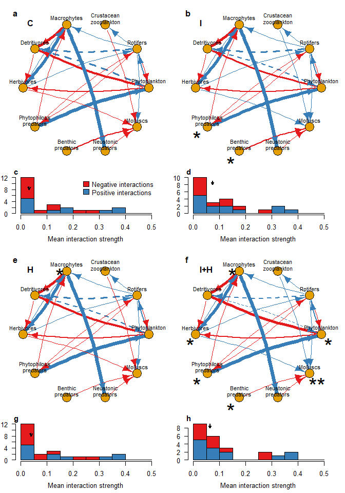

# Overview of S-map coefficient results

### Load required packages

``` r
sessionInfo() #save session information (R version 3.6.3 (2020))
```

    ## R version 3.6.3 (2020-02-29)
    ## Platform: x86_64-w64-mingw32/x64 (64-bit)
    ## Running under: Windows 10 x64 (build 19045)
    ## 
    ## Matrix products: default
    ## 
    ## locale:
    ## [1] LC_COLLATE=Japanese_Japan.932  LC_CTYPE=Japanese_Japan.932   
    ## [3] LC_MONETARY=Japanese_Japan.932 LC_NUMERIC=C                  
    ## [5] LC_TIME=Japanese_Japan.932    
    ## 
    ## attached base packages:
    ## [1] stats     graphics  grDevices utils     datasets  methods   base     
    ## 
    ## loaded via a namespace (and not attached):
    ##  [1] compiler_3.6.3  magrittr_2.0.3  fastmap_1.1.0   cli_3.4.1      
    ##  [5] tools_3.6.3     htmltools_0.5.2 rstudioapi_0.11 yaml_2.2.1     
    ##  [9] stringi_1.4.6   rmarkdown_2.5   knitr_1.30      stringr_1.4.0  
    ## [13] xfun_0.19       digest_0.6.27   rlang_1.1.0     evaluate_0.14

``` r
library(ggplot2) #3.3.2
library(dplyr) #1.0.2
```

    ## 
    ## Attaching package: 'dplyr'

    ## The following objects are masked from 'package:stats':
    ## 
    ##     filter, lag

    ## The following objects are masked from 'package:base':
    ## 
    ##     intersect, setdiff, setequal, union

``` r
library(tidyr) #1.1.2
library(patchwork) #1.1.1
library(igraph) #1.2.6
```

    ## 
    ## Attaching package: 'igraph'

    ## The following object is masked from 'package:tidyr':
    ## 
    ##     crossing

    ## The following objects are masked from 'package:dplyr':
    ## 
    ##     as_data_frame, groups, union

    ## The following objects are masked from 'package:stats':
    ## 
    ##     decompose, spectrum

    ## The following object is masked from 'package:base':
    ## 
    ##     union

``` r
library(RColorBrewer) #1.1.2
```

### Data compilation

``` r
all_multsmap_coefs <- read.csv("./processed_data/all_regulsmap_coefs240123.csv")
head(all_multsmap_coefs)
```

    ##   Treatment  Tank Week Year r_d smap_coef Recipient     Donor
    ## 1      Cont Cont1    2 2017 c_1        NA Phytopla1 Phytopla1
    ## 2      Cont Cont1    4 2017 c_1 -1.139396 Phytopla1 Phytopla1
    ## 3      Cont Cont1    6 2017 c_1 -1.127893 Phytopla1 Phytopla1
    ## 4      Cont Cont1    8 2017 c_1 -1.101508 Phytopla1 Phytopla1
    ## 5      Cont Cont1   10 2017 c_1 -1.134545 Phytopla1 Phytopla1
    ## 6      Cont Cont1   12 2017 c_1 -1.154388 Phytopla1 Phytopla1

``` r
all_multsmap_coefs$Recipient <- 
  factor(all_multsmap_coefs$Recipient, 
         levels=unique(all_multsmap_coefs$Recipient))
all_multsmap_coefs$Donor <- 
  factor(all_multsmap_coefs$Donor, 
         levels=c("Phytopla1", "Phytopla1_1", "Roti1", "Roti1_1", "Roti1_2", 
                  "Zoopla1", "Zoopla1_1", "Zoopla1_2", "Zoopla1_3", "Zoopla1_4", 
                  "Mp1", "Mp1_1", "Det1", "Herb1", "Herb1_1", "Herb1_2", 
                  "Pred.P1", "Pred.P1_1", "Pred.P1_2", "Pred.P1_3", "Pred.B1", 
                  "Pred.S1", "Pred.S1_1", "Pred.S1_2", "Pred.S1_3", "Moll1", "0"))
all_multsmap_coefs$Treatment <- factor(all_multsmap_coefs$Treatment, levels=c("Cont", "Fipro", "Pent", "Joint"))
```

## Overview

### Furequency distribution of mean S-map coefs

``` r
all_multsmap_coefs <- 
  all_multsmap_coefs %>%
  unite(col="Recipient_Donor", Recipient, Donor, remove=FALSE)
all_multsmap_coefs_smrz <- 
  all_multsmap_coefs %>%
  group_by(Treatment, Recipient, Donor, r_d, Recipient_Donor, Year, Tank) %>%
  summarise(smap_coef=mean(smap_coef, na.rm=TRUE)) %>%
  group_by(Treatment, Recipient, Donor, r_d, Recipient_Donor) %>%
  summarise(smap_coef=mean(smap_coef, na.rm=TRUE))
```

    ## `summarise()` regrouping output by 'Treatment', 'Recipient', 'Donor', 'r_d',
    ## 'Recipient_Donor', 'Year' (override with `.groups` argument)`summarise()`
    ## regrouping output by 'Treatment', 'Recipient', 'Donor', 'r_d' (override with
    ## `.groups` argument)

``` r
all_multsmap_coefs_smrz_intersp <- 
  all_multsmap_coefs_smrz %>%
  separate(Donor, into=c("Donor_", "delay"), sep="_", remove=FALSE) %>%
  filter(Recipient!=Donor_ & r_d!="c_0") %>%
  select(-Donor_, - delay)
```

    ## Warning: Expected 2 pieces. Missing pieces filled with `NA` in 164 rows [1, 3,
    ## 4, 5, 6, 7, 8, 11, 12, 13, 14, 15, 20, 21, 22, 24, 25, 26, 27, 28, ...].

``` r
all_multsmap_coefs_smrz_intersp_abs <- 
  all_multsmap_coefs_smrz_intersp %>%
  mutate(Sign=ifelse(smap_coef>0, "Positive", "Negative"), abs_smap_coef=abs(smap_coef)) %>%
  arrange(Treatment, Recipient, Donor)

f_labels <- data.frame(Treatment=c("Cont", "Fipro", "Pent", "Joint"), 
                       label=rep("↓", times=4), 
                       x=tapply(all_multsmap_coefs_smrz_intersp_abs$abs_smap_coef, 
                                all_multsmap_coefs_smrz_intersp_abs$Treatment, 
                                function(x) median(x, na.rm=TRUE)), 
                       y=rep(7, times=4))
ggplot(all_multsmap_coefs_smrz_intersp_abs) +
  geom_histogram(position="stack", binwidth=0.05, mapping=aes(x=abs_smap_coef, fill=Sign)) + facet_wrap(~Treatment) +
  geom_text(data=f_labels, aes(label=label, x=x, y=y), size=10)
```


### Networks

\*Orange: negative effect. Blue: positive effect. Thickness: mean
interaction strength. Dashed arrow: 0.05\<P\<0.1.

``` r
library(igraph)
g1 <- graph(edges=c(2,1, 5,1, 7,1,
                    1,2, 6,2, 7,2,
                    2,3,
                    2,4, 6,4, 7,4,
                    1,5, 2,5, 4,5,
                    1,6, 4,6, 5,6,
                    2,7,
                    4,9,
                    2,10, 3,10, 6,10, 8,10, 9,10), n=10, directed=T)
IS.Tr.mean <- all_multsmap_coefs_smrz_intersp_abs
V(g1)$name <- c("Phytopla", "Rotifer", "Zoopla.Cru", "Macrophyte", "Detritivore", "Herbivore",
                "Phyto.predator", "Bent.predator", "Surf.predator", "Mollusca") #save nodes' names
l <- layout_in_circle(g1) #layout in circle

#each treatment
par(mfrow=c(2, 2), mar=c(3, 3, 3, 3), family="sans")
for (i in c("Cont", "Fipro", "Pent", "Joint")){
  plot(g1, layout=l, vertex.label.family="sans",
       edge.lty=c(1, 2, 1,
                  1, 1, 1,
                  1,
                  1, 1, 1,
                  1, 2, 1,
                  1, 1, 1,
                  1,
                  1,
                  1, 1, 1, 1, 1),
       edge.color=c(ifelse(subset(IS.Tr.mean, Treatment==i)[,"Sign"]=="Positive", 2, 6)),
       edge.curved=0.1,
       edge.width=subset(IS.Tr.mean, Treatment==i)$abs_smap_coef*20)
  legend("topleft", legend=i, bty="n", x.intersp=0, y.intersp=0, cex=1.2)
  if (i=="Fipro") text(c(-0.98, -0.44), c(-0.73, -1.14), labels="*", cex=4) else {
    if (i=="Pent") text(-0.42, 1.12, labels="*", cex=4) else { 
      if (i=="Joint") text(c(-0.98, -0.44, 0.92, 1.1, -0.42, -1.09),
                           c(-0.73, -1.14, -0.73, -0.11, 1.12, -0.11),
                           labels=c("*", "*", "**", "*", "*", "*"), cex=4)
    }
  }
  
}
```


## Generate Fig. S2

``` r
palSet1 <- brewer.pal(9, "Set1")

g1 <- graph(edges=c(2,1, 5,1, 7,1, 
                    1,2, 6,2, 7,2, 
                    2,3, 
                    2,4, 6,4, 7,4, 
                    1,5, 2,5, 4,5,
                    1,6, 4,6, 5,6, 
                    2,7, 
                    4,9,
                    2,10, 3,10, 6,10, 8,10, 9,10), n=10, directed=T)

V(g1)$name <- c("Phytoplankton", "Rotifers", "Crustacean\nzooplankton", "Macrophytes", 
                "Detritivores", "Herbivores", 
                "Phytophilous\npredators", "Benthic\npredators", "Neustonic\npredators", "Molluscs") #save nodes' names
l <- layout_in_circle(g1) #layout in circle

#windows(7, 10, rescale="fixed")
#pdf("./figs/figS2.pdf", width=7, height=10)
layout(matrix(c(1, 2, 5, 6, 3, 4, 7, 8), ncol=2, byrow=TRUE), heights=c(2.5, 1, 2.5, 1))
#each treatment
par(mar=c(2, 2, 2, 2), family="sans")
plot(g1, layout=l, vertex.label.family="sans",
     edge.lty=c(1, 2, 1, 
                1, 1, 1,
                1, 
                1, 1, 1, 
                1, 2, 1, 
                1, 1, 1, 
                1, 
                1, 
                1, 1, 1, 1, 1), 
     edge.color=c(ifelse(subset(IS.Tr.mean, Treatment=="Cont")[,"Sign"]=="Positive", palSet1[2], palSet1[1])), 
     edge.curved=0.1, 
     edge.width=subset(IS.Tr.mean, Treatment=="Cont")$abs_smap_coef*20, 
     vertex.label.dist=1.5, vertex.label.degree=-pi/2, 
     vertex.label.color="black")
legend("topleft", legend="a", bty="n", xpd=NA, x.intersp=-1, y.intersp=-1, cex=1.5, text.font=2)
legend("topleft", legend="C", bty="n", x.intersp=1, y.intersp=1, cex=1.5, text.font=2)

plot(g1, layout=l, vertex.label.family="sans",
     edge.lty=c(1, 2, 1, 
                1, 1, 1,
                1, 
                1, 1, 1, 
                1, 2, 1, 
                1, 1, 1, 
                1, 
                1, 
                1, 1, 1, 1, 1), 
     edge.color=c(ifelse(subset(IS.Tr.mean, Treatment=="Fipro")[,"Sign"]=="Positive", palSet1[2], palSet1[1])), 
     edge.curved=0.1, 
     edge.width=subset(IS.Tr.mean, Treatment=="Fipro")$abs_smap_coef*20, 
     vertex.label.dist=1.5, vertex.label.degree=-pi/2, 
     vertex.label.color="black")
legend("topleft", legend="b", bty="n", xpd=NA, x.intersp=-1, y.intersp=-1, cex=1.5, text.font=2)
legend("topleft", legend="I", bty="n", x.intersp=1, y.intersp=1, cex=1.5, text.font=2)
text(c(-0.98, -0.44), c(-0.73, -1.14), labels="*", cex=4)

plot(g1, layout=l, vertex.label.family="sans",
     edge.lty=c(1, 2, 1, 
                1, 1, 1,
                1, 
                1, 1, 1, 
                1, 2, 1, 
                1, 1, 1, 
                1, 
                1, 
                1, 1, 1, 1, 1), 
     edge.color=c(ifelse(subset(IS.Tr.mean, Treatment=="Pent")[,"Sign"]=="Positive", palSet1[2], palSet1[1])), 
     edge.curved=0.1, 
     edge.width=subset(IS.Tr.mean, Treatment=="Pent")$abs_smap_coef*20, 
     vertex.label.dist=1.5, vertex.label.degree=-pi/2, 
     vertex.label.color="black")
legend("topleft", legend="e", bty="n", xpd=NA, x.intersp=-1, y.intersp=-1, cex=1.5, text.font=2)
legend("topleft", legend="H", bty="n", x.intersp=1, y.intersp=1, cex=1.5, text.font=2)
text(-0.42, 1, labels="*", cex=4)

plot(g1, layout=l, vertex.label.family="sans",
     edge.lty=c(1, 2, 1, 
                1, 1, 1,
                1, 
                1, 1, 1, 
                1, 2, 1, 
                1, 1, 1, 
                1, 
                1, 
                1, 1, 1, 1, 1), 
     edge.color=c(ifelse(subset(IS.Tr.mean, Treatment=="Joint")[,"Sign"]=="Positive", palSet1[2], palSet1[1])), 
     edge.curved=0.1, 
     edge.width=subset(IS.Tr.mean, Treatment=="Joint")$abs_smap_coef*20, 
     vertex.label.dist=1.5, vertex.label.degree=-pi/2, 
     vertex.label.color="black")
legend("topleft", legend="f", bty="n", xpd=NA, x.intersp=-1, y.intersp=-1, cex=1.5, text.font=2)
legend("topleft", legend="I+H", bty="n", x.intersp=1, y.intersp=1, cex=1.5, text.font=2)
text(c(-0.98, -0.44, 0.92, 1.1, -0.42, -1.09), 
     c(-0.73, -1.14, -0.73, -0.11, 1, -0.11), 
     labels=c("*", "*", "**", "*", "*", "*"), cex=4)


par(mar=c(4, 2, 0, 2), mgp=c(2.5, 1, 0), las=1, family="sans", cex=0.8)
for (i in 1:4) {
  hist(subset(IS.Tr.mean, Treatment==c("Cont", "Fipro", "Pent", "Joint")[i])$abs_smap_coef, breaks=seq(0, 0.5, 0.05),
       xlab="Mean interaction strength", col=palSet1[1], main=c("")[i])
  lines(hist(subset(IS.Tr.mean, Treatment==c("Cont", "Fipro", "Pent", "Joint")[i] & Sign=="Positive")$abs_smap_coef, plot=FALSE, 
             breaks=seq(0, 0.5, 0.05)), col=palSet1[2], xlim=c(0, 0.5))
  arrows(median(subset(IS.Tr.mean, Treatment==c("Cont", "Fipro", "Pent", "Joint")[i])$abs_smap_coef), 9, 
         median(subset(IS.Tr.mean, Treatment==c("Cont", "Fipro", "Pent", "Joint")[i])$abs_smap_coef), 8, code=2, length=0.05, lwd=2, xpd=NA)
  legend("topright", legend=c("Negative interactions", "Positive interactions"), bty="n",
         pt.bg=palSet1[1:2], pch=22, plot=c(TRUE, FALSE, FALSE, FALSE)[i], pt.cex=2)
  legend("topleft", legend=c("c", "d", "g", "h")[i], 
         bty="n", xpd=NA, x.intersp=-1.2, y.intersp=-2, cex=1.2, text.font=2)
}
```



``` r
dev.off()
```

    ## null device 
    ##           1

## Source of variation in the S-map coefs (Fig. S5)

We performed two-way ANOVA for every interaction link, examining the
effects of treatment, census date and their interaction on S-map
coefficient values, to confirm whether the temporal fluctuations of the
interaction effect were consistent among replicates. The mean squares of
residuals are unbiased estimates of the variance of various noises
including differences in individual replicates. If these values are
small relative to those of census dates or treatments, temporal
fluctuations of s-map coefs should be considered as relatively
consistent among replicates.

``` r
all_multsmap_coefs <- 
  all_multsmap_coefs %>%
  unite(col="Recipient_Donor", Recipient, Donor, remove=FALSE)

anova_res <- 
  all_multsmap_coefs %>%
  unite("Year_Week", Year, Week, sep="_", remove=FALSE) %>%
  split(., .$Recipient_Donor) %>%
  lapply(., function(data) {
    res <- as.data.frame(anova(lm(smap_coef ~ Treatment * Year_Week, data)))
    res <- cbind(Source=rownames(res), res)
    res}) %>%
  do.call(rbind, .) %>% 
  cbind(., Recipient_Donor=rep(unique(all_multsmap_coefs$Recipient_Donor), each=4))

theme_set(theme_bw())
anova_res$Source <- factor(anova_res$Source, levels=unique(anova_res$Source))
ggplot(anova_res, aes(y=!!as.name("Mean Sq"), x=Source, group=Recipient_Donor)) + 
  geom_point() + geom_line() + scale_y_log10() + 
  ylab("Mean squares") + scale_x_discrete(labels=c("Treatment"="Treatment", 
                                                   "Year_Week"="Census date", 
                                                   "Treatment:Year_Week"="Treatment x Census date", 
                                                   "Residuals"="Residuals"))
```


``` r
ggsave("./figs/figS5.ggplot2.pdf", width=6, height=6, device=cairo_pdf, unit="in")

ggplot(anova_res, aes(y=!!as.name("F value"), x=Source, group=Recipient_Donor)) + 
  geom_point() + geom_line() + scale_y_log10()
```

    ## Warning: Removed 57 rows containing missing values (geom_point).

    ## Warning: Removed 57 row(s) containing missing values (geom_path).


``` r
F_value_count <- matrix(c(nrow(subset(anova_res, Source=="Treatment" & anova_res[,"F value"]<=1)),
                          nrow(subset(anova_res, Source=="Treatment" & anova_res[,"F value"]>1)),
                          nrow(subset(anova_res, Source=="Year_Week" & anova_res[,"F value"]<=1)),
                          nrow(subset(anova_res, Source=="Year_Week" & anova_res[,"F value"]>1)),
                          nrow(subset(anova_res, Source=="Treatment:Year_Week" & anova_res[,"F value"]<=1)),
                          nrow(subset(anova_res, Source=="Treatment:Year_Week" & anova_res[,"F value"]>1))), nrow=3, byrow=TRUE)
rownames(F_value_count) <- c("Treatment", "Year_Week", "Treatment:Year_Week")
colnames(F_value_count) <- c("F<=1", "F>1")
F_value_count
```

    ##                     F<=1 F>1
    ## Treatment             16  41
    ## Year_Week              9  48
    ## Treatment:Year_Week   21  36
