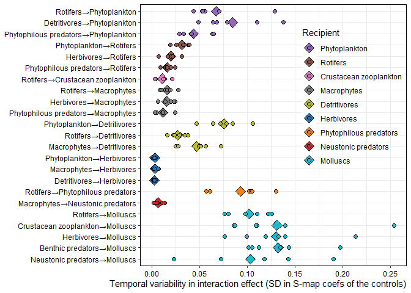
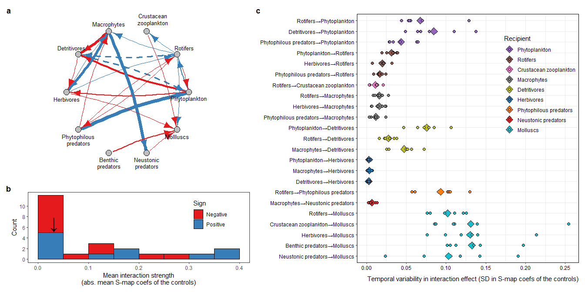
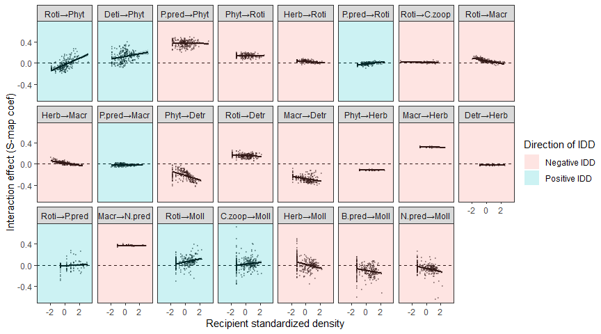

# Heterogeneity in interaction variability among different links

### Load packages

``` r
sessionInfo() #save session information (R version 3.6.3 (2020))
```

    ## R version 3.6.3 (2020-02-29)
    ## Platform: x86_64-w64-mingw32/x64 (64-bit)
    ## Running under: Windows 10 x64 (build 19045)
    ## 
    ## Matrix products: default
    ## 
    ## locale:
    ## [1] LC_COLLATE=Japanese_Japan.932  LC_CTYPE=Japanese_Japan.932   
    ## [3] LC_MONETARY=Japanese_Japan.932 LC_NUMERIC=C                  
    ## [5] LC_TIME=Japanese_Japan.932    
    ## 
    ## attached base packages:
    ## [1] stats     graphics  grDevices utils     datasets  methods   base     
    ## 
    ## other attached packages:
    ##  [1] rmarkdown_2.5      afex_0.28-0        emmeans_1.5.2-1    car_3.0-10        
    ##  [5] carData_3.0-4      lme4_1.1-25        Matrix_1.2-18      ggeffects_1.2.0   
    ##  [9] visreg_2.7.0       glmmTMB_1.0.2.1    igraph_1.2.6       ggsci_2.9         
    ## [13] RColorBrewer_1.1-2 patchwork_1.1.1    tidyr_1.1.2        dplyr_1.0.2       
    ## [17] ggplot2_3.3.2     
    ## 
    ## loaded via a namespace (and not attached):
    ##  [1] nlme_3.1-150        rprojroot_1.3-2     numDeriv_2016.8-1.1 tools_3.6.3        
    ##  [5] TMB_1.7.18          backports_1.2.0     utf8_1.1.4          R6_2.5.0           
    ##  [9] mgcv_1.8-33         colorspace_2.0-3    withr_2.5.0         tidyselect_1.1.0   
    ## [13] curl_4.3            compiler_3.6.3      cli_3.4.1           desc_1.2.0         
    ## [17] sandwich_3.0-0      labeling_0.4.2      scales_1.1.1        mvtnorm_1.1-1      
    ## [21] stringr_1.4.0       digest_0.6.27       foreign_0.8-75      minqa_1.2.4        
    ## [25] rio_0.5.16          pkgconfig_2.0.3     htmltools_0.5.2     fastmap_1.1.0      
    ## [29] rlang_1.1.0         readxl_1.3.1        rstudioapi_0.11     gridGraphics_0.5-1 
    ## [33] farver_2.0.3        generics_0.1.0      zoo_1.8-8           zip_2.1.1          
    ## [37] magrittr_2.0.3      Rcpp_1.0.11         munsell_0.5.0       fansi_1.0.3        
    ## [41] abind_1.4-5         lifecycle_1.0.3     stringi_1.4.6       multcomp_1.4-14    
    ## [45] yaml_2.2.1          MASS_7.3-53         plyr_1.8.6          grid_3.6.3         
    ## [49] parallel_3.6.3      forcats_0.5.0       crayon_1.3.4        lattice_0.20-38    
    ## [53] haven_2.3.1         splines_3.6.3       hms_0.5.3           knitr_1.30         
    ## [57] pillar_1.4.6        boot_1.3-24         estimability_1.3    reshape2_1.4.4     
    ## [61] codetools_0.2-16    pkgload_1.1.0       glue_1.4.2          evaluate_0.14      
    ## [65] data.table_1.13.2   vctrs_0.6.1         nloptr_1.2.2.2      testthat_3.0.0     
    ## [69] cellranger_1.1.0    gtable_0.3.0        purrr_0.3.4         assertthat_0.2.1   
    ## [73] xfun_0.19           openxlsx_4.2.3      xtable_1.8-4        coda_0.19-4        
    ## [77] survival_3.1-8      tibble_3.0.4        lmerTest_3.1-3      statmod_1.4.35     
    ## [81] TH.data_1.0-10      ellipsis_0.3.2

``` r
library(ggplot2); packageVersion("ggplot2") #3.3.2
```

    ## [1] '3.3.2'

``` r
library(dplyr); packageVersion("dplyr") #1.0.2
```

    ## [1] '1.0.2'

``` r
library(tidyr); packageVersion("tidyr") #1.1.2
```

    ## [1] '1.1.2'

``` r
library(patchwork); packageVersion("patchwork") #1.1.1
```

    ## [1] '1.1.1'

``` r
library(igraph); packageVersion("igraph") #1.2.6
```

    ## [1] '1.2.6'

``` r
library(RColorBrewer); packageVersion("RColorBrewer") #1.1.2
```

    ## [1] '1.1.2'

``` r
library(ggsci); packageVersion("ggsci") #2.9
```

    ## [1] '2.9'

### Data compilation

``` r
all_multsmap_coefs <- read.csv("./processed_data/all_regulsmap_coefs240123.csv")
all_Ts <- read.csv("./processed_data/all_Ts240123.csv")

head(all_multsmap_coefs)
```

    ##   Treatment  Tank Week Year r_d smap_coef Recipient     Donor
    ## 1      Cont Cont1    2 2017 c_1        NA Phytopla1 Phytopla1
    ## 2      Cont Cont1    4 2017 c_1 -1.139396 Phytopla1 Phytopla1
    ## 3      Cont Cont1    6 2017 c_1 -1.127893 Phytopla1 Phytopla1
    ## 4      Cont Cont1    8 2017 c_1 -1.101508 Phytopla1 Phytopla1
    ## 5      Cont Cont1   10 2017 c_1 -1.134545 Phytopla1 Phytopla1
    ## 6      Cont Cont1   12 2017 c_1 -1.154388 Phytopla1 Phytopla1

``` r
head(all_Ts)
```

    ##   Week  Year_Tank Abundance scAbundance Recipient
    ## 1    2 2017_Cont1       799  0.70605734 Phytopla1
    ## 2    4 2017_Cont1        86 -0.11756142 Phytopla1
    ## 3    6 2017_Cont1      1873  1.02204355 Phytopla1
    ## 4    8 2017_Cont1       187  0.16847324 Phytopla1
    ## 5   10 2017_Cont1       127  0.02577338 Phytopla1
    ## 6   12 2017_Cont1       305  0.34930867 Phytopla1

``` r
all_multsmap_coefs$Recipient <- 
  factor(all_multsmap_coefs$Recipient, 
         levels=unique(all_multsmap_coefs$Recipient))
all_multsmap_coefs$Donor <- 
  factor(all_multsmap_coefs$Donor, 
         levels=c("Phytopla1", "Phytopla1_1", "Roti1", "Roti1_1", "Roti1_2", 
                  "Zoopla1", "Zoopla1_1", "Zoopla1_2", "Zoopla1_3", "Zoopla1_4", 
                  "Mp1", "Mp1_1", "Det1", "Herb1", "Herb1_1", "Herb1_2", 
                  "Pred.P1", "Pred.P1_1", "Pred.P1_2", "Pred.P1_3", "Pred.B1", 
                  "Pred.S1", "Pred.S1_1", "Pred.S1_2", "Pred.S1_3", "Moll1", "0"))
all_multsmap_coefs$Treatment <- factor(all_multsmap_coefs$Treatment, levels=c("Cont", "Fipro", "Pent", "Joint"))
all_multsmap_coefs <- 
  all_multsmap_coefs %>%
  unite(col="Recipient_Donor", Recipient, Donor, remove=FALSE) %>%
  mutate(Recipient_Donor=factor(Recipient_Donor,
                                levels=c("Phytopla1_Roti1", 
                                         "Phytopla1_Det1", 
                                         "Phytopla1_Pred.P1", 
                                         "Roti1_Phytopla1",
                                         "Roti1_Herb1",
                                         "Roti1_Pred.P1",
                                         "Zoopla1_Roti1",
                                         "Mp1_Roti1",
                                         "Mp1_Herb1",
                                         "Mp1_Pred.P1",
                                         "Det1_Phytopla1",
                                         "Det1_Roti1",
                                         "Det1_Mp1",
                                         "Herb1_Phytopla1",
                                         "Herb1_Mp1",
                                         "Herb1_Det1",
                                         "Pred.P1_Roti1",
                                         "Pred.S1_Mp1",
                                         "Moll1_Roti1",
                                         "Moll1_Zoopla1",
                                         "Moll1_Herb1",
                                         "Moll1_Pred.B1",
                                         "Moll1_Pred.S1"
                                )))
```

## Network and interaction properties of the controls

### Histogram

``` r
all_multsmap_coefs_YTsmrz <- #mean and sd of smap coefs per year per tank
  all_multsmap_coefs %>%
  group_by(Treatment, Recipient, Donor, r_d, Recipient_Donor, Year, Tank) %>%
  summarise(smap_coef_mean=mean(smap_coef, na.rm=TRUE), 
            smap_coef_SD=sd(smap_coef, na.rm=TRUE))
```

    ## `summarise()` regrouping output by 'Treatment', 'Recipient', 'Donor', 'r_d',
    ## 'Recipient_Donor', 'Year' (override with `.groups` argument)

``` r
all_multsmap_coefs_Osmrz <-  #averaging over years and tanks
  all_multsmap_coefs_YTsmrz %>%
  group_by(Treatment, Recipient, Donor, r_d, Recipient_Donor) %>%
  summarise(smap_coef=mean(smap_coef_mean, na.rm=TRUE), 
            smap_coef_SD=mean(smap_coef_SD, na.rm=TRUE))
```

    ## `summarise()` regrouping output by 'Treatment', 'Recipient', 'Donor', 'r_d' (override with
    ## `.groups` argument)

``` r
all_multsmap_coefs_YTsmrz_intersp <- #extract interspecific effects
  all_multsmap_coefs_YTsmrz %>%
  separate(Donor, into=c("Donor_", "delay"), sep="_", remove=FALSE) %>%
  filter(Recipient!=Donor_ & r_d!="c_0") %>% #omit intraspecific effects and intercepts
  select(-Donor_, - delay)
```

    ## Warning: Expected 2 pieces. Missing pieces filled with `NA` in 984 rows [1, 2, 3, 4, 5, 6,
    ## 13, 14, 15, 16, 17, 18, 19, 20, 21, 22, 23, 24, 25, 26, ...].

``` r
all_multsmap_coefs_Osmrz_intersp <- #extract interspecific effects
  all_multsmap_coefs_Osmrz %>%
  separate(Donor, into=c("Donor_", "delay"), sep="_", remove=FALSE) %>%
  filter(Recipient!=Donor_ & r_d!="c_0") %>% #omit intraspecific effects and intercepts
  select(-Donor_, - delay)
```

    ## Warning: Expected 2 pieces. Missing pieces filled with `NA` in 164 rows [1, 3, 4, 5, 6, 7,
    ## 8, 11, 12, 13, 14, 15, 20, 21, 22, 24, 25, 26, 27, 28, ...].

``` r
all_multsmap_coefs_Osmrz_intersp_abs <- #add absolute values of s-map coefs and their signs
  all_multsmap_coefs_Osmrz_intersp %>%
  mutate(Sign=ifelse(smap_coef>0, "Positive", "Negative"), abs_smap_coef=abs(smap_coef)) %>%
  arrange(Treatment, Recipient, Donor) # not necessary

f_labels <- data.frame(Treatment=c("Cont", "Fipro", "Pent", "Joint"), #median of mean interaction strength
                       label=rep("↓", times=4), 
                       x=tapply(all_multsmap_coefs_Osmrz_intersp_abs$abs_smap_coef, 
                                all_multsmap_coefs_Osmrz_intersp_abs$Treatment, 
                                function(x) median(x, na.rm=TRUE)), 
                       y=rep(7, times=4))

histogram.cont.fig <- #extract and process control data
  filter(all_multsmap_coefs_Osmrz_intersp_abs, Treatment=="Cont") %>%
  ggplot(.) +
  geom_histogram(position="stack", binwidth=0.05, boundary=0, closed="left", color="black", mapping=aes(x=abs_smap_coef, fill=Sign)) +
  scale_x_continuous(name="Mean interaction strength\n(abs. mean S-map coefs of the controls)") + 
  scale_y_continuous(breaks=seq(0, 10, 2), name="Count") + 
  geom_text(data=f_labels[1,], aes(label=label, x=x, y=y), size=10) + 
  scale_fill_brewer(palette="Set1") +
  theme_test() + 
  theme(legend.position=c(0.9, 0.9), legend.justification=c(1, 1))
histogram.cont.fig
```


### Network

``` r
library(igraph)

palSet1 <- brewer.pal(9, "Set1")

IS.Tr.mean <- all_multsmap_coefs_Osmrz_intersp_abs

g1 <- graph(edges=c(2,1, 5,1, 7,1, 
                    1,2, 6,2, 7,2, 
                    2,3, 
                    2,4, 6,4, 7,4, 
                    1,5, 2,5, 4,5,
                    1,6, 4,6, 5,6, 
                    2,7, 
                    4,9,
                    2,10, 3,10, 6,10, 8,10, 9,10), n=10, directed=T)

V(g1)$name <- c("Phytoplankton", "Rotifers", "Crustacean\nzooplankton", "Macrophytes", "Detritivores", 
                "Herbivores", "Phytophilous\npredators", 
                "Benthic\npredators", "Neustonic\npredators", "Mollluscs") #save nodes' names
l <- layout_in_circle(g1) #layout in circle

par(mar=c(3, 3, 3, 3), family="sans")
plot(g1, layout=l, vertex.label.family="sans", vertex.color=8, vertex.size=10, 
     vertex.label.color="black",
     edge.lty=c(1, 2, 1, 
                1, 1, 1,
                1, 
                1, 1, 1, 
                1, 2, 1, 
                1, 1, 1, 
                1, 
                1, 
                1, 1, 1, 1, 1), 
     edge.color=c(ifelse(subset(IS.Tr.mean, Treatment=="Cont")[,"Sign"]=="Positive", palSet1[2], palSet1[1])), 
     edge.curved=0.1, 
     edge.width=seq(0.5, 8, 0.5)[cut(as.numeric(subset(IS.Tr.mean, Treatment=="Cont")$abs_smap_coef*20), 
                                     labels=seq(0.5, 8, 0.5), 
                                     breaks=seq(0, 8, 0.5), 
                                     right=TRUE)], 
     edge.arrow.size=1.5, 
     vertex.label.dist=c(1.5, 2.2, 3.1, 1.5, 2.2, 1.5, 2.2, 2.2, 2.2, 1.5), 
     vertex.label.degree=c(pi/2, -pi/4, -7*pi/20, -pi/2, -3*pi/4, pi/2, pi/2, pi/2, pi/2, pi/2))
legend("topleft", legend="Cont", bty="n", x.intersp=0, y.intersp=0, cex=1.2)
```


### Temporal variability

``` r
theme_custom <- function() { #change black labels
  theme_bw() + 
    theme(axis.text=element_text(colour="black"), 
          panel.border=element_rect(fill=NA, 
                                    colour="black", size=rel(0.8)), 
          line=element_line(size=0.15))
}

map_RD <- #軸ラベル
  c("Phytopla1_Roti1"="Rotifers→Phytoplankton", 
    "Phytopla1_Det1"="Detritivores→Phytoplankton", 
    "Phytopla1_Pred.P1"="Phytophilous predators→Phytoplankton", 
    "Roti1_Phytopla1"="Phytoplankton→Rotifers", 
    "Roti1_Herb1"="Herbivores→Rotifers", 
    "Roti1_Pred.P1"="Phytophilous predators→Rotifers", 
    "Zoopla1_Roti1"="Rotifers→Crustacean zooplankton", 
    "Mp1_Roti1"="Rotifers→Macrophytes", 
    "Mp1_Herb1"="Herbivores→Macrophytes", 
    "Mp1_Pred.P1"="Phytophilous predators→Macrophytes", 
    "Det1_Phytopla1"="Phytoplankton→Detritivores", 
    "Det1_Roti1"="Rotifers→Detritivores", 
    "Det1_Mp1"="Macrophytes→Detritivores", 
    "Herb1_Phytopla1"="Phytoplankton→Herbivores", 
    "Herb1_Mp1"="Macrophytes→Herbivores", 
    "Herb1_Det1"="Detritivores→Herbivores", 
    "Pred.P1_Roti1"="Rotifers→Phytophilous predators",
    "Pred.S1_Mp1"="Macrophytes→Neustonic predators", 
    "Moll1_Roti1"="Rotifers→Molluscs", 
    "Moll1_Zoopla1"="Crustacean zooplankton→Molluscs", 
    "Moll1_Herb1"="Herbivores→Molluscs", 
    "Moll1_Pred.B1"="Benthic predators→Molluscs", 
    "Moll1_Pred.S1"="Neustonic predators→Molluscs", 
    "NA"="NA"
  )

map_Recipient <- #legend label
  c(Phytopla1="Phytoplankton",
    Roti1="Rotifers", 
    Zoopla1="Crustacean zooplankton",
    Mp1="Macrophytes", 
    Det1="Detritivores", 
    Herb1="Herbivores", 
    Pred.P1="Phytophilous predators", 
    Pred.B1="Benthic predators", 
    Pred.S1="Neustonic predators", 
    Moll1="Molluscs",
    "NA"="NA"
  )

IS.indices_ggplot2 <- #data processing
  all_multsmap_coefs_YTsmrz_intersp %>%
  mutate(RD=map_RD[as.character(Recipient_Donor)], 
         Recipient=factor(map_Recipient[as.character(Recipient)], 
                          levels=c("Phytoplankton", 
                                   "Rotifers", 
                                   "Crustacean zooplankton", 
                                   "Macrophytes", 
                                   "Detritivores", 
                                   "Herbivores", 
                                   "Phytophilous predators", 
                                   "Benthic predators", 
                                   "Neustonic predators", 
                                   "Molluscs")))

IS.indices_ggplot2_mean <- #data processing
  na.omit(IS.indices_ggplot2) %>%
  group_by(Treatment, RD, Recipient) %>%
  summarise(smap_coef_SD=mean(smap_coef_SD)) %>%
  filter(Treatment=="Cont")
```

    ## `summarise()` regrouping output by 'Treatment', 'RD' (override with `.groups` argument)

``` r
tempvar <- #draw sd fig
  ggplot(IS.indices_ggplot2_mean, aes(x=smap_coef_SD, y=RD)) + 
  geom_point(aes(fill=Recipient), shape=23, size=4.4, stroke=0.3) + 
  theme_custom() + 
  theme(axis.title.y=element_blank(), 
        legend.position=c(1, 0.93), legend.justification=c(1, 1), 
        legend.background=element_rect(fill=NA, colour=NA), 
        axis.title.x=element_text(hjust=1)) + 
  scale_x_continuous(name="Temporal variability in interaction effect (SD in S-map coefs of the controls)") +
  scale_y_discrete(
    limits=rev(c("Rotifers→Phytoplankton", 
                 "Detritivores→Phytoplankton", 
                 "Phytophilous predators→Phytoplankton", 
                 "Phytoplankton→Rotifers", 
                 "Herbivores→Rotifers", 
                 "Phytophilous predators→Rotifers", 
                 "Rotifers→Crustacean zooplankton", 
                 "Rotifers→Macrophytes", 
                 "Herbivores→Macrophytes", 
                 "Phytophilous predators→Macrophytes", 
                 "Phytoplankton→Detritivores", 
                 "Rotifers→Detritivores", 
                 "Macrophytes→Detritivores", 
                 "Phytoplankton→Herbivores", 
                 "Macrophytes→Herbivores", 
                 "Detritivores→Herbivores", 
                 "Rotifers→Phytophilous predators",
                 "Macrophytes→Neustonic predators", 
                 "Rotifers→Molluscs", 
                 "Crustacean zooplankton→Molluscs", 
                 "Herbivores→Molluscs", 
                 "Benthic predators→Molluscs", 
                 "Neustonic predators→Molluscs"
    ))) +
  geom_point(filter(na.omit(IS.indices_ggplot2), Treatment=="Cont"), 
             mapping=aes(x=smap_coef_SD, y=RD, fill=Recipient), size=2.2, shape=21, stroke=0.3) +
  scale_fill_manual(values=(pal_d3(palette="category10")(10))[c(5:9, 1:2, 4, 10)])
tempvar
```



### Generate Fig. 2abc

``` r
palSet1 <- brewer.pal(9, "Set1")

g1 <- graph(edges=c(2,1, 5,1, 7,1, 
                    1,2, 6,2, 7,2, 
                    2,3, 
                    2,4, 6,4, 7,4, 
                    1,5, 2,5, 4,5,
                    1,6, 4,6, 5,6, 
                    2,7, 
                    4,9,
                    2,10, 3,10, 6,10, 8,10, 9,10), n=10, directed=T)

V(g1)$name <- c("Phytoplankton", "Rotifers", "Crustacean\nzooplankton", "Macrophytes", "Detritivores", 
                "Herbivores", "Phytophilous\npredators", 
                "Benthic\npredators", "Neustonic\npredators", "Mollluscs") #save nodes' names
l <- layout_in_circle(g1) #layout in circle

panel1 <- function(x) {par(mar=c(3, 3, 3, 3), family="sans", cex=0.8, las=1)
  plot(x, layout=l, vertex.label.family="sans", vertex.color=8, vertex.size=10, 
       vertex.label.color="black",
       edge.lty=c(1, 2, 1, 
                  1, 1, 1,
                  1, 
                  1, 1, 1, 
                  1, 2, 1, 
                  1, 1, 1, 
                  1, 
                  1, 
                  1, 1, 1, 1, 1), 
       edge.color=c(ifelse(subset(IS.Tr.mean, Treatment=="Cont")[,"Sign"]=="Positive", palSet1[2], palSet1[1])), 
       edge.curved=0.1, 
       edge.width=seq(0.5, 8, 0.5)[cut(as.numeric(subset(IS.Tr.mean, Treatment=="Cont")$abs_smap_coef*20), 
                                       labels=seq(0.5, 8, 0.5), 
                                       breaks=seq(0, 8, 0.5), 
                                       right=TRUE)], 
       edge.arrow.size=1.2, 
       vertex.label.dist=c(1.5, 2.2, 3.1, 1.5, 2.2, 1.5, 2.2, 2.2, 2.2, 1.5), 
       vertex.label.degree=c(pi/2, -pi/4, -7*pi/20, -pi/2, -3*pi/4, pi/2, pi/2, pi/2, pi/2, pi/2))
}


fig3abc.ggplot2 <- 
  wrap_elements(full=~panel1(g1)) + 
  histogram.cont.fig + plot_layout(ncol=1, heights=c(0.7, 0.3)) - 
  tempvar + 
  plot_annotation(tag_levels='a') & theme(plot.tag=element_text(face="bold"))

plot(fig3abc.ggplot2)
```



## Describe interaction density-dependence

``` r
all_multsmap_coefs_intersp <- 
  all_multsmap_coefs %>%
  separate(Donor, into=c("Donor_", "delay"), sep="_", remove=FALSE) %>% 
  filter(Recipient!=Donor_ & r_d!="c_0") %>% #omit intraspecific effects and intercepts
  select(-Donor_, - delay)%>% #omit unnecessary columns
  unite("Year_Tank", Year, Tank, remove=FALSE) %>%
  ungroup(.)
```

    ## Warning: Expected 2 pieces. Missing pieces filled with `NA` in 9800 rows [1, 2, 3, 4, 5,
    ## 6, 7, 8, 9, 10, 11, 12, 13, 14, 15, 16, 17, 18, 19, 20, ...].

``` r
all_multsmap_coefs_intersp_ab <- left_join(mutate(all_multsmap_coefs_intersp, Year=as.character(Year)), all_Ts)
```

    ## Joining, by = c("Year_Tank", "Week", "Recipient")

``` r
ddepend_lmres_list <-
  all_multsmap_coefs_intersp_ab %>%
  split(., f=.$Recipient_Donor) %>%
  lapply(function(data) as.data.frame(summary(lm(smap_coef ~ scAbundance, data))$coefficients))

ddepend_aovres_list <-
  all_multsmap_coefs_intersp_ab %>%
  split(., f=.$Recipient_Donor) %>%
  lapply(function(data) summary(aov(smap_coef ~ scAbundance, data)))

ddepend_lmres <-
  ddepend_lmres_list %>% do.call(rbind, .) %>%
  mutate(Recipient_Donor=rep(names(ddepend_lmres_list), each=2),
         Source=rep(c("Intercept", "scAbundance"), times=nrow(.)/2))

ddepend_lmres <- 
  ddepend_lmres %>%
  separate(Recipient_Donor, into=c("Recipient", "Donor"), sep="_") %>%
  filter(Source=="scAbundance") %>%
  mutate(SignDD=ifelse(Estimate>0, "PositiveDD", "NegativeDD"))
```

``` r
theme_set(theme_test())

dumdata <- 
  mutate(cbind(unite(ddepend_lmres, col="Recipient_Donor", Recipient, Donor), scAbundance=0, smap_coef=0), 
         Recipient_Donor=factor(Recipient_Donor, levels=unite(arrange(.data=ddepend_lmres, Estimate), col="Recipient_Donor", Recipient, Donor)$Recipient_Donor))

strip.labs <- 
  c("Roti→Phyt", 
    "Deti→Phyt", 
    "P.pred→Phyt", 
    "Phyt→Roti", 
    "Herb→Roti", 
    "P.pred→Roti", 
    "Roti→C.zoop", 
    "Roti→Macr", 
    "Herb→Macr", 
    "P.pred→Macr", 
    "Phyt→Detr", 
    "Roti→Detr", 
    "Macr→Detr", 
    "Phyt→Herb", 
    "Macr→Herb", 
    "Detr→Herb", 
    "Roti→P.pred",
    "Macr→N.pred", 
    "Roti→Moll", 
    "C.zoop→Moll", 
    "Herb→Moll", 
    "B.pred→Moll", 
    "N.pred→Moll"
  )
names(strip.labs) <- as.character(levels(all_multsmap_coefs$Recipient_Donor))

gg1_ <- all_multsmap_coefs_intersp_ab %>% 
  #  mutate(Recipient_Donor=factor(Recipient_Donor, levels=unite(arrange(.data=ddepend_lmres, Estimate), col="Recipient_Donor", Recipient, Donor)$Recipient_Donor)) %>%
  ggplot(aes(x=scAbundance, y=smap_coef)) + 
  facet_wrap(~Recipient_Donor, labeller=labeller(Recipient_Donor=strip.labs), ncol=8) + 
  geom_smooth(method="lm", color="black", size=1) + 
  geom_hline(yintercept=0, linetype=2) + 
  geom_point(alpha=0.3, size=0.01) +
  geom_rect(data=dumdata, aes(fill=SignDD), alpha=0.2, xmin=-Inf, xmax=Inf, ymin=-Inf, ymax=Inf) +
  scale_x_continuous(name="Recipient standardized density") +
  scale_y_continuous(name="Interaction effect (S-map coef)") + 
  scale_fill_discrete(name="Direction of IDD", labels=c("Negative IDD", "Positive IDD"))
gg1_
```

    ## `geom_smooth()` using formula 'y ~ x'

    ## Warning: Removed 696 rows containing non-finite values (stat_smooth).

    ## Warning: Removed 696 rows containing missing values (geom_point).



### Generate Fig. 3

``` r
fig3.ggplot2_2 <- 
  fig3abc.ggplot2 - gg1_ + plot_layout(nrow=2) + 
  plot_annotation(tag_levels='a') & theme(plot.tag=element_text(face="bold"), text=element_text(size=14))

#windows(rescale="fixed", width=14, height=12)
plot(fig3.ggplot2_2)
```

    ## `geom_smooth()` using formula 'y ~ x'

    ## Warning: Removed 696 rows containing non-finite values (stat_smooth).

    ## Warning: Removed 696 rows containing missing values (geom_point).


``` r
ggsave("./figs/fig3.ggplot2.pdf", width=14, height=12, device=cairo_pdf, unit="in")
```

    ## `geom_smooth()` using formula 'y ~ x'

    ## Warning: Removed 696 rows containing non-finite values (stat_smooth).

    ## Warning: Removed 696 rows containing missing values (geom_point).
