# Determine best embedding dimensions

\*Copied from 2021 codes (messy). Need refinement.

``` r
library(rEDM); packageVersion("rEDM") #0.7.5
```

    ## [1] '0.7.5'

``` r
library(tidyr)
library(dplyr)
```

    ## 
    ## Attaching package: 'dplyr'

    ## The following objects are masked from 'package:stats':
    ## 
    ##     filter, lag

    ## The following objects are masked from 'package:base':
    ## 
    ##     intersect, setdiff, setequal, union

## Determine best embedding dimension E

``` r
all_Ts <- read.csv("./processed_data/all_Ts240123.csv") 

all_Ts <- #必要な列の作成
  all_Ts %>%
  separate(Year_Tank, into=c("Year", "Tank"), sep="_") %>% #年とタンク
  mutate(Treatment=substr(Tank, 1, nchar(Tank)-1)) %>% #処理名
  mutate(Treatment=factor(Treatment, levels=c("Cont", "Fipro", "Pent", "Joint")), #処理名の順序
         Tank=factor(Tank, levels=unique(Tank)), #タンクの順序
         Recipient=factor(Recipient, levels=c("Phytopla1", "Roti1", "Zoopla1", "Mp1", 
                                              "Det1", "Herb1", "Pred.P1", "Pred.B1", "Pred.S1", "Moll1"))) 

Phytopla1 <- subset(all_Ts, Recipient=="Phytopla1")
Roti1 <- subset(all_Ts, Recipient=="Roti1")
Zoopla1 <- subset(all_Ts, Recipient=="Zoopla1")
Mp1 <- subset(all_Ts, Recipient=="Mp1")
Det1 <- subset(all_Ts, Recipient=="Det1")
Herb1 <- subset(all_Ts, Recipient=="Herb1")
Pred.P1 <- subset(all_Ts, Recipient=="Pred.P1")
Pred.B1 <- subset(all_Ts, Recipient=="Pred.B1")
Pred.S1 <- subset(all_Ts, Recipient=="Pred.S1")
Moll1 <- subset(all_Ts, Recipient=="Moll1")

lib_custom <- matrix(c(c(1,10, 12,21, 23,32, 34,43, 45,54, 56,65, 67,76, 78,87), #define library
                     c(1,10, 12,21, 23,32, 34,43, 45,54, 56,65, 67,76, 78,87)+88, 
                     c(1,10, 12,21, 23,32, 34,43, 45,54, 56,65, 67,76, 78,87)+176), ncol=2, byrow=TRUE)
lib_custom_Mp <- matrix(c(c(1,10, 12,21, 23,32, 34,43, 45,54, 56,65, 67,76, 78,87), #define library of macrophye
                       c(1,10, 12,21, 23,32, 34,43, 45,54, 56,65, 67,76, 78,87)+88, 
                       c(2,10, 13,21, 24,32, 35,43, 46,54, 57,65, 68,76, 79,87)+176), ncol=2, byrow=TRUE)


simp_Phytopla_res0 <- simplex(Phytopla1$scAbundance, E=1:9, lib=lib_custom, pred=lib_custom, silent=TRUE)
par(mfrow=c(1, 3), cex=1, las=1)
plot(rho ~ E, simp_Phytopla_res0, type="l"); plot(mae ~ E, simp_Phytopla_res0, type="l"); plot(rmse ~ E, simp_Phytopla_res0, type="l")
```

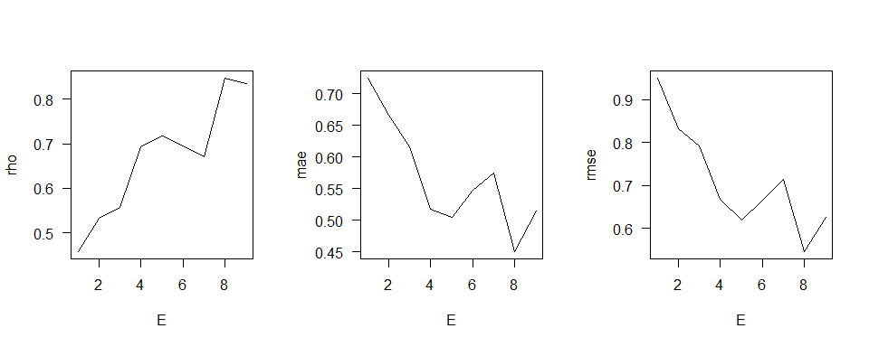

``` r
EPh <- 5 #optimal E was high dimensional, so choose suboptimal one

simp_Roti_res0 <- simplex(Roti1$scAbundance, E=1:9, lib=lib_custom, pred=lib_custom, silent=TRUE)
par(mfrow=c(1, 3), cex=1, las=1)
plot(rho ~ E, simp_Roti_res0, type="l"); plot(mae ~ E, simp_Roti_res0, type="l"); plot(rmse ~ E, simp_Roti_res0, type="l")
```

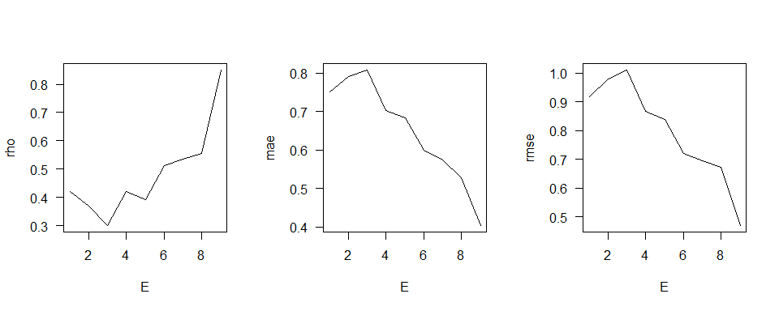

``` r
ERo <- 6 #optimal E was high dimensional, so choose suboptimal one

simp_Zoopla_res0 <- simplex(Zoopla1$scAbundance, E=1:9, lib=lib_custom, pred=lib_custom, silent=TRUE)
par(mfrow=c(1, 3), cex=1, las=1)
plot(rho ~ E, simp_Zoopla_res0, type="l"); plot(mae ~ E, simp_Zoopla_res0, type="l"); plot(rmse ~ E, simp_Zoopla_res0, type="l")
```

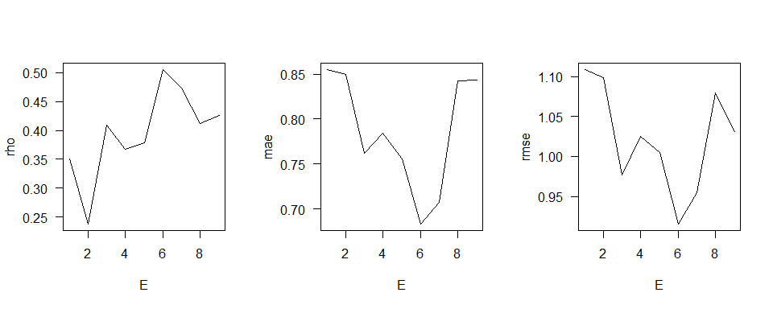

``` r
EZo <- 6 

simp_Mp_res0 <- simplex(Mp1$scAbundance, E=1:8, lib=lib_custom_Mp, pred=lib_custom_Mp, silent=TRUE)
par(mfrow=c(1, 3), cex=1, las=1)
plot(rho ~ E, simp_Mp_res0, type="l"); plot(mae ~ E, simp_Mp_res0, type="l"); plot(rmse ~ E, simp_Mp_res0, type="l")
```


``` r
EMp <- 5  #optimal E was high dimensional, so choose suboptimal one

simp_Det_res0 <- simplex(Det1$scAbundance, E=1:9, lib=lib_custom, pred=lib_custom, silent=TRUE)
par(mfrow=c(1, 3), cex=1, las=1)
plot(rho ~ E, simp_Det_res0, type="l"); plot(mae ~ E, simp_Det_res0, type="l"); plot(rmse ~ E, simp_Det_res0, type="l")
```

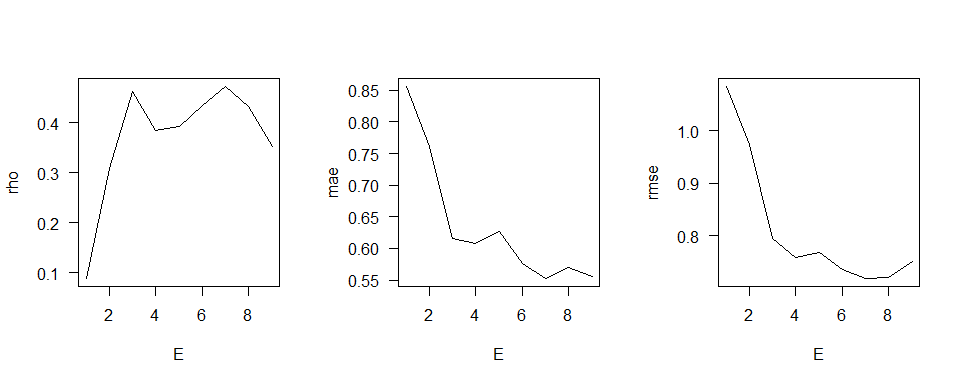

``` r
EDet <- 4  #optimal E was high dimensional, so choose suboptimal one

simp_Herb_res0 <- simplex(Herb1$scAbundance, E=1:9, lib=lib_custom, pred=lib_custom, silent=TRUE)
par(mfrow=c(1, 3), cex=1, las=1)
plot(rho ~ E, simp_Herb_res0, type="l"); plot(mae ~ E, simp_Herb_res0, type="l"); plot(rmse ~ E, simp_Herb_res0, type="l")
```

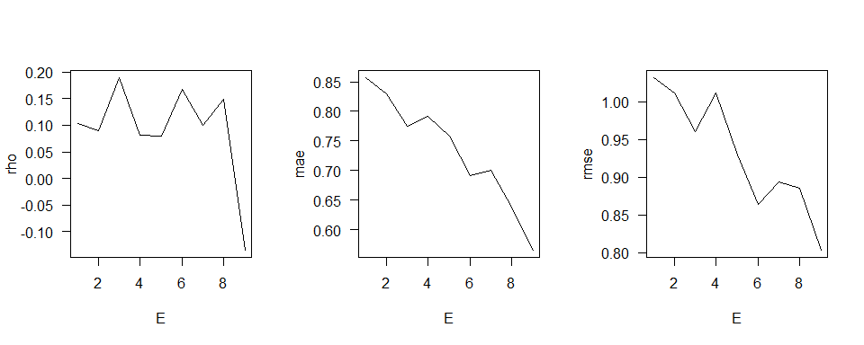

``` r
EHerb <- 6 #Absolute prediction skill was low

simp_PP1_res0 <- simplex(Pred.P1$scAbundance, E=1:9, lib=lib_custom, pred=lib_custom, silent=TRUE)
par(mfrow=c(1, 3), cex=1, las=1)
plot(rho ~ E, simp_PP1_res0, type="l"); plot(mae ~ E, simp_PP1_res0, type="l"); plot(rmse ~ E, simp_PP1_res0, type="l")
```


``` r
EPP <- 5 #optimal E was high dimensional, so choose suboptimal one

simp_PB1_res0 <- simplex(Pred.B1$scAbundance, E=1:9, lib=lib_custom, pred=lib_custom, silent=TRUE)
par(mfrow=c(1, 3), cex=1, las=1)
plot(rho ~ E, simp_PB1_res0, type="l"); plot(mae ~ E, simp_PB1_res0, type="l"); plot(rmse ~ E, simp_PB1_res0, type="l")
```

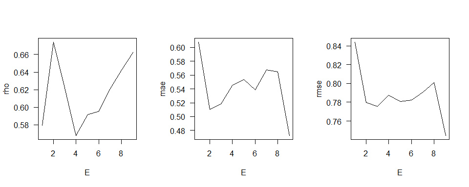

``` r
EPB <- 2

simp_PS1_res0 <- simplex(Pred.S1$scAbundance, E=1:9, lib=lib_custom, pred=lib_custom, silent=TRUE)
par(mfrow=c(1, 3), cex=1, las=1)
plot(rho ~ E, simp_PS1_res0, type="l"); plot(mae ~ E, simp_PS1_res0, type="l"); plot(rmse ~ E, simp_PS1_res0, type="l")
```

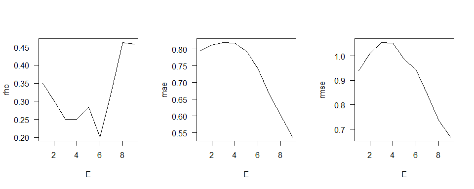

``` r
EPS <- 5 #strange patterns were observed

simp_Moll_res0 <- simplex(Moll1$scAbundance, E=1:9, lib=lib_custom, pred=lib_custom, silent=TRUE)
par(mfrow=c(1, 3), cex=1, las=1)
plot(rho ~ E, simp_Moll_res0, type="l"); plot(mae ~ E, simp_Moll_res0, type="l"); plot(rmse ~ E, simp_Moll_res0, type="l")
```

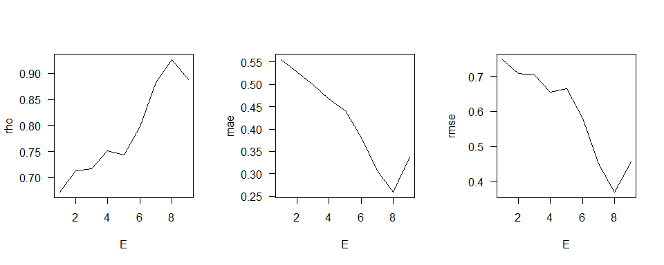

``` r
EMoll <- 4 #optimal E was high dimensional, so choose suboptimal one
```

## Visually observe prediction skills of simplex projection

-   Detritivore, herbivore, surface predator are hard to predict

``` r
simp_Phytopla_res1 <- simplex(Phytopla1$scAbundance, E=EPh, lib=lib_custom, pred=lib_custom, silent=TRUE, stats_only=FALSE)
simp_Roti_res1 <- simplex(Roti1$scAbundance, E=ERo, lib=lib_custom, pred=lib_custom, silent=TRUE, stats_only=FALSE)
simp_Zoopla_res1 <- simplex(Zoopla1$scAbundance, E=EZo, lib=lib_custom, pred=lib_custom, silent=TRUE, stats_only=FALSE)
simp_Mp_res1 <- simplex(Mp1$scAbundance, E=EMp, lib=lib_custom_Mp, pred=lib_custom_Mp, silent=TRUE, stats_only=FALSE)
simp_Det_res1 <- simplex(Det1$scAbundance, E=EDet, lib=lib_custom, pred=lib_custom, silent=TRUE, stats_only=FALSE)
simp_Herb_res1 <- simplex(Herb1$scAbundance, E=EHerb, lib=lib_custom, pred=lib_custom, silent=TRUE, stats_only=FALSE)
simp_PP_res1 <- simplex(Pred.P1$scAbundance, E=EPP, lib=lib_custom, pred=lib_custom, silent=TRUE, stats_only=FALSE)
simp_PB_res1 <- simplex(Pred.B1$scAbundance, E=EPB, lib=lib_custom, pred=lib_custom, silent=TRUE, stats_only=FALSE)
simp_PS_res1 <- simplex(Pred.S1$scAbundance, E=EPS, lib=lib_custom, pred=lib_custom, silent=TRUE, stats_only=FALSE)
simp_Moll_res1 <- simplex(Moll1$scAbundance, E=EMoll, lib=lib_custom, pred=lib_custom, silent=TRUE, stats_only=FALSE)

par(mfrow=c(2, 5), las=1, cex=0.8)
plot(obs ~ pred, simp_Phytopla_res1$model_output[[1]], main="phytopla")
abline(a=0, b=1)
plot(obs ~ pred, simp_Roti_res1$model_output[[1]], main="roti")
abline(a=0, b=1)
plot(obs ~ pred, simp_Zoopla_res1$model_output[[1]], main="zoopla")
abline(a=0, b=1)
plot(obs ~ pred, simp_Mp_res1$model_output[[1]], main="plant")
abline(a=0, b=1)
plot(obs ~ pred, simp_Det_res1$model_output[[1]], main="detr")
abline(a=0, b=1)
plot(obs ~ pred, simp_Herb_res1$model_output[[1]], main="herb")
abline(a=0, b=1)
plot(obs ~ pred, simp_PP_res1$model_output[[1]], main="p.pred")
abline(a=0, b=1)
plot(obs ~ pred, simp_PB_res1$model_output[[1]], main="b.pred")
abline(a=0, b=1)
plot(obs ~ pred, simp_PS_res1$model_output[[1]], main="s.pred")
abline(a=0, b=1)
plot(obs ~ pred, simp_Moll_res1$model_output[[1]], main="moll")
abline(a=0, b=1)
```


``` r
par(mfrow=c(5, 2), mgp=c(2, 1, 0), mar=c(3, 3, 2, 1), las=1, cex=0.8)
plot(obs ~ time, simp_Phytopla_res1$model_output[[1]], type="l", main="phytopla")
lines(pred ~ time, simp_Phytopla_res1$model_output[[1]], col="red")
plot(obs ~ time, simp_Roti_res1$model_output[[1]], type="l", main="roti")
lines(pred ~ time, simp_Roti_res1$model_output[[1]], col="red")
plot(obs ~ time, simp_Zoopla_res1$model_output[[1]], type="l", main="zoopla")
lines(pred ~ time, simp_Zoopla_res1$model_output[[1]], col="red")
plot(obs ~ time, simp_Mp_res1$model_output[[1]], type="l", main="plant")
lines(pred ~ time, simp_Mp_res1$model_output[[1]], col="red")
plot(obs ~ time, simp_Det_res1$model_output[[1]], type="l", main="detr")
lines(pred ~ time, simp_Det_res1$model_output[[1]], col="red")
plot(obs ~ time, simp_Herb_res1$model_output[[1]], type="l", main="herb")
lines(pred ~ time, simp_Herb_res1$model_output[[1]], col="red")
plot(obs ~ time, simp_PP_res1$model_output[[1]], type="l", main="p.pred")
lines(pred ~ time, simp_PP_res1$model_output[[1]], col="red")
plot(obs ~ time, simp_PB_res1$model_output[[1]], type="l", main="b.pred")
lines(pred ~ time, simp_PB_res1$model_output[[1]], col="red")
plot(obs ~ time, simp_PS_res1$model_output[[1]], type="l", main="s.pred")
lines(pred ~ time, simp_PS_res1$model_output[[1]], col="red")
plot(obs ~ time, simp_Moll_res1$model_output[[1]], type="l", main="moll")
lines(pred ~ time, simp_Moll_res1$model_output[[1]], col="red")
```


## Prediction decay

``` r
simp_Phytopla_res2 <- simplex(Phytopla1$scAbundance, E=EPh, tp=1:9, lib=lib_custom, pred=lib_custom, silent=TRUE)
simp_Roti_res2 <- simplex(Roti1$scAbundance, E=ERo, tp=1:9, lib=lib_custom, pred=lib_custom, silent=TRUE)
simp_Zoopla_res2 <- simplex(Zoopla1$scAbundance, E=EZo, tp=1:9, lib=lib_custom, pred=lib_custom, silent=TRUE)
simp_Mp_res2 <- simplex(Mp1$scAbundance, E=EMp, tp=1:8, lib=lib_custom_Mp, pred=lib_custom_Mp, silent=TRUE)
simp_Det_res2 <- simplex(Det1$scAbundance, E=EDet, tp=1:9, lib=lib_custom, pred=lib_custom, silent=TRUE)
simp_Herb_res2 <- simplex(Herb1$scAbundance, E=EHerb, tp=1:9, lib=lib_custom, pred=lib_custom, silent=TRUE)
simp_PP_res2 <- simplex(Pred.P1$scAbundance, E=EPP, tp=1:9, lib=lib_custom, pred=lib_custom, silent=TRUE)
simp_PB_res2 <- simplex(Pred.B1$scAbundance, E=EPB, tp=1:9, lib=lib_custom, pred=lib_custom, silent=TRUE)
simp_PS_res2 <- simplex(Pred.S1$scAbundance, E=EPS, tp=1:9, lib=lib_custom, pred=lib_custom, silent=TRUE)
simp_Moll_res2 <- simplex(Moll1$scAbundance, E=EMoll, tp=1:9, lib=lib_custom, pred=lib_custom, silent=TRUE)

par(mfrow=c(2, 5), las=1, cex=0.8)
plot(rho ~ tp, simp_Phytopla_res2, main="phytopla", type="l")
plot(rho ~ tp, simp_Roti_res2, main="roti", type="l")
plot(rho ~ tp, simp_Zoopla_res2, main="zoopla", type="l")
plot(rho ~ tp, simp_Mp_res2, main="plant", type="l")
plot(rho ~ tp, simp_Det_res2, main="detr", type="l")
plot(rho ~ tp, simp_Herb_res2, main="herb", type="l")
plot(rho ~ tp, simp_PP_res2, main="p.pred", type="l")
plot(rho ~ tp, simp_PB_res2, main="b.pred", type="l")
plot(rho ~ tp, simp_PS_res2, main="s.pred", type="l")
plot(rho ~ tp, simp_Moll_res2, main="moll", type="l")
```


``` r
#Rotifer, detritivore, benthic predator, surface predator, molluscaがよくない
```

## Identify nonlinearity (state dependency)

``` r
smap_Phytopla_res0 <- s_map(Phytopla1$scAbundance, E=EPh, lib=lib_custom, pred=lib_custom, silent=TRUE)
smap_Roti_res0 <- s_map(Roti1$scAbundance, E=ERo, lib=lib_custom, pred=lib_custom, silent=TRUE)
smap_Zoopla_res0 <- s_map(Zoopla1$scAbundance, E=EZo, lib=lib_custom, pred=lib_custom, silent=TRUE)
smap_Mp_res0 <- s_map(Mp1$scAbundance, E=EMp, lib=lib_custom_Mp, pred=lib_custom_Mp, silent=TRUE)
smap_Det_res0 <- s_map(Det1$scAbundance, E=EDet, lib=lib_custom, pred=lib_custom, silent=TRUE)
smap_Herb_res0 <- s_map(Herb1$scAbundance, E=EHerb, lib=lib_custom, pred=lib_custom, silent=TRUE)
smap_PP_res0 <- s_map(Pred.P1$scAbundance, E=EPP, lib=lib_custom, pred=lib_custom, silent=TRUE)
smap_PB_res0 <- s_map(Pred.B1$scAbundance, E=EPB, lib=lib_custom, pred=lib_custom, silent=TRUE)
smap_PS_res0 <- s_map(Pred.S1$scAbundance, E=EPS, lib=lib_custom, pred=lib_custom, silent=TRUE)
smap_Moll_res0 <- s_map(Moll1$scAbundance, E=EMoll, lib=lib_custom, pred=lib_custom, silent=TRUE)

par(mfrow=c(2, 5), mgp=c(2, 1, 0), mar=c(3, 3, 2, 1), cex=0.8, las=1)
plot(rho ~ theta, smap_Phytopla_res0, type="l", main="phytopla")
plot(rho ~ theta, smap_Roti_res0, type="l", main="roti")
plot(rho ~ theta, smap_Zoopla_res0, type="l", main="zoopla")
plot(rho ~ theta, smap_Mp_res0, type="l", main="plant")
plot(rho ~ theta, smap_Det_res0, type="l", main="detr")
plot(rho ~ theta, smap_Herb_res0, type="l", main="herb")
plot(rho ~ theta, smap_PP_res0, type="l", main="p.pred")
plot(rho ~ theta, smap_PB_res0, type="l", main="b.pred")
plot(rho ~ theta, smap_PS_res0, type="l", main="s.pred")
plot(rho ~ theta, smap_Moll_res0, type="l", main="moll")
```

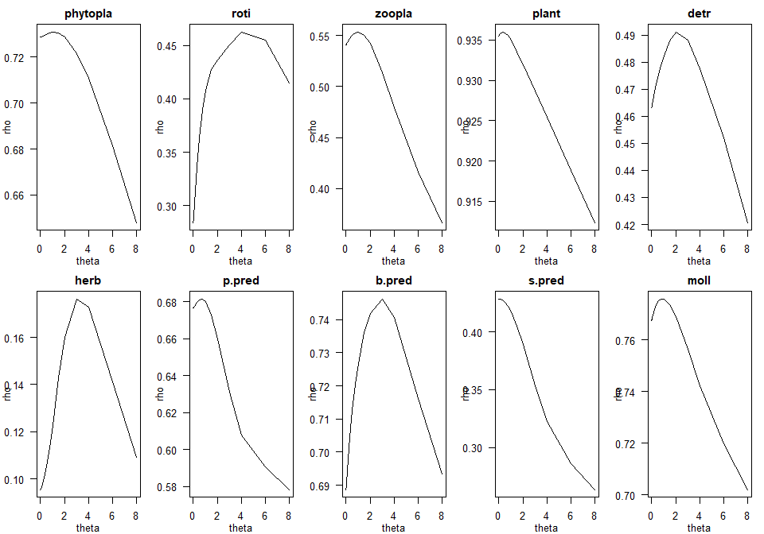

``` r
par(mfrow=c(2, 5), mgp=c(2, 1, 0), mar=c(3, 3, 2, 1), cex=0.8, las=1)
plot(mae ~ theta, smap_Phytopla_res0, type="l", main="phytopla")
plot(mae ~ theta, smap_Roti_res0, type="l", main="roti")
plot(mae ~ theta, smap_Zoopla_res0, type="l", main="zoopla")
plot(mae ~ theta, smap_Mp_res0, type="l", main="plant")
plot(mae ~ theta, smap_Det_res0, type="l", main="detr")
plot(mae ~ theta, smap_Herb_res0, type="l", main="herb")
plot(mae ~ theta, smap_PP_res0, type="l", main="p.pred")
plot(mae ~ theta, smap_PB_res0, type="l", main="b.pred")
plot(mae ~ theta, smap_PS_res0, type="l", main="s.pred")
plot(mae ~ theta, smap_Moll_res0, type="l", main="moll")
```

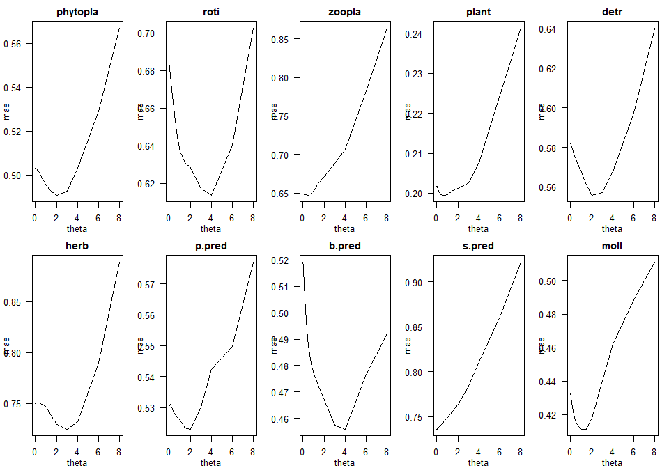

``` r
par(mfrow=c(2, 5), mgp=c(2, 1, 0), mar=c(3, 3, 2, 1), cex=0.8, las=1)
plot(rmse ~ theta, smap_Phytopla_res0, type="l", main="phytopla")
plot(rmse ~ theta, smap_Roti_res0, type="l", main="roti")
plot(rmse ~ theta, smap_Zoopla_res0, type="l", main="zoopla")
plot(rmse ~ theta, smap_Mp_res0, type="l", main="plant")
plot(rmse ~ theta, smap_Det_res0, type="l", main="detr")
plot(rmse ~ theta, smap_Herb_res0, type="l", main="herb")
plot(rmse ~ theta, smap_PP_res0, type="l", main="p.pred")
plot(rmse ~ theta, smap_PB_res0, type="l", main="b.pred")
plot(rmse ~ theta, smap_PS_res0, type="l", main="s.pred")
plot(rmse ~ theta, smap_Moll_res0, type="l", main="moll")
```

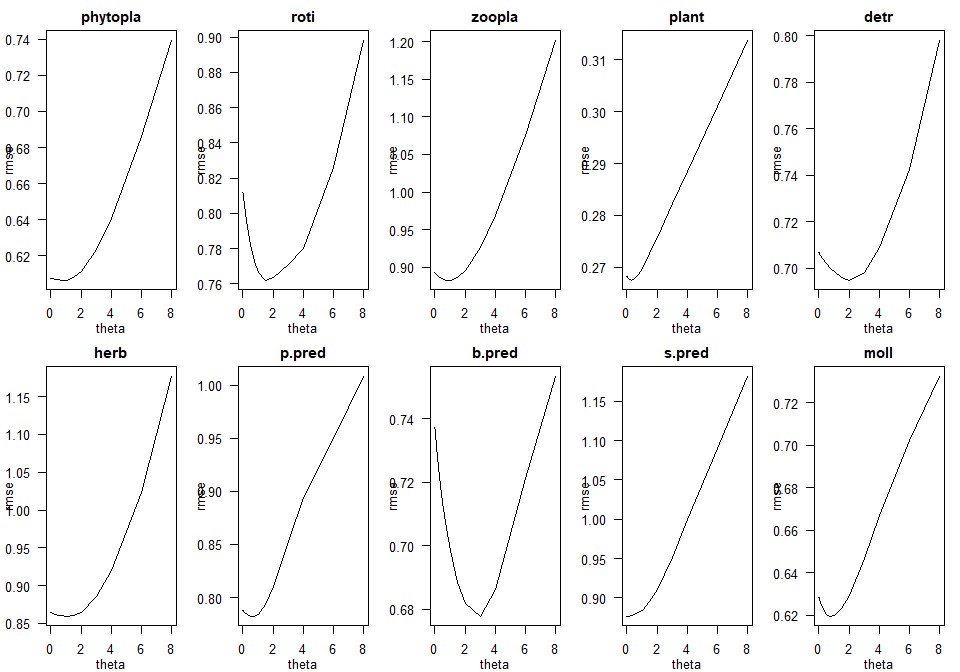

``` r
TPh <- smap_Phytopla_res0[which.min(smap_Phytopla_res0$rmse), "theta"]
TPh
```

    ## [1] 0.75

``` r
TRo <- smap_Roti_res0[which.min(smap_Roti_res0$rmse), "theta"]
TRo
```

    ## [1] 1.5

``` r
TZo <- smap_Zoopla_res0[which.min(smap_Zoopla_res0$rmse), "theta"]
TZo
```

    ## [1] 1

``` r
TMp <- smap_Mp_res0[which.min(smap_Mp_res0$rmse), "theta"]
TMp
```

    ## [1] 0.3

``` r
TDet <- smap_Det_res0[which.min(smap_Det_res0$rmse), "theta"]
TDet
```

    ## [1] 2

``` r
THerb <- smap_Herb_res0[which.min(smap_Herb_res0$rmse), "theta"]
THerb
```

    ## [1] 1

``` r
TPP <- smap_PP_res0[which.min(smap_PP_res0$rmse), "theta"]
TPP
```

    ## [1] 0.75

``` r
TPB <- smap_PB_res0[which.min(smap_PB_res0$rmse), "theta"]
TPB
```

    ## [1] 3

``` r
TPS <- smap_PS_res0[which.min(smap_PS_res0$rmse), "theta"]
TPS
```

    ## [1] 0.03

``` r
TMoll <- smap_Moll_res0[which.min(smap_Moll_res0$rmse), "theta"]
TMoll
```

    ## [1] 0.75

``` r
#意外なことに、surface predator以外は非線形性が認められた
```

## Visually observe prediction skills of S-map

``` r
TPh <- smap_Phytopla_res0[which.min(smap_Phytopla_res0$rmse), "theta"]
TRo <- smap_Roti_res0[which.min(smap_Roti_res0$rmse), "theta"]
TZo <- smap_Zoopla_res0[which.min(smap_Zoopla_res0$rmse), "theta"]
TMp <- smap_Mp_res0[which.min(smap_Mp_res0$rmse), "theta"]
TDet <- smap_Det_res0[which.min(smap_Det_res0$rmse), "theta"]
THerb <- smap_Herb_res0[which.min(smap_Herb_res0$rmse), "theta"]
TPP <- smap_PP_res0[which.min(smap_PP_res0$rmse), "theta"]
TPB <- smap_PB_res0[which.min(smap_PB_res0$rmse), "theta"]
TPS <- smap_PS_res0[which.min(smap_PS_res0$rmse), "theta"]
TMoll <- smap_Moll_res0[which.min(smap_Moll_res0$rmse), "theta"]


smap_Phytopla_res1 <- s_map(Phytopla1$scAbundance, E=EPh, theta=TPh, lib=lib_custom, pred=lib_custom, silent=TRUE, stats_only=FALSE)
smap_Roti_res1 <- s_map(Roti1$scAbundance, E=ERo, theta=TRo, lib=lib_custom, pred=lib_custom, silent=TRUE, stats_only=FALSE)
smap_Zoopla_res1 <- s_map(Zoopla1$scAbundance, E=EZo, theta=TZo, lib=lib_custom, pred=lib_custom, silent=TRUE, stats_only=FALSE)
smap_Mp_res1 <- s_map(Mp1$scAbundance, E=EMp, theta=TMp, lib=lib_custom_Mp, pred=lib_custom_Mp, silent=TRUE, stats_only=FALSE)
smap_Det_res1 <- s_map(Det1$scAbundance, E=EDet, theta=TDet, lib=lib_custom, pred=lib_custom, silent=TRUE, stats_only=FALSE)
smap_Herb_res1 <- s_map(Herb1$scAbundance, E=EHerb, theta=THerb, lib=lib_custom, pred=lib_custom, silent=TRUE, stats_only=FALSE)
smap_PP_res1 <- s_map(Pred.P1$scAbundance, E=EPP, theta=TPP, lib=lib_custom, pred=lib_custom, silent=TRUE, stats_only=FALSE)
smap_PB_res1 <- s_map(Pred.B1$scAbundance, E=EPB, theta=TPB, lib=lib_custom, pred=lib_custom, silent=TRUE, stats_only=FALSE)
smap_PS_res1 <- s_map(Pred.S1$scAbundance, E=EPS, theta=TPS, lib=lib_custom, pred=lib_custom, silent=TRUE, stats_only=FALSE)
smap_Moll_res1 <- s_map(Moll1$scAbundance, E=EMoll, theta=TMoll, lib=lib_custom, pred=lib_custom, silent=TRUE, stats_only=FALSE)


par(mfrow=c(2, 5), mgp=c(2, 1, 0), mar=c(3, 3, 2, 1), cex=0.8, las=1)
plot(obs ~ pred, smap_Phytopla_res1$model_output[[1]], main="phytopla")
abline(a=0, b=1)
plot(obs ~ pred, smap_Roti_res1$model_output[[1]], main="roti")
abline(a=0, b=1)
plot(obs ~ pred, smap_Zoopla_res1$model_output[[1]], main="zoopla")
abline(a=0, b=1)
plot(obs ~ pred, smap_Mp_res1$model_output[[1]], main="plant")
abline(a=0, b=1)
plot(obs ~ pred, smap_Det_res1$model_output[[1]], main="detr")
abline(a=0, b=1)
plot(obs ~ pred, smap_Herb_res1$model_output[[1]], main="herb")
abline(a=0, b=1)
plot(obs ~ pred, smap_PP_res1$model_output[[1]], main="p.pred")
abline(a=0, b=1)
plot(obs ~ pred, smap_PB_res1$model_output[[1]], main="b.pred")
abline(a=0, b=1)
plot(obs ~ pred, smap_PS_res1$model_output[[1]], main="s.pred")
abline(a=0, b=1)
plot(obs ~ pred, smap_Moll_res1$model_output[[1]], main="moll")
abline(a=0, b=1)
```


``` r
par(mfrow=c(5, 2), mgp=c(2, 1, 0), mar=c(3, 3, 2, 1), cex=0.8, las=1)
plot(obs ~ time, smap_Phytopla_res1$model_output[[1]], type="l", main="phytopla")
lines(pred ~ time, smap_Phytopla_res1$model_output[[1]], col="red")
plot(obs ~ time, smap_Roti_res1$model_output[[1]], type="l", main="roti")
lines(pred ~ time, smap_Roti_res1$model_output[[1]], col="red")
plot(obs ~ time, smap_Zoopla_res1$model_output[[1]], type="l", main="zoopla")
lines(pred ~ time, smap_Zoopla_res1$model_output[[1]], col="red")
plot(obs ~ time, smap_Mp_res1$model_output[[1]], type="l", main="plant")
lines(pred ~ time, smap_Mp_res1$model_output[[1]], col="red")
plot(obs ~ time, smap_Det_res1$model_output[[1]], type="l", main="detr")
lines(pred ~ time, smap_Det_res1$model_output[[1]], col="red")
plot(obs ~ time, smap_Herb_res1$model_output[[1]], type="l", main="herb")
lines(pred ~ time, smap_Herb_res1$model_output[[1]], col="red")
plot(obs ~ time, smap_PP_res1$model_output[[1]], type="l", main="p.pred")
lines(pred ~ time, smap_PP_res1$model_output[[1]], col="red")
plot(obs ~ time, smap_PB_res1$model_output[[1]], type="l", main="b.pred")
lines(pred ~ time, smap_PB_res1$model_output[[1]], col="red")
plot(obs ~ time, smap_PS_res1$model_output[[1]], type="l", main="s.pred")
lines(pred ~ time, smap_PS_res1$model_output[[1]], col="red")
plot(obs ~ time, smap_Moll_res1$model_output[[1]], type="l", main="moll")
lines(pred ~ time, smap_Moll_res1$model_output[[1]], col="red")
```


